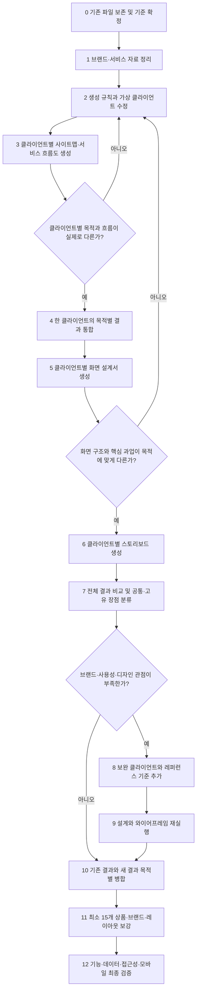

# UIUX 와이어프레임 작업 단계 순서

> 지금까지 학생 피드백에서 공통으로 안내한 작업 순서를 통합한 문서입니다. 기존 결과물을 보존하면서 클라이언트의 목적이 설계에 반영되도록 만들고, 브랜드 정보와 상품 구성, 디자인 완성도를 단계적으로 보강한 뒤 최종 결과를 검증하는 흐름을 기준으로 합니다.

## 전체 흐름

## 0단계 기존 결과 보존 및 작업 기준 확정

1. 기존 클라이언트, 분석, 사이트맵, 서비스 흐름도, 화면 설계서, 스토리보드와 와이어프레임을 삭제하지 않습니다.
2. 기존 결과는 `수정 전 결과`, 새 결과는 `수정 후 결과`로 구분합니다.
3. 최종본, 비교본과 실험본의 폴더 및 파일명을 분리합니다.
4. 클라이언트 ID·이름, 입력 파일, 출력 파일과 현재 단계를 관리할 매니페스트 또는 현황표를 만듭니다.
5. 모든 내부 링크와 참조 경로는 프로젝트 기준 상대 경로를 사용합니다.

완료 기준:

- 원본을 덮어쓰지 않고 전후 결과를 비교할 수 있음
- 어떤 입력에서 어떤 결과가 생성되었는지 추적할 수 있음
- 중복 파일과 최종 파일이 구분됨

## 1단계 브랜드와 서비스의 기준 자료 정리

다음 내용을 먼저 확정합니다.

- 브랜드가 시작된 문제
- 회사와 브랜드의 철학
- 사용자가 얻게 되는 변화
- 핵심 기술과 제작 과정
- 검증 가능한 성과와 출처
- 대표 상품과 전체 상품 체계
- 주요 사용자와 핵심 과업
- 서비스의 최종 전환 목표

확인되지 않은 수치, 인증, 임상·효능, 판매량, 후기, 가격과 정책은 `근거 있음`, `가상 데이터`, `확인 필요`, `삭제`로 구분합니다. 가상 클라이언트는 설계 입력 자료로만 사용하고 실제 고객 후기나 검증 데이터로 표현하지 않습니다.

## 2단계 생성 규칙과 가상 클라이언트 수정

### 클라이언트 파일에 작성할 내용

- 현재 상황과 문제
- 목적과 니즈
- 우선순위
- 판단 기준
- 성공 조건
- 제약 사항
- 확인이 필요한 정보

### 클라이언트 파일에서 미리 고정하지 않을 내용

- GNB 메뉴 구성
- 카드, 슬라이드와 탭의 개수
- 3D 뷰어, 타이머, 다이얼과 모달 같은 특정 UI
- 화면 순서와 레이아웃
- 장바구니 드로어, FAQ와 스크롤 복원 같은 해결책

UI 해결책은 클라이언트의 목적과 니즈를 분석한 뒤 사이트맵, 서비스 흐름도와 화면 설계 단계에서 도출합니다. 모든 클라이언트에게 동일한 UI 구성요소를 필수로 지정하면 결과 구조가 같아질 수 있습니다.

기존 설계는 유지하되 브랜드와 디자인 표현이 부족한 경우에는 기존 클라이언트를 삭제하지 않고 다음 요구를 추가합니다.

- 브랜드 철학과 시작 배경을 중요하게 여김
- 기술력, 제작 과정과 검증 가능한 성과를 확인하고 싶음
- 대표 상품과 전체 상품의 관계를 이해하고 싶음
- 반복 카드보다 브랜드에 맞는 다양한 화면 강약을 원함
- 모바일과 접근성까지 포함한 높은 완성도를 요구함

## 3단계 클라이언트별 사이트맵과 서비스 흐름도 생성

각 클라이언트의 목적별로 사이트맵과 서비스 흐름도를 생성합니다.

사이트맵에서 달라져야 하는 항목:

- 중요 메뉴와 콘텐츠 우선순위
- 필요한 상세 페이지
- 핵심 기능
- 진입 경로와 전환 위치

서비스 흐름도에서 달라져야 하는 항목:

- 시작 지점
- 핵심 행동
- 전환 목표
- 정상 흐름
- 오류, 이탈과 재진입 흐름
- 완료 결과

홈, 로그인, 상품 탐색처럼 서비스상 공통으로 필요한 구조는 같아도 됩니다. 그러나 클라이언트의 목적이 다른데 중요 화면, 행동 순서와 전환 목표까지 모두 같으면 생성 규칙을 다시 수정해야 합니다.

### 차별화 검증 게이트

목적이 가장 다른 클라이언트 2~3명을 먼저 선택해 결과를 비교합니다.

- 직업이나 이름만 바뀌고 내용은 같은지
- 핵심 목적이 첫 진입 화면과 주요 기능에 반영되었는지
- 정상 흐름뿐 아니라 예외 상태도 목적에 따라 달라지는지
- 클라이언트별 고유 요구가 화면이나 행동으로 변환되었는지

차이가 확인되지 않으면 전체 결과를 계속 생성하지 않고 2단계로 돌아갑니다.

## 4단계 한 클라이언트의 목적별 결과 통합

한 클라이언트에게 목적 1~5가 있다면 사이트맵과 서비스 흐름도를 각각 하나의 클라이언트 통합 결과로 정리합니다.

통합 원칙:

1. 목적별 결과를 단순히 이어 붙이지 않습니다.
2. 중복 화면과 기능은 하나로 합칩니다.
3. 서로 다른 목적의 경로와 요구는 누락하지 않습니다.
4. 핵심 목적과 보조 목적의 우선순위를 정합니다.
5. 화면 ID, 명칭과 이동 경로를 통일합니다.
6. 통합 결과가 원본 목적 1~5의 어떤 요구를 반영했는지 추적할 수 있게 기록합니다.

## 5단계 클라이언트별 화면 설계서 생성

통합 사이트맵과 서비스 흐름도를 입력으로 클라이언트별 화면 설계서를 생성합니다.

화면 설계서에 포함할 내용:

- 화면 ID와 목적
- 진입·종료 조건
- 정보 우선순위
- 핵심 콘텐츠와 기능
- 사용자 행동과 시스템 처리
- 정상·로딩·빈 상태·오류·완료 상태
- 다음 화면과 CTA
- 반응형과 접근성 기준

### 화면 구조 검증 게이트

화면 설계서가 모두 같은 구조로 나오면 스토리보드 생성 전에 멈춥니다.

1. 기존 화면 설계서는 `수정 전 결과`로 보존합니다.
2. 목적이 가장 다른 클라이언트 2~3명을 비교합니다.
3. 공통 UI 강제 규칙과 고정 섹션이 남아 있는지 확인합니다.
4. 목적 5개를 모두 같은 비중으로 넣었는지 확인합니다.
5. 생성 규칙을 수정한 뒤 선택한 2~3명만 다시 생성합니다.
6. 첫 화면, 핵심 과업, 화면 순서, 기능과 전환이 달라졌는지 확인합니다.
7. 차이가 확인된 뒤에만 나머지 화면 설계서를 재생성합니다.

공통 헤더와 기본 탐색은 같아도 되지만 클라이언트별 핵심 행동과 콘텐츠 우선순위는 실제 화면 구조에서 달라야 합니다.

## 6단계 클라이언트별 스토리보드 생성

차별화가 검증된 화면 설계서를 기준으로 스토리보드를 생성합니다.

스토리보드에서는 다음 연결을 명확히 합니다.

- 요구사항 ID → 사이트맵 화면 → 서비스 흐름 → 화면 설계서 → 스토리보드
- 섹션 ID와 실제 HTML 영역
- 사용자 행동과 상태 변화
- 모달·필터·폼·상세보기의 시작과 종료
- 데스크톱과 모바일의 배치 변화

존재하지 않는 상위 파일을 결합했다고 작성하거나 검증하지 않은 상태에서 `100% 완료`, `완벽히 병합` 같은 표현을 사용하지 않습니다.

## 7단계 전체 클라이언트 결과 비교

클라이언트별 결과를 다음 두 종류로 나눕니다.

### 공통 장점

여러 클라이언트에게 실제로 필요한 기본 구조와 기능입니다.

- 공통 탐색
- 상품 발견과 상세 확인
- 기본 신청·구매 흐름
- 공통 오류와 복구 상태
- 공통 접근성 기준

### 고유 장점

특정 목적과 사용자에게 필요한 차별화 요소입니다.

- 다른 정보 우선순위
- 고유한 핵심 기능
- 특정 사용 상황과 상품 조합
- 다른 콘텐츠 흐름과 전환 방식
- 브랜드를 표현하는 독특한 레이아웃

최종 결과에는 공통 요소를 무조건 전부 넣지 않고 서비스 목적과 중요도에 따라 선택합니다. 고유 요소도 적용 이유가 분명한 항목만 병합합니다.

## 8단계 부족한 관점 확인 및 보완 클라이언트 추가

새 클라이언트는 기존 결과가 비슷하다는 이유만으로 추가하지 않습니다. 기존 생성 규칙과 결과를 정상화한 뒤 전체 비교에서도 다음 관점이 비어 있을 때만 추가합니다.

- 브랜드와 회사의 강점
- 사용성 및 상품 선택 기준
- 디자인 완성도와 감성
- 접근성
- 모바일 경험
- 구매·신청 전환
- 특정 페이지의 별도 목적

보완 클라이언트 역시 구체적인 화면을 미리 지시하지 않고 부족한 관점에 대한 목적, 니즈, 판단 기준과 성공 조건을 작성합니다.

## 9단계 레퍼런스 탐색·분류·분석

레퍼런스는 많이 모으는 것이 목적이 아닙니다. 학생이 선택한 사이트 형식과 브랜드에 가까우며 현재 와이어프레임의 부족한 부분을 직접 보완할 수 있는 사례를 소수 선정합니다.

기존 분석 파일은 수정하거나 삭제하지 않고 파일 마지막에 탐색 기준과 분류·분석 규칙을 추가합니다.

### 분류

- 사용성: 필터, 비교, 상세 탐색, 신청 흐름과 상태 설계가 좋은 사례
- 심미성: 제품 재질, 큰 이미지, 화면 분할, 기술 도해와 레이아웃이 좋은 사례
- 무드: 브랜드의 감정, 사용 장면과 분위기를 잘 전달하는 사례

`분류`에는 사이트가 어느 기준에 해당하는지만 기록합니다.

### 분석

각 사이트마다 다음 내용을 작성합니다.

- 참고할 요소
- 현재 와이어프레임에서 부족한 부분
- 현재 브랜드에 적용할 방식
- 그대로 복제하지 않고 변경할 부분
- 적용할 섹션과 목적
- 모바일 적용 시 확인할 내용

레퍼런스의 색상과 화면 모양을 그대로 따라 하지 않고 정보 전달 방식, 시각적 강약과 사용자 흐름을 분석합니다.

## 10단계 설계와 와이어프레임 재실행 및 목적별 병합

보완 클라이언트와 레퍼런스 분석 결과를 요구사항에 반영하고 설계와 와이어프레임을 다시 실행합니다.

최종 병합 원칙:

1. 기존 와이어프레임 전체를 새 결과로 교체하지 않습니다.
2. 기존 결과에서 잘된 기능, 정보 구조와 흐름을 유지합니다.
3. 새 결과에서는 부족한 관점을 직접 보완하는 요소만 선택합니다.
4. 같은 목적의 중복 섹션은 하나로 정리합니다.
5. 선택한 요소마다 어떤 문제를 보완하는지 기록합니다.
6. 기존 결과와 새 결과의 데이터·화면 ID·링크를 다시 연결합니다.

## 11단계 와이어프레임 1~4단계 적용

### 와이어프레임 1단계

초반에 생성한 와이어프레임을 기반으로 초안을 생성합니다.

- 핵심 페이지와 기본 사용자 흐름 확인
- 기존 클라이언트 요구의 반영 여부 확인
- 주요 기능과 상태의 위치 확인

### 와이어프레임 2단계

최소 15개 상품이 실제로 배치되도록 설계합니다.

- 문서에 숫자만 적지 않고 화면에서 실제 상품 확인
- 상품명, 대상, 핵심 차이, 구성과 CTA 제공
- 이미 15개 이상이면 상품을 억지로 추가하지 않고 현재 체계 유지
- 상품이 부족하면 대표 상품을 기반으로 색상·소재·라인·용량·사용 목적 등을 변형
- 이름이나 색상만 무작위로 바꾸지 않고 브랜드 기준에 따라 차이 설정

### 와이어프레임 3단계

브랜드 정보와 최소 15개 상품이 각 섹션에 조화롭게 배치되도록 수정합니다.

- 기존 클라이언트와 설계 내용 보존
- 브랜드 시작, 철학, 기술, 제작 과정과 검증 가능한 성과 보강
- 대표 상품 2~3개를 관련 이야기와 함께 먼저 강조
- 대표 상품과 파생 상품의 관계 표시
- 전체 상품은 페이지 후반의 모음 영역에서 비교 가능하게 제공
- 필터, 상세보기와 주요 CTA 연결

상품은 한곳에만 모두 나열하지 않습니다. 대표 상품은 Hero, 브랜드 철학, 기술, 제작 과정과 사용 장면에서 서로 다른 역할로 보여주고 마지막에 전체 상품 그리드를 제공합니다.

### 와이어프레임 4단계

3단계 결과를 기반으로 설계 관점과 디자인 관점의 부족한 부분을 분석하고 보완합니다.

설계 관점:

- 대표 상품과 전체 상품의 관계
- 선택 기준과 비교 흐름
- 필터, 빈 상태, 오류, 로딩, 완료와 복구
- 상세 모달과 신청·구매 흐름
- 데이터 일치와 화면 간 연결
- 모바일 탐색과 접근성

디자인 관점:

- 핵심 메시지와 시각적 우선순위
- 큰 이미지와 짧은 문장의 조합
- 화면 분할과 좌우 교차 배치
- 제품 구조와 기술 도해
- 제작 과정 타임라인
- 브랜드별 포인트 컬러와 재질 표현
- 반복 카드와 에디토리얼형 섹션의 강약

## 12단계 최종 검증

### 콘텐츠와 데이터

- [ ] 상품 수가 문서와 실제 화면에서 일치하는가?
- [ ] 대표 상품과 전체 상품의 명칭·가격·구성이 일치하는가?
- [ ] 필터 결과와 상품 데이터가 일치하는가?
- [ ] 상세 모달과 신청·구매 화면에 올바른 상품이 연결되는가?
- [ ] 검증되지 않은 수치·인증·효능·후기·가격이 구분되었는가?
- [ ] 가상 클라이언트가 실제 고객이나 후기처럼 표현되지 않았는가?

### 구조와 기능

- [ ] 사이트맵, 서비스 흐름도, 화면 설계서, 스토리보드와 HTML의 ID가 연결되는가?
- [ ] 내부 참조 파일이 실제로 존재하는가?
- [ ] 상대 경로와 페이지 링크가 정상 작동하는가?
- [ ] 필터 초기화, 빈 상태, 오류, 로딩, 완료와 재시도가 구현되었는가?
- [ ] 상세 화면에서 돌아왔을 때 필터와 스크롤 상태가 필요한 경우 유지되는가?

### 접근성

- [ ] 페이지마다 적절한 `h1`과 의미 단위별 `section`이 있는가?
- [ ] 폼의 `label for`와 입력 `id`가 연결되는가?
- [ ] 모달에 역할, 제목과 닫기 버튼의 접근 가능한 이름이 있는가?
- [ ] 모달 열기·닫기, Focus Trap, ESC와 포커스 복귀가 작동하는가?
- [ ] 필터·탭·FAQ의 선택 및 펼침 상태가 코드에도 전달되는가?
- [ ] 동적 오류와 완료 상태가 보조기술에 전달되는가?

### 디자인과 반응형

- [ ] 대표 상품과 일반 상품의 시각적 우선순위가 분명한가?
- [ ] 반복 카드만 사용하지 않고 섹션별 목적에 맞는 레이아웃을 사용했는가?
- [ ] CSS 오브제와 안내 문구가 실제 이미지 영역으로 발전했는가?
- [ ] 이미지 목적, 비율, 재질, 사용 장면과 대체 텍스트가 정의되었는가?
- [ ] 모바일에서 GNB, 필터, 긴 상품 목록, 모달과 폼을 사용할 수 있는가?
- [ ] 데스크톱과 모바일에서 정보 우선순위가 유지되는가?

## 최종 제출 구성

최종 제출 전 다음 파일을 구분합니다.

- 기존 결과 또는 수정 전 비교본
- 최종 클라이언트와 요구사항
- 최종 사이트맵과 서비스 흐름도
- 최종 화면 설계서
- 최종 스토리보드
- 최종 와이어프레임 HTML
- 레퍼런스 분류·분석 결과
- 상품 데이터와 상태 명세
- 검증 결과 또는 체크리스트
- 최종 선택 근거와 병합 기준

캐시, 로그, 의존성 폴더와 임시 파일은 최종 산출물에서 분리합니다. 최종 파일은 하나의 기준 경로에서 열 수 있어야 하며 문서, 데이터와 실제 화면의 내용이 일치해야 합니다.

## 한 줄 진행 순서

`기존 결과 보존 → 브랜드·서비스 기준 정리 → 생성 규칙과 기존 클라이언트 수정 → 클라이언트별 사이트맵·서비스 흐름도 생성 및 차별화 검증 → 목적별 결과 통합 → 화면 설계서 생성 및 구조 검증 → 스토리보드 생성 → 전체 결과의 공통·고유 장점 비교 → 부족한 관점이 있을 때만 보완 클라이언트 추가 → 사용성·심미성·무드 레퍼런스 분석 → 설계·와이어프레임 재실행 → 기존 결과와 새 결과 목적별 병합 → 브랜드 정보와 최소 15개 상품 보강 → 기능·데이터·접근성·모바일 최종 검증`
