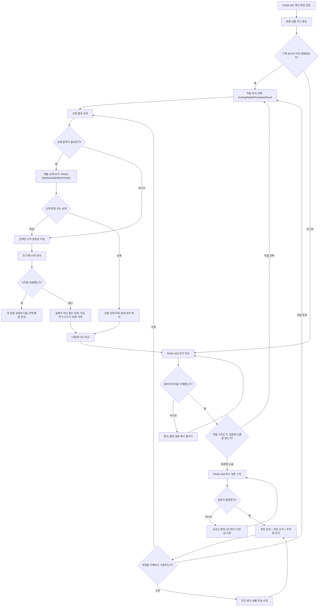

# VC-08 다온 — 서비스 흐름도 v1

상태: `DRAFT_CONTINUOUS_RUN`
클라이언트 역할: 첫 선택 부담
입력: V4 제품 연결, V5 사이트 구조맵 보강, final-design 사이트 구조맵

## 1. 기본 정보와 완료 정의

- 핵심 목적: 가입·설정 없이 자신에게 맞는 기록 시작 경로를 이해하고 부담 없이 하나를 선택한다.
- 핵심 요구: 용어 설명, 대표 상황, 건너뛰기, 직접 선택, 추천 초안 수정.
- 성공: 선택한 첫 경로와 그 이유를 자신의 말로 설명할 수 있다.
- 금지: 성격 진단, 유형 확정, 필수 가입·설정으로 선택을 차단하지 않는다.
- 연결 요구사항: `REQ-008`, `ER-001~004`.
- 연결 제품: `PROD-009`, `PROD-024`, `PROD-048`, `PROD-062`, `PROD-075`, `PROD-092`.
- 연결 페이지: `PAGE-001` 메인, `PAGE-002` 방식 비교, `PAGE-003` 목적·분량·장소·기기 질문, 제품 상세·비교 후보.

## 2. 대표 과업

### 과업 A — 직접 비교해서 시작 방식 선택

메인에서 대표 상황을 확인하고 Analog·Digital·Template 차이를 비교한 뒤 직접 선택한다.

### 과업 B — 질문형 추천으로 선택 부담 줄이기

선택이 어려우면 최소 질문에 답하고, 추천 근거와 부적합 조건을 확인한 뒤 추천을 수정하거나 수락한다.

### 과업 C — 선택을 보류하고 다시 시작하기

정보가 부족하거나 마음이 바뀌면 건너뛰기·이전·보류를 사용하고 선택 상태를 잃지 않은 채 다시 비교한다.

## 3. 서비스 흐름



## 4. 단계별 상세

| 단계 | 사용자 목적·행동 | 화면·페이지 | 시스템 응답 | 다음 분기 | 연결 |
|---|---|---|---|---|---|
| 1 | 대표 상황을 보고 나에게 맞는 시작점을 찾음 | PAGE-001 | 용어를 최소화한 상황 카드와 직접 선택 CTA 제공 | 방식 확정/비확정 | REQ-008 |
| 2 | Analog·Digital·Template 차이를 비교함 | PAGE-002 | 구조·입력량·난도·완성 예시를 나란히 제공 | 이해/설명 요청 | ER-001~004 |
| 3 | 이해가 부족한 용어를 확인함 | PAGE-002 보조 설명 | 설명 펼침, 예시, 현재 위치 유지 | 비교로 복귀 | REQ-008 |
| 4 | 직접 선택 또는 질문형 추천 선택 | PAGE-002 | 선택권과 도움 경로를 동등하게 노출 | 직접/질문 | REQ-008 |
| 5 | 목적·분량·장소·기기 최소 응답 | PAGE-003 | 답변 수를 표시하고 건너뛰기 허용 | 응답 부족/충분 | PAGE-003 |
| 6 | 추천 결과와 이유를 검토함 | 추천 결과 영역 | 추천 근거·부적합 조건·수정 CTA 제공 | 수용/수정/직접 변경 | REQ-008 |
| 7 | 추천 조건 또는 방식을 수정함 | 추천 결과/비교 | 수정 전 답변과 선택 상태 보존 | 재추천/직접 선택 | REQ-008 |
| 8 | 연결 제품을 상세·비교함 | 제품 상세·비교 | Product ID, 사용 상황, 선택 근거 표시 | 확정/보류 | PROD-009 외 5개 |
| 9 | 첫 경로를 확정하거나 나중으로 미룸 | 선택 요약 | 확정 시 시작 CTA, 보류 시 상태 저장 | 시작/보류 | REQ-008 |
| 10 | 가장 작은 단위로 첫 행동 완료 | 시작 안내 | 한 줄·한 항목 등 작은 완료를 인정 | 완료/중단 | Client 성공 조건 |
| 11 | 중단 후 재개함 | 보류·복귀 상태 | 지금 하기·나누기·보류·삭제 선택지 제공 | 비교/재개 | 예외 원칙 |

## 5. 예외·상태 흐름

- 응답 부족: 미응답 항목을 표시하되 건너뛰고 추천 초안으로 이동할 수 있다.
- 결과 없음: 추천을 정답으로 표시하지 않고 직접 비교·초기화·보류를 제공한다.
- 용어 혼란: 설명을 펼친 뒤 동일 비교 위치로 복귀한다.
- 추천 불만족: 추천 근거를 확인하고 조건 수정 또는 직접 선택으로 전환한다.
- 제품 상세 이탈: 선택 상태와 원래 위치를 보존하고 뒤로가기 후 복귀한다.
- 저장 실패·오프라인: 상태를 명시하고 재시도·로컬 보류·나중에 복귀를 제공한다.
- 중단: 실패 판정 대신 지금 하기·나누기·보류·삭제를 선택하게 한다.

## 6. 제품·사이트 구조 연결 검증

- V4의 `REQ-008`과 다온의 첫 선택 부담이 직접 반영됨.
- V5의 메인·방식 비교·질문·제품 비교 경로가 흐름에 포함됨.
- final-design 구조의 `Main and entry → Core task → Product discovery → Product detail and compare → Shared states`가 순서에 반영됨.
- 연결 제품 6개는 후보로만 제시하며 가격·재고·판매 확정으로 해석하지 않음.
- 추천 수락을 성공 기준으로 삼지 않고, 이유를 이해한 선택·수정을 성공으로 정의함.

## 7. 추적 메타데이터

```text
CLIENT=VC-08
REQ=REQ-008
PRODUCTS=PROD-009, PROD-024, PROD-048, PROD-062, PROD-075, PROD-092
PAGES=PAGE-001, PAGE-002, PAGE-003, 제품 상세·비교
STATUS=DRAFT_CONTINUOUS_RUN
REVIEW=DEFERRED_UNTIL_VC51
```
