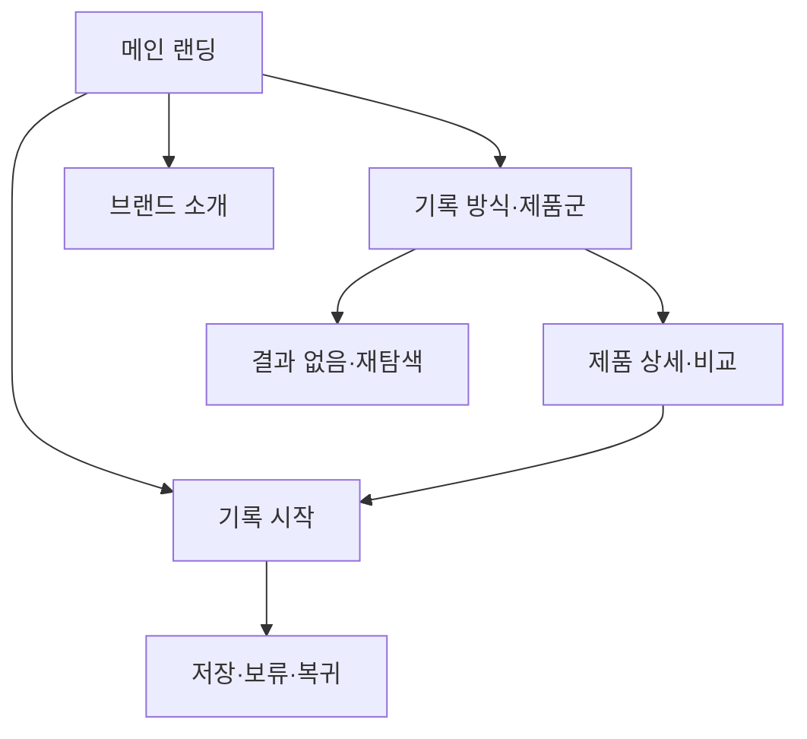

# VC-01 은재 — 사이트구조맵 A안 V1

## 1. 설계 개요

- 기준 Client: VC-01 은재 / 아날로그 장문 기록
- 핵심 목표: 긴 글을 부담 없이 시작하고, 일정·회고·제품 선택을 하나의 기록 흐름으로 이어간다.
- 입력 연결: REQ-001, 제품 후보 PROD-001·002·003·031·032·033·061·062·063·064·095
- 핵심 방향: 기록 시작을 최우선으로 두는 흐름

## 2. 전역 내비게이션

메인 랜딩 | 기록 방식·제품군 | 브랜드 소개 | 기록 시작 | 검색

## 3. 계층형 사이트맵

- 1차: 메인 랜딩 / 기록 방식·제품군 / 브랜드 소개 / 기록 시작
  - 2차 메인 랜딩: 브랜드 Hero / 핵심 가치 / 대표 제품 레일 / 기록 방식 안내 / Client 과업별 진입 / Footer
  - 2차 기록 방식·제품군: 장문 기록 / 일정·회고 / 아날로그·디지털 연결 / 비교·선택 가이드
    - 3차: 제품군 목록 / 제품 상세 / 제품 비교 / 사용 상황·기록 예시
  - 2차 브랜드 소개: 브랜드 방향 / 제작 과정 / 기록 철학 / 제품과 콘텐츠의 관계
  - 2차 기록 시작: 목적 선택 / 기록 방식 선택 / 첫 기록 안내 / 저장·보류

## 4. 메뉴·콘텐츠·기능

| 페이지 | 목적 | 핵심 콘텐츠 | 주요 기능 | 연결 |
|---|---|---|---|---|
| 메인 랜딩 | 브랜드 이해와 기록 시작 | Hero, 가치, 제품 레일 | 앵커 이동, 제품 탐색 | 기록 방식, 브랜드 소개 |
| 기록 방식·제품군 | 상황별 탐색 | 장문·일정·회고 제품군 | 필터, 비교, 보류 | 상세, 기록 시작 |
| 브랜드 소개 | 신뢰·철학 전달 | 제작 과정, 기록 철학 | 섹션 이동 | 제품군 |
| 기록 시작 | 첫 행동 지원 | 목적·방식 선택 | 선택, 저장, 취소, 복귀 | 메인, 제품 상세 |
| 제품 상세 | 후보 이해 | 사용 상황, 특징, 연결 콘텐츠 | 비교, 보류 | 제품군, 기록 시작 |

## 5. 공통·상태·예외

- 공통: Header, 현재 위치, 검색, Footer, 접근 가능한 대체 이동
- 상태: 신규 방문, 기록 진행 중, 보류, 저장 완료(상태는 자료 기반 가정)
- 여정: 메인 → 기록 목적 선택 → 제품군 탐색 → 비교·보류 → 기록 시작
- 예외: 결과 없음, 저장 실패, 취소, 이전 위치 복귀

## 6. Mermaid

## 7. 검증

- Client 목표·REQ·제품 연결: 반영
- 메인·카테고리·브랜드 소개 역할: 분리
- 판매와 포트폴리오 탐색: 구분 필요, 최종 문구는 후속 검증
- 가정: 회원 상태·저장 방식은 입력 자료에 없어 가정 표시
- 대표 15개 선정: 미실행
