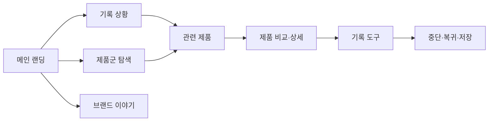

# VC-01 은재 — 사이트구조맵 B안 V1

## 1. 설계 개요

- 기준 Client: VC-01 은재 / 아날로그 장문 기록
- 핵심 목표: 제품보다 기록 상황과 긴 글의 맥락을 먼저 이해하게 한다.
- 입력 연결: REQ-001, PROD-001·002·003·031·032·033·061·062·063·064·095
- 핵심 방향: 콘텐츠·상황 중심 탐색 후 제품으로 연결

## 2. 전역 내비게이션

메인 랜딩 | 기록 상황 | 제품군 탐색 | 브랜드 이야기 | 기록 도구

## 3. 계층형 사이트맵

- 1차: 메인 랜딩 / 기록 상황 / 제품군 탐색 / 브랜드 이야기 / 기록 도구
  - 2차 기록 상황: 오래 쓰는 기록 / 일정과 메모 / 다시 시작하는 기록 / 기록 예시
    - 3차: 상황 콘텐츠 / 관련 제품 / 사용 전환 안내
  - 2차 제품군 탐색: 장문 기록 / 일정 연결 / 회고·리뷰 / 비교 허브
  - 2차 브랜드 이야기: 브랜드 방향 / 제작 과정 / 기록 자율성 / 포트폴리오
  - 2차 기록 도구: 시작 / 진행 중 기록 / 보류 / 복귀

## 4. 메뉴·콘텐츠·기능

| 페이지 | 목적 | 핵심 콘텐츠 | 주요 기능 | 연결 |
|---|---|---|---|---|
| 메인 랜딩 | 상황 공감과 브랜드 소개 | Hero, 상황 카드, 제품 레일 | 앵커·탐색 | 기록 상황, 제품군 |
| 기록 상황 | 문제·맥락 이해 | 장문 기록 사례, 일정·회고 | 상황 선택 | 관련 제품 |
| 제품군 탐색 | 제품 후보 비교 | 제품군, 특징, 사례 | 필터·비교·보류 | 상세, 기록 도구 |
| 브랜드 이야기 | 브랜드 가치 이해 | 철학·과정·포트폴리오 | 섹션 이동 | 제품군 |
| 기록 도구 | 행동 전환 | 기록 시작·진행·복귀 | 저장·취소 | 메인, 상세 |

## 5. 공통·상태·예외

- 공통: 브랜드 식별, 검색, 현재 위치, Footer
- 상태: 콘텐츠만 보는 상태, 제품 비교 상태, 기록 진행 상태(가정)
- 여정: 상황 콘텐츠 → 관련 제품 → 비교 → 기록 도구
- 예외: 제품 후보 없음, 비교 취소, 기록 중단, 저장 실패

## 6. Mermaid

## 7. 검증

- Client의 긴 글 맥락: 반영
- 제품은 콘텐츠 맥락 뒤에 연결: 반영
- 페이지 역할 중복: 제품군과 기록 상황의 경계 후속 검토
- 회원 상태·저장 정책: 가정
- 대표 15개 선정: 미실행
