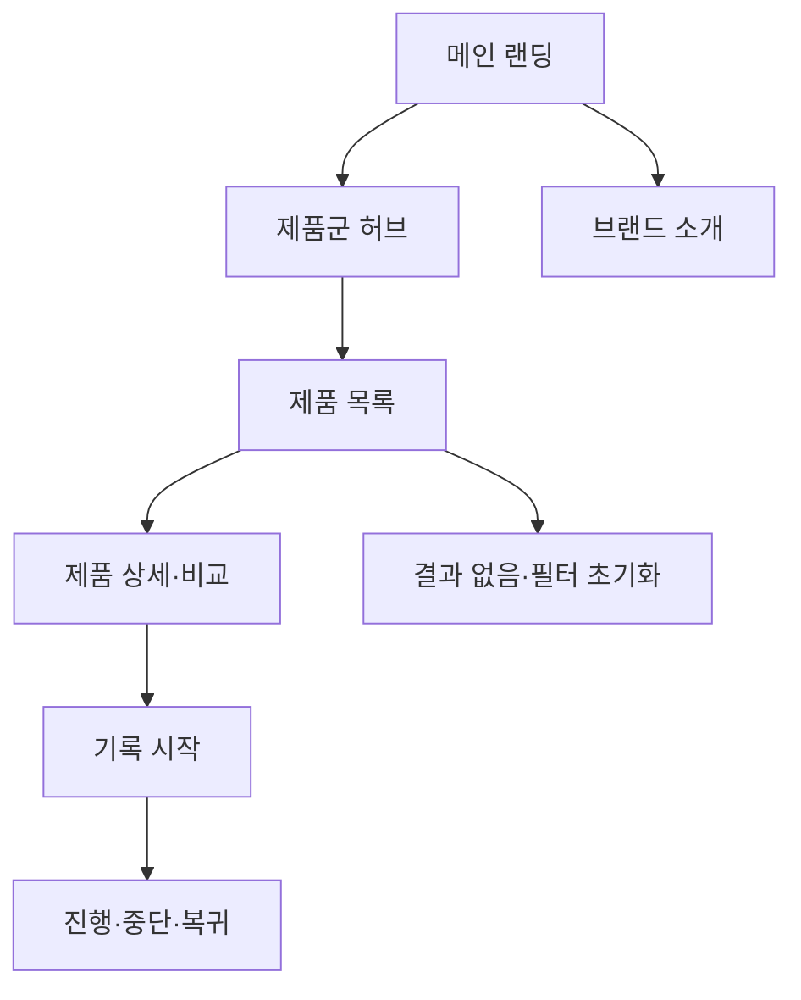

# VC-01 은재 — 사이트구조맵 C안 V1

## 1. 설계 개요

- 기준 Client: VC-01 은재 / 아날로그 장문 기록
- 핵심 목표: 처음 방문한 사용자가 대표 제품군을 빠르게 이해하고 기록 방식으로 진입한다.
- 입력 연결: REQ-001, PROD-001·002·003·031·032·033·061·062·063·064·095
- 핵심 방향: 제품군 허브와 긴 랜딩을 결합

## 2. 전역 내비게이션

메인 랜딩 | 제품군 허브 | 브랜드 소개 | 기록 시작 | 검색·비교

## 3. 계층형 사이트맵

- 1차: 메인 랜딩 / 제품군 허브 / 브랜드 소개 / 기록 시작
  - 2차 메인 랜딩: 브랜드 Hero / 제품군 미리보기 / 대표 사용 장면 / 기록 시작 CTA / 브랜드 요약
  - 2차 제품군 허브: 장문 기록 / 일정·메모 / 회고·리뷰 / 아날로그·디지털 전환
    - 3차: 제품 목록 / 제품 상세 / 비교 / 관련 기록 콘텐츠
  - 2차 브랜드 소개: 브랜드 방향 / 제작·재료 / 포트폴리오 / 제품군과의 관계
  - 2차 기록 시작: 목적·분량 선택 / 방식 선택 / 시작 / 중단·복귀

## 4. 메뉴·콘텐츠·기능

| 페이지 | 목적 | 핵심 콘텐츠 | 주요 기능 | 연결 |
|---|---|---|---|---|
| 메인 랜딩 | 첫인상·빠른 진입 | Hero, 제품군, 사용 장면 | 스크롤, CTA | 허브, 브랜드 |
| 제품군 허브 | 전체 방향 감각 | 4개 제품군, 비교 기준 | 카테고리·비교 | 상세, 기록 |
| 브랜드 소개 | 브랜드 정체성 | 방향, 재료, 포트폴리오 | 앵커 이동 | 허브 |
| 기록 시작 | 행동 전환 | 목적·분량·방식 | 선택·중단·복귀 | 상세, 메인 |
| 제품 상세 | 제품 후보 이해 | 특징, 상황, 기록 연결 | 비교·보류 | 허브 |

## 5. 공통·상태·예외

- 공통: Header, 검색, 브레드크럼, Footer
- 상태: 신규·탐색·비교·기록 진행·보류(일부 가정)
- 여정: 메인 → 제품군 허브 → 제품 상세·비교 → 기록 시작
- 예외: 결과 없음, 필터 초기화, 비교 항목 부족, 기록 취소·복귀

## 6. Mermaid

## 7. 검증

- 제품 후보군을 중심으로 한 탐색 경로: 반영
- 브랜드 소개와 제품 허브: 분리
- 포트폴리오·비판매 목적: 명시 필요
- 회원·저장 상태: 입력 미확정으로 가정 표시
- 대표 15개 선정: 미실행
