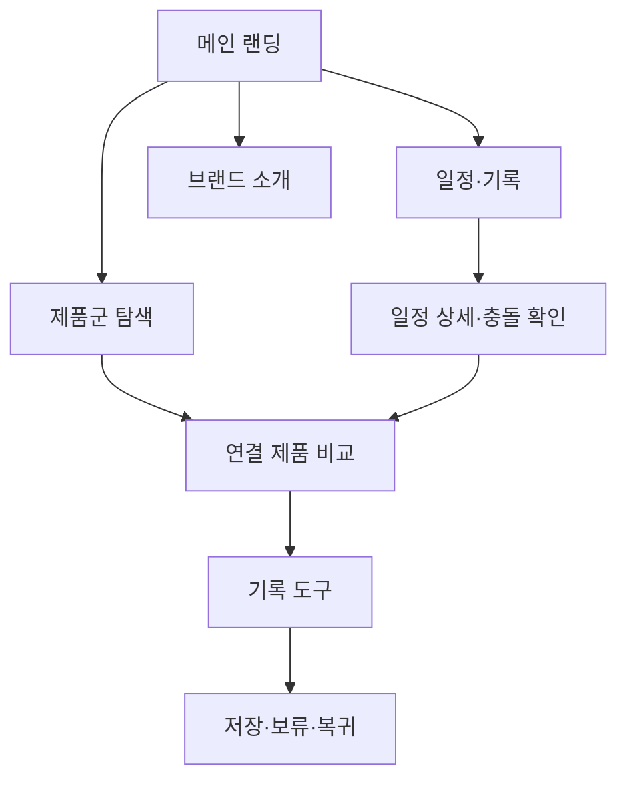

# VC-02 지안 — 사이트구조맵 A안 V1

## 1. Client·통합 분석 근거

- Client: VC-02 지안 / 미래 일정 흐름 통제
- 핵심 목표: 일정과 기록을 한 흐름으로 확인하고 충돌을 줄인다.
- 요구 기준: REQ-002
- 연결 제품: V4 제품 연결 목록 및 `제품콘텐츠-도출결과-V2.md`의 PROD-002·004·005·006·034·035·036·065·066·067·068
- 대표 15개 선정: 미실행

## 2. 사이트구조맵 분석 결과

| 요구·REQ | 메뉴 | 콘텐츠 | 기능 | 연결 페이지 | 근거·가정 |
|---|---|---|---|---|---|
| 일정 흐름 통제·REQ-002 | 일정·기록 | 일정 흐름, 메모 연결 | 기간 선택·충돌 확인 | 메인·제품군 | V4 Client 근거 |
| 알림 부담 조절·REQ-002 | 설정·기록 도구 | 알림·복귀 안내 | 선택·보류·복귀 | 기록 시작 | 일부 상태 가정 |

## 3. 계층형 사이트맵

- 1차: 메인 랜딩 / 일정·기록 / 제품군 탐색 / 브랜드 소개 / 기록 도구
  - 2차 메인: Hero / 일정 흐름 미리보기 / 제품 레일 / 브랜드 가치 / 시작 CTA
  - 2차 일정·기록: 일정 흐름 / 메모 연결 / 충돌 확인 / 다시 보기
    - 3차: 일정 상세 / 연결 제품 / 비교 / 복귀 안내
  - 2차 제품군: 일정 기록 / 메모 교차 / 알림 설정 / 아날로그·디지털 연결
  - 2차 브랜드 소개: 방향 / 제작 과정 / 기록 철학 / 포트폴리오
  - 2차 기록 도구: 시작 / 진행 / 보류 / 복귀

## 4. 공통·상태·여정·예외

- 공통: Header·전역 메뉴·검색·현재 위치·Footer
- 상태: 신규 탐색(가정), 일정 비교, 기록 진행, 보류·복귀
- 여정: 메인 → 일정 흐름 확인 → 관련 제품 비교 → 기록 도구
- 예외: 일정 충돌, 결과 없음, 알림 취소, 저장 실패, 이전 위치 복귀

## 5. Mermaid

## 6. 검증

- Client 기본 정보·요구·REQ·제품 연결: 반영
- 메뉴·콘텐츠·기능 추적: 반영
- 1~3차 계층: 반영
- 회원 상태: 입력 미확정으로 가정 표시
- MD·MMD·SVG 경로: 동일 구조로 검증
