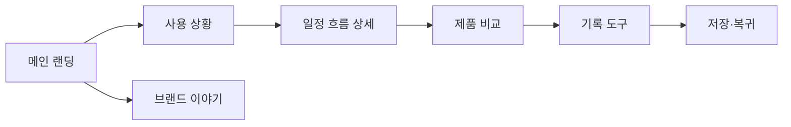

# VC-02 지안 — 사이트구조맵 B안 V1

## 1. Client·통합 분석 근거

- Client: VC-02 지안 / 미래 일정 흐름 통제
- 핵심 목표: 일정과 메모의 관계를 먼저 이해한 뒤 제품을 선택한다.
- 요구 기준: REQ-002
- 제품 연결: PROD-002·004·005·006·034·035·036·065·066·067·068
- 대표 15개 선정: 미실행

## 2. 사이트구조맵 분석 결과

| 요구·REQ | 메뉴 | 콘텐츠 | 기능 | 연결 페이지 | 근거·가정 |
|---|---|---|---|---|---|
| 일정 맥락 이해·REQ-002 | 사용 상황 | 일정·메모 사례 | 상황 선택·관련 제품 연결 | 제품 상세 | V4 Client 근거 |
| 충돌 회피·REQ-002 | 비교·확인 | 충돌 전후 상태 | 비교·되돌리기 | 기록 도구 | 일부 상태 가정 |

## 3. 계층형 사이트맵

- 1차: 메인 랜딩 / 사용 상황 / 제품 비교 / 브랜드 이야기 / 기록 도구
  - 2차 사용 상황: 미래 일정 / 일정과 메모 / 충돌 회피 / 다시 시작
    - 3차: 상황 콘텐츠 / 연결 제품 / 일정 흐름 상세
  - 2차 제품 비교: 일정형 / 메모형 / 알림형 / 아날로그·디지털형
  - 2차 브랜드 이야기: 기록 철학 / 제작 과정 / 제품군 관계
  - 2차 기록 도구: 선택 / 진행 / 저장 / 복귀

## 4. 공통·상태·여정·예외

- 공통: Header·검색·브레드크럼·Footer
- 상태: 탐색(가정), 비교, 일정 입력, 보류, 복귀
- 여정: 사용 상황 → 일정 흐름 → 제품 비교 → 기록 도구
- 예외: 입력 누락, 충돌 결과 없음, 비교 취소, 저장 실패

## 5. Mermaid

## 6. 검증

- 일정 흐름과 제품 선택을 상황 콘텐츠 뒤에 연결
- 카테고리·브랜드 소개 역할 분리
- 상태·예외는 입력 자료에 없는 경우 가정 표시
