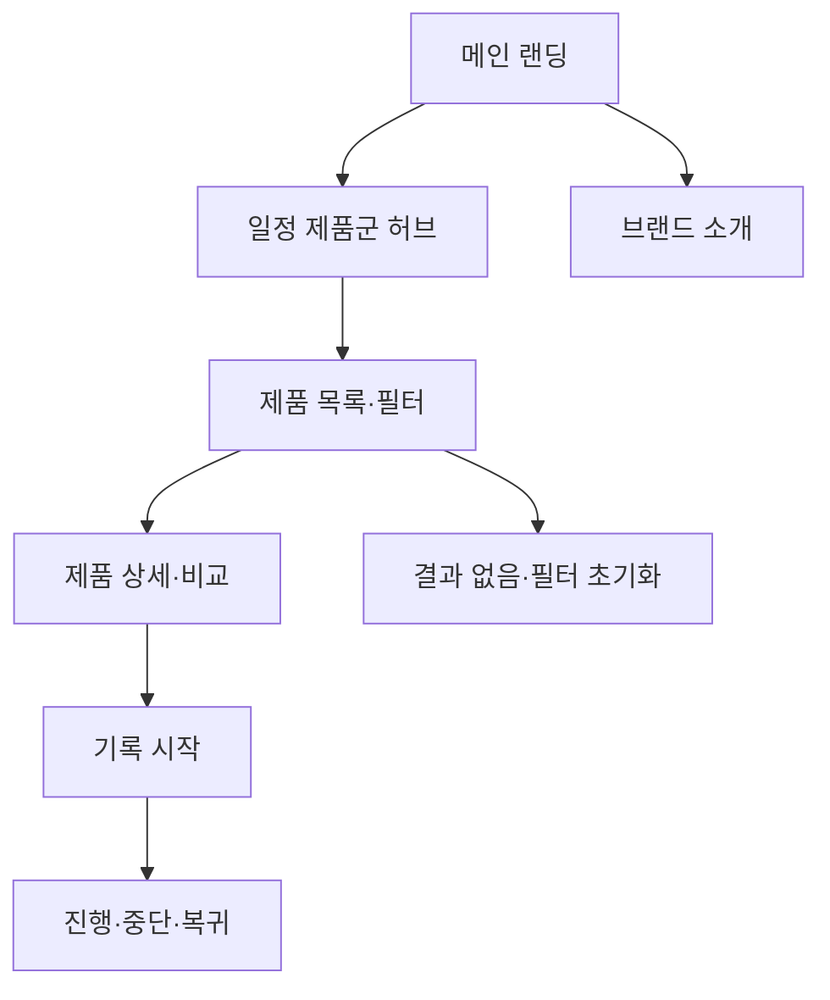

# VC-02 지안 — 사이트구조맵 C안 V1

## 1. Client·통합 분석 근거

- Client: VC-02 지안 / 미래 일정 흐름 통제
- 핵심 목표: 메인에서 일정·기록 제품군의 전체 방향을 빠르게 파악한다.
- 요구 기준: REQ-002
- 제품 연결: PROD-002·004·005·006·034·035·036·065·066·067·068
- 대표 15개 선정: 미실행

## 2. 사이트구조맵 분석 결과

| 요구·REQ | 메뉴 | 콘텐츠 | 기능 | 연결 페이지 | 근거·가정 |
|---|---|---|---|---|---|
| 전체 일정 방향·REQ-002 | 일정 제품군 허브 | 일정·메모·알림 제품군 | 카테고리·필터·비교 | 상세 | 제품 결과 V2 |
| 흐름 통제·REQ-002 | 메인 CTA | 일정 흐름 시작 안내 | 시작·보류·복귀 | 기록 도구 | V4 Client |

## 3. 계층형 사이트맵

- 1차: 메인 랜딩 / 일정 제품군 허브 / 브랜드 소개 / 기록 시작
  - 2차 메인: Hero / 일정 제품군 레일 / 충돌 회피 콘텐츠 / 브랜드 요약 / 시작 CTA
  - 2차 일정 제품군: 흐름 관리 / 메모 연결 / 알림 조절 / 전환 제품
    - 3차: 제품 목록 / 상세 / 비교 / 사용 상황
  - 2차 브랜드 소개: 방향 / 과정 / 기록 철학 / 포트폴리오
  - 2차 기록 시작: 목적·기간 / 방식 / 시작 / 중단·복귀

## 4. 공통·상태·여정·예외

- 공통: Header·검색·브레드크럼·Footer
- 상태: 신규, 일정 선택, 비교, 기록 진행, 복귀(일부 가정)
- 여정: 메인 → 일정 제품군 허브 → 비교 → 기록 시작
- 예외: 필터 결과 없음, 충돌, 취소, 저장·복귀

## 5. Mermaid

## 6. 검증

- Client 기본 정보·요구·제품 연결: 반영
- 일정 제품군과 브랜드 포트폴리오 구분: 반영
- 대표 15개 선정: 미실행
