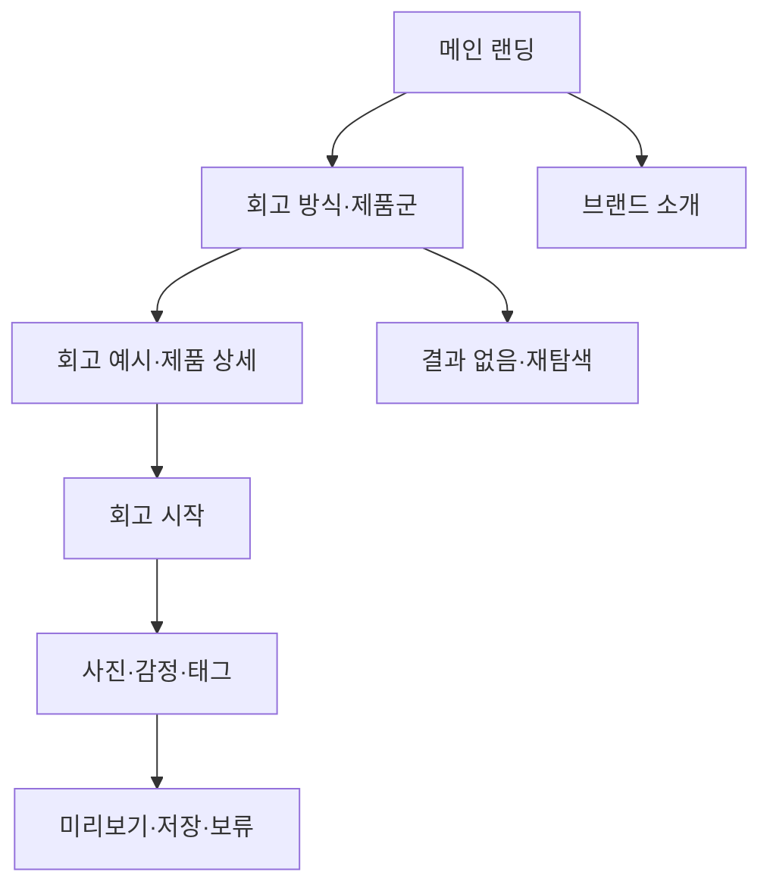

# VC-03 하람 — 사이트구조맵 A안 V1

## 1. Client·분석 근거

- Client: VC-03 하람 / 저부담 시각 회고
- 핵심 목표: 긴 입력 없이 사진·짧은 선택으로 회고를 시작한다.
- 요구: REQ-003
- 연결 제품: PROD-007·008·009·037·038·039·069·070·071·072
- 대표 15개: 미실행

## 2. 사이트구조맵 분석 결과

| 요구·REQ | 메뉴 | 콘텐츠 | 기능 | 연결 | 근거·가정 |
|---|---|---|---|---|---|
| 저부담 회고·REQ-003 | 회고 방식 | 사진·짧은 문장·감정 선택 | 빠른 입력·미리보기 | 메인·제품군 | V5 Client |
| 맥락 재탐색·REQ-003 | 회고 기록 | 날짜·사진·태그 | 검색·필터·복귀 | 상세 | 제품 연결 |

## 3. 계층형 사이트맵

- 1차: 메인 랜딩 / 회고 방식·제품군 / 브랜드 소개 / 회고 시작
  - 2차 메인: Hero / 빠른 회고 소개 / 제품 레일 / 기록 철학 / CTA
  - 2차 회고 방식·제품군: 사진 회고 / 감정 선택 / 짧은 기록 / 재탐색
    - 3차: 제품 목록 / 제품 상세 / 회고 예시 / 비교
  - 2차 브랜드 소개: 방향 / 제작 과정 / 기록 철학 / 포트폴리오
  - 2차 회고 시작: 사진 선택 / 감정·태그 / 미리보기 / 저장·보류

## 4. 상태·여정·예외

- 공통: Header·검색·현재 위치·Footer
- 상태: 신규 탐색(가정), 입력 중, 미리보기, 저장·보류
- 여정: 메인 → 회고 방식 → 제품·예시 → 회고 시작
- 예외: 사진 없음, 입력 취소, 저장 실패, 결과 없음

## 5. Mermaid

## 6. 검증

- Client 기본 정보·REQ·제품 ID·메뉴·콘텐츠·기능 반영
- 메인·카테고리·브랜드 소개 역할 분리
- 대표 15개 선정: 미실행
