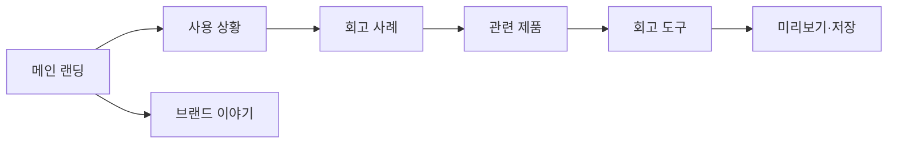

# VC-03 하람 — 사이트구조맵 B안 V1

## 1. Client·분석 근거

- Client: VC-03 하람 / 저부담 시각 회고
- 핵심 목표: 회고 사례를 먼저 보고 부담이 낮은 기록 방식을 고른다.
- 요구: REQ-003
- 연결 제품: PROD-007·008·009·037·038·039·069·070·071·072
- 대표 15개: 미실행

## 2. 사이트구조맵 분석 결과

| 요구·REQ | 메뉴 | 콘텐츠 | 기능 | 연결 | 근거·가정 |
|---|---|---|---|---|---|
| 빠른 기록·REQ-003 | 사용 상황 | 짧은 회고 사례 | 사례 선택·관련 제품 | 제품 상세 | V5 Client |
| 표현 부담 완화·REQ-003 | 회고 도구 | 감정·태그·사진 | 선택·되돌리기 | 회고 시작 | 일부 상태 가정 |

## 3. 계층형 사이트맵

- 1차: 메인 랜딩 / 사용 상황 / 회고 제품군 / 브랜드 이야기 / 회고 도구
  - 2차 사용 상황: 하루 회고 / 사진 중심 / 감정 중심 / 짧은 기록
    - 3차: 사례 콘텐츠 / 연결 제품 / 회고 예시
  - 2차 회고 제품군: 사진 기록 / 미니 기록 / 감정 선택 / 재탐색
  - 2차 브랜드 이야기: 기록 철학 / 제작 과정 / 제품군 관계
  - 2차 회고 도구: 시작 / 편집 / 미리보기 / 저장

## 4. 상태·여정·예외

- 공통: Header·검색·브레드크럼·Footer
- 상태: 사례 탐색(가정), 입력, 미리보기, 저장·보류
- 여정: 사례 → 제품군 → 회고 도구 → 미리보기
- 예외: 사례 없음, 사진 오류, 취소, 재시도

## 5. Mermaid

## 6. 검증

- 상황 콘텐츠 뒤에 제품과 회고 도구를 연결
- 입력·미리보기·저장 예외 표시
- 대표 15개 선정: 미실행
