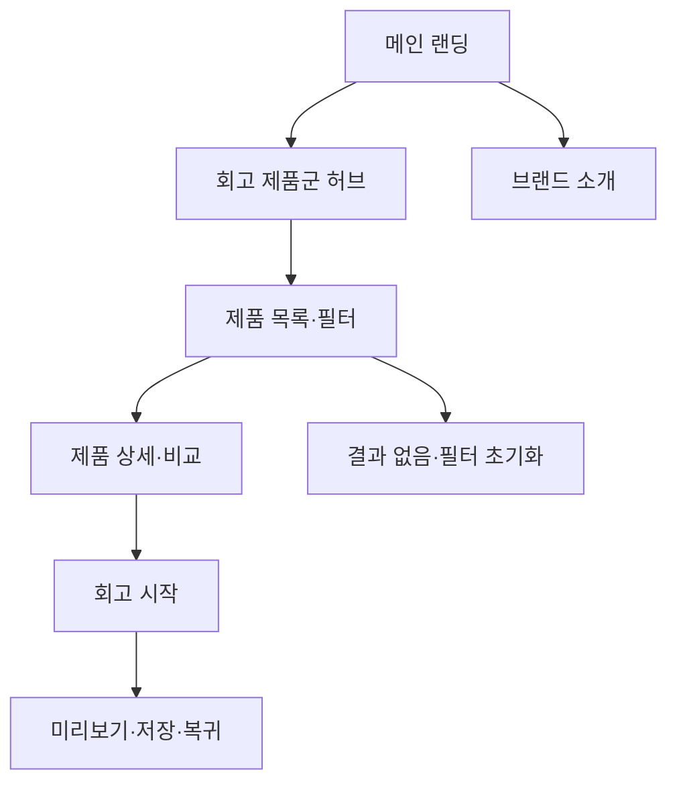

# VC-03 하람 — 사이트구조맵 C안 V1

## 1. Client·분석 근거

- Client: VC-03 하람 / 저부담 시각 회고
- 핵심 목표: 메인에서 회고 제품군의 차이를 빠르게 파악하고 바로 시작한다.
- 요구: REQ-003
- 연결 제품: PROD-007·008·009·037·038·039·069·070·071·072
- 대표 15개: 미실행

## 2. 사이트구조맵 분석 결과

| 요구·REQ | 메뉴 | 콘텐츠 | 기능 | 연결 | 근거·가정 |
|---|---|---|---|---|---|
| 회고 제품군 이해·REQ-003 | 회고 제품군 허브 | 사진·감정·짧은 기록 | 카테고리·필터·비교 | 상세 | 제품 결과 V2 |
| 즉시 시작·REQ-003 | 메인 CTA | 빠른 회고 안내 | 시작·보류·복귀 | 회고 도구 | V5 Client |

## 3. 계층형 사이트맵

- 1차: 메인 랜딩 / 회고 제품군 허브 / 브랜드 소개 / 회고 시작
  - 2차 메인: Hero / 회고 제품군 레일 / 사용 장면 / 브랜드 요약 / 시작 CTA
  - 2차 제품군 허브: 사진 회고 / 감정 선택 / 짧은 기록 / 재탐색
    - 3차: 제품 목록 / 상세 / 비교 / 관련 콘텐츠
  - 2차 브랜드 소개: 방향 / 제작 과정 / 포트폴리오 / 제품 관계
  - 2차 회고 시작: 사진·감정 / 방식 / 미리보기 / 저장·복귀

## 4. 상태·여정·예외

- 공통: Header·검색·브레드크럼·Footer
- 상태: 신규, 제품 선택, 입력 중, 미리보기, 복귀(일부 가정)
- 여정: 메인 → 회고 제품군 → 상세·비교 → 회고 시작
- 예외: 결과 없음, 사진 오류, 필터 초기화, 취소·복귀

## 5. Mermaid

## 6. 검증

- Client 요구·제품·메뉴·콘텐츠·기능 연결: 반영
- 포트폴리오 탐색과 판매 목적: 후속 검증
- 대표 15개 선정: 미실행
