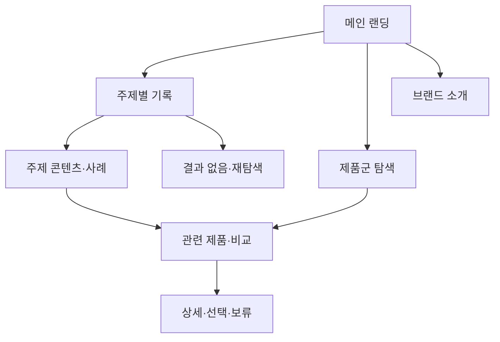

# VC-04 소담 — 사이트구조맵 A안 V2 상세본

## 1. Client 전체 분석

- Client: VC-04 소담 / 주제별 기록 탐색
- 목표: 기록 목적과 주제에 맞는 콘텐츠·제품을 빠르게 찾는다.
- 상황·과업: 주제를 선택하고 관련 기록 방식·제품을 비교한 뒤 선택·보류한다.
- 불편: 메뉴와 제품군의 이름이 모호하면 원하는 기록을 찾지 못한다.
- 판단 기준: 주제 명확성, 콘텐츠 근거, 제품군 구분, 재탐색 가능성
- 성공: 메인 → 주제 선택 → 관련 제품·콘텐츠 → 상세·비교 완료
- 실패: 중복 카테고리, 모호한 라벨, 끊긴 검색·복귀 경로
- 요구: REQ-004
- 연결 제품: PROD-010·011·012·040·041·042·073·074·075·076
- 대표 15개: 미실행

## 2. 요구 → 메뉴·콘텐츠·기능

| 요구·REQ | 메뉴 | 콘텐츠 | 기능 | 페이지 | 근거 |
|---|---|---|---|---|---|
| 주제별 탐색·REQ-004 | 주제별 기록 | 주제·기록 사례 | 주제 선택·검색 | 메인·카테고리 | Client V5 |
| 제품 비교·REQ-004 | 제품군 | 제품 특징·사용 상황 | 필터·비교·보류 | 목록·상세 | 제품 결과 V2 |
| 라벨 명확성·REQ-004 | 전역 메뉴 | 현재 위치·카테고리 설명 | 브레드크럼·복귀 | 공통 | 접근성·IA 검증 |

## 3. 구조안·사이트맵

- 전략: 주제 선택을 첫 진입점으로 둔 과업 직결형
- 1차: 메인 랜딩 / 주제별 기록 / 제품군 탐색 / 브랜드 소개 / 상세·비교
  - 메인: Hero / 주제 카드 / 제품 레일 / 브랜드 요약 / CTA
  - 주제별 기록: 일상 / 감정 / 일정 / 관계 / 프로젝트
    - 3차: 주제 콘텐츠 / 관련 제품 / 기록 예시 / 비교
  - 제품군: 주제별 제품 / 기록 방식 / 비교 기준 / 상세
  - 브랜드 소개: 방향 / 제작 과정 / 포트폴리오 / 제품 관계

## 4. 페이지·흐름·검증

| 페이지 | 목적 | 콘텐츠 | 기능 | 행동·연결 |
|---|---|---|---|---|
| 메인 | 주제 진입 | 주제 카드·제품 레일 | 앵커·탐색 | 주제·제품군 |
| 주제 허브 | 기록 맥락 제공 | 주제 설명·사례 | 주제 선택·검색 | 관련 제품·상세 |
| 제품군 | 후보 비교 | 제품군·특징 | 필터·비교·보류 | 상세·브랜드 |
| 상세 | 선택 근거 | 사용 상황·근거 | 비교·복귀 | 기록·목록 |
| 브랜드 | 신뢰 형성 | 방향·과정 | 앵커·관련 제품 | 제품군 |

- 정상: 메인 → 주제 → 제품군 → 상세 → 선택·보류
- 예외: 결과 없음 → 라벨·필터 초기화 → 전체 주제 복귀; 취소 → 이전 위치 복귀
- 상태: 비회원 탐색·비교·보류·복귀(일부 가정)
- 검증: Client 정보·REQ·제품·메뉴·콘텐츠·기능·1~3차 계층 반영

## 5. Mermaid

## 6. 추적

- 제품 원본: `../../03-제품콘텐츠-출력물/제품콘텐츠-도출결과-V2.md`
- 연결 제품: PROD-010·011·012·040·041·042·073·074·075·076
- 대표 15개 선정: 미실행
