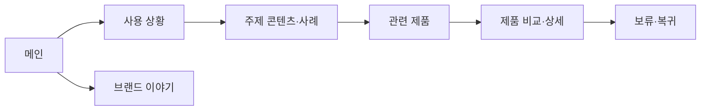

# VC-04 소담 — 사이트구조맵 B안 V2 상세본

## 1. Client 분석·구조 전략

- Client: VC-04 소담 / 주제별 기록 탐색
- 요구·REQ: 주제와 사례를 먼저 이해한 뒤 제품을 선택 / REQ-004
- 제품: PROD-010·011·012·040·041·042·073·074·075·076
- 전략: 콘텐츠·상황 선행형. 제품보다 주제와 사례를 먼저 보여준다.
- 목표·성공: 주제 사례 → 관련 제품 → 비교·보류까지 완료
- 실패: 주제와 제품 카테고리가 따로 놀거나 검색 결과가 끊김

## 2. 매핑표

| 요구 | 메뉴 | 콘텐츠 | 기능 | 연결 |
|---|---|---|---|---|
| 주제 이해·REQ-004 | 사용 상황 | 주제별 사례·기록 방식 | 사례 선택 | 관련 제품 |
| 탐색 지속·REQ-004 | 주제 검색 | 태그·분류 근거 | 검색·필터·초기화 | 목록·상세 |
| 비교 판단·REQ-004 | 관련 제품 | 특징·사용 상황 | 비교·보류·복귀 | 행동 |

## 3. 사이트맵·페이지

- 1차: 메인 / 사용 상황 / 주제 콘텐츠 / 제품 비교 / 브랜드 이야기
  - 사용 상황: 일상 / 감정 / 일정 / 관계 / 프로젝트
    - 3차: 사례 상세 / 관련 제품 / 기록 예시
  - 제품 비교: 제품군 / 비교 기준 / 상세 / 보류
  - 브랜드: 방향 / 제작 / 포트폴리오 / 제품 관계
  - 공통: 검색·브레드크럼·Footer

## 4. 페이지 상세·예외

| 페이지 | 목적 | 콘텐츠 | 기능 | 진입·이탈 |
|---|---|---|---|---|
| 메인 | 주제 공감 | Hero·주제 카드 | 앵커 | 주제·브랜드 |
| 사용 상황 | 맥락 이해 | 사례·태그 | 선택·검색 | 제품·콘텐츠 |
| 제품 비교 | 판단 지원 | 후보·근거 | 필터·비교 | 상세·보류 |
| 브랜드 | 신뢰 | 철학·과정 | 앵커 | 메인·제품 |

- 정상: 메인 → 상황 → 사례 → 관련 제품 → 비교
- 분기: 제품 직접 탐색 또는 콘텐츠 선행 탐색
- 예외: 결과 없음, 검색어 수정, 비교 취소, 이전 위치 복귀
- 상태: 탐색·검색·비교·보류(회원 상태는 가정)

## 5. Mermaid

## 6. 검증·추적

- 제품 원본: `../../03-제품콘텐츠-출력물/제품콘텐츠-도출결과-V2.md`
- 연결 REQ: REQ-004
- 대표 15개: 미실행
