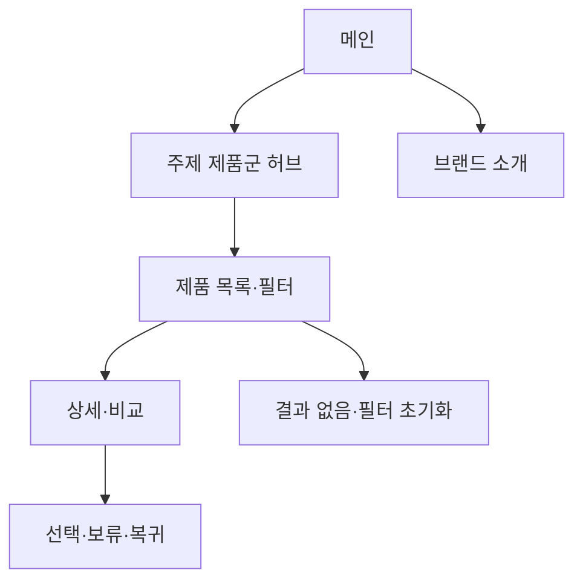

# VC-04 소담 — 사이트구조맵 C안 V3 상세본
+

## 10. 수정된 V5 입력 검증·V3 재생성

- 사이트구조맵 입력: `01-클라이언트생성-출력물/클라이언트-출력물-V5-사이트구조맵보강/VC-04-소담-주제별 기록 탐색-V5.md`
- Client·REQ 재확인: VC-04 ↔ REQ-004
- 실제 요구: 주제별 템플릿 구분, 속지·템플릿 미리보기, 표현 자산과 기능 템플릿 분리.
- 수용 조건: 이름과 미리보기만으로 용도를 이해하고 자신에게 맞지 않는 후보를 제외한다.
- 실패·차단 조건: 통합만을 장점으로 강요하거나 외부 연동·가격을 임의 추가한다.
- 제품 연결: PROD-010 — 독서·음악 기록 리필 묶음 / PROD-011 — 주제 인덱스 바인더 / PROD-012 — 기록 방식 비교 템플릿 / PROD-040 — 일과 변화 기록 템플릿 / PROD-041 — 음악 감상 장면 카드 / PROD-042 — 주제 전환 인덱스 리필 / PROD-073 — 영화 장면 기록 카드 / PROD-074 — 프로젝트 회고 템플릿 / PROD-075 — 주제별 빈 양식 팩 / PROD-076 — 주제 검색 인덱스 카드
- 대표 15개 선정: 미실행
- V1·V2 결과: 보존. 이 V3는 수정된 V5를 반영한 재생성본입니다.
- 검증: Client 요구·REQ·제품명·페이지 구조의 연결을 재확인한 후 다음 단계 입력으로 사용합니다.

## 1. Client 분석·구조 전략

- Client: VC-04 소담 / 주제별 기록 탐색
- 요구·REQ: 주제별 제품군 전체 방향을 빠르게 파악 / REQ-004
- 목표: 제품군 허브에서 주제·기능·콘텐츠 차이를 파악하고 상세로 이동
- 제품: PROD-010·011·012·040·041·042·073·074·075·076
- 전략: 제품군·포트폴리오 허브형
- 성공: 제품군 허브 → 필터·비교 → 상세·보류

## 2. 매핑표

| 요구 | 메뉴 | 콘텐츠 | 기능 | 연결 |
|---|---|---|---|---|
| 제품군 구분·REQ-004 | 주제 제품군 허브 | 주제·기록 방식 | 카테고리·필터 | 목록 |
| 선택 근거·REQ-004 | 제품 상세 | 특징·사용 장면·브랜드 근거 | 비교·보류 | 행동 |
| 재탐색·REQ-004 | 검색·브레드크럼 | 현재 위치·분류 설명 | 초기화·복귀 | 공통 |

## 3. 사이트맵·페이지

- 1차: 메인 / 주제 제품군 허브 / 제품 목록·필터 / 브랜드 소개 / 상세·비교
  - 메인: Hero / 제품군 레일 / 주제 미리보기 / 브랜드 요약 / CTA
  - 허브: 일상 / 감정 / 일정 / 관계 / 프로젝트
    - 3차: 제품 목록 / 상세 / 비교 / 관련 콘텐츠
  - 브랜드: 방향 / 제작 과정 / 포트폴리오 / 제품 관계

## 4. 페이지 상세·흐름

| 페이지 | 목적 | 콘텐츠 | 기능 | 사용자 행동 |
|---|---|---|---|---|
| 메인 | 전체 방향 | 주제 제품군·Hero | 스크롤·CTA | 허브 진입 |
| 허브 | 카테고리 이해 | 주제·기록 방식 | 선택·필터 | 목록 탐색 |
| 목록 | 후보 비교 | 카드·특징·근거 | 정렬·비교 | 상세 진입 |
| 상세 | 판단 완료 | 사용 상황·브랜드 콘텐츠 | 보류·복귀 | 선택·다음 행동 |

- 정상: 메인 → 허브 → 목록·필터 → 상세·비교
- 예외: 결과 없음·필터 초기화·비교 부족·취소·복귀
- 상태: 신규·탐색·비교·보류(일부 가정)

## 5. Mermaid

## 6. 검증·추적

- Client 기본 정보·REQ-004·제품 연결: 반영
- 메뉴·콘텐츠·기능·페이지 연결: 반영
- 제품 원본: `../../03-제품콘텐츠-출력물/제품콘텐츠-도출결과-V2.md`
- 대표 15개 선정: 미실행
## 구조 전략 (표준 보완)
- 기존 구조안·사이트맵과 매핑표를 표준 전략 섹션으로 매핑한다.

## 사용자 흐름·상태 (표준 보완)
- 기존 페이지 흐름·예외·상태 정보를 표준 사용자 흐름으로 통합한다.

## 중복·끊김·가정 검증 (표준 보완)
- 기존 검증·추적 내용을 중복·끊김·가정 검증으로 통합한다.

## 판정 (표준 보완)
- V3 구조·REQ·제품 연결 검증 결과를 유지한다.
## Client·REQ 추적 (표준 보완)
- 기존 Client·REQ 연결 내용을 표준 추적 섹션으로 정리한다.

## 구조 전략 (표준 보완)
- 기존 구조안·사이트맵과 매핑표를 표준 전략 섹션으로 정리한다.

## 페이지·콘텐츠·기능 계약 (표준 보완)
- 기존 페이지·상세 설계를 표준 기능 계약으로 정리한다.

## 사용자 흐름·상태 (표준 보완)
- 기존 페이지 흐름·예외·상태 정보를 표준 사용자 흐름으로 정리한다.

## 중복·끊김·가정 검증 (표준 보완)
- 기존 검증·추적 내용을 표준 검증 섹션으로 정리한다.

## Mermaid (표준 보완)
- 동일 폴더의 대응 MMD 파일을 흐름 원본으로 참조한다.

## 판정 (표준 보완)
- V3 구조·REQ·제품 연결 검증 결과를 유지한다.
