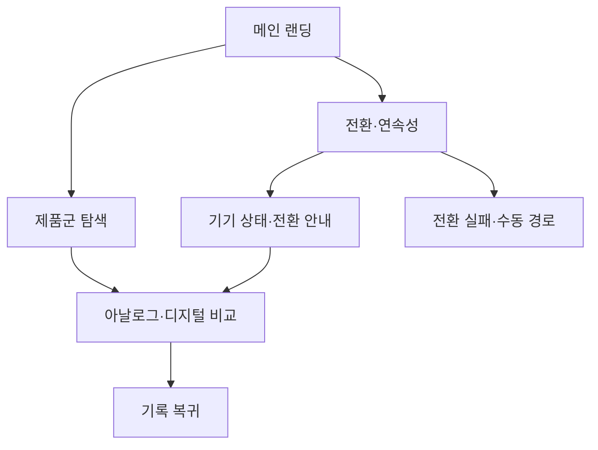

# VC-05 태오 — 사이트구조맵 A안 V2 상세본

## 1. Client 전체 분석

- Client: VC-05 태오 / 다기기 연속성 검증
- 목표: 기기와 기록 방식이 바뀌어도 작업 맥락을 잃지 않는다.
- 상황·과업: 기기 전환 상태를 확인하고 아날로그·디지털 기록의 연결 여부를 판단한다.
- 불편: 전환 시점·복귀 위치·동기화 상태가 불명확하면 기록을 중단한다.
- 판단 기준: 현재 상태, 전환 단계, 복귀 가능성, 정보의 정직성
- 성공: 메인 → 전환 안내 → 제품·콘텐츠 비교 → 기록 복귀
- 실패: 자동 전환만 강조하거나 상태·오류·대체 경로가 없음
- 요구: REQ-005
- 연결 제품: PROD-013·014·043·044·045·077·078
- 대표 15개: 미실행

## 2. 요구 → 메뉴·콘텐츠·기능

| 요구·REQ-005 | 메뉴 | 콘텐츠 | 기능 | 페이지 | 근거 |
|---|---|---|---|---|---|
| 기기 전환 상태 확인 | 전환·연속성 | 전환 단계·현재 상태 | 상태 확인·수동 전환 | 메인·상세 | Client V5 |
| 복귀 위치 유지 | 기록 도구 | 마지막 위치·변경 내역 | 복귀·중단·재시도 | 기록 도구 | 제품 결과 V2 |
| 대체 방식 판단 | 제품군 | 아날로그·디지털 특징 | 비교·보류 | 목록·상세 | Client 요구 |

## 3. 구조안·사이트맵

- 전략: 전환 과업 직결형
- 1차: 메인 랜딩 / 전환·연속성 / 제품군 탐색 / 브랜드 소개 / 기록 복귀
  - 메인: Hero / 전환 문제 / 상태 미리보기 / 제품 레일 / CTA
  - 전환·연속성: 기기 상태 / 전환 안내 / 아날로그·디지털 연결 / 오류 안내
    - 3차: 상태 상세 / 관련 제품 / 대체 경로 / 복귀 기록
  - 제품군: 전환형 제품 / 수동 방식 / 기록 보존 / 비교
  - 브랜드: 기록 자율성 / 제작 과정 / 포트폴리오 / 제품 관계

## 4. 페이지·흐름·검증

| 페이지 | 목적 | 콘텐츠 | 기능 | 행동·연결 |
|---|---|---|---|---|
| 메인 | 전환 문제 이해 | 상태·연속성 소개 | 앵커·CTA | 전환·제품군 |
| 전환 허브 | 현재 상태 확인 | 기기·단계·변경 | 상태 확인·수동 전환 | 상세·복귀 |
| 제품군 | 방식 비교 | 특징·전환 범위 | 필터·비교·보류 | 상세 |
| 상세 | 선택 근거 | 사용 상황·대체 경로 | 비교·복귀 | 기록 도구 |
| 복귀 | 중단 후 재개 | 마지막 위치·상태 | 재시도·복귀 | 완료 |

- 정상: 메인 → 전환 상태 → 제품 비교 → 기록 복귀
- 예외: 전환 실패 → 상태 설명·수동 경로; 동기화 결과 없음 → 재시도·이전 위치
- 상태: 탐색·전환 중·보류·복귀(일부 가정)

## 5. Mermaid

## 6. 추적

- 제품 원본: `../../03-제품콘텐츠-출력물/제품콘텐츠-도출결과-V2.md`
- Product ID: PROD-013·014·043·044·045·077·078
- 연결 REQ: REQ-005
