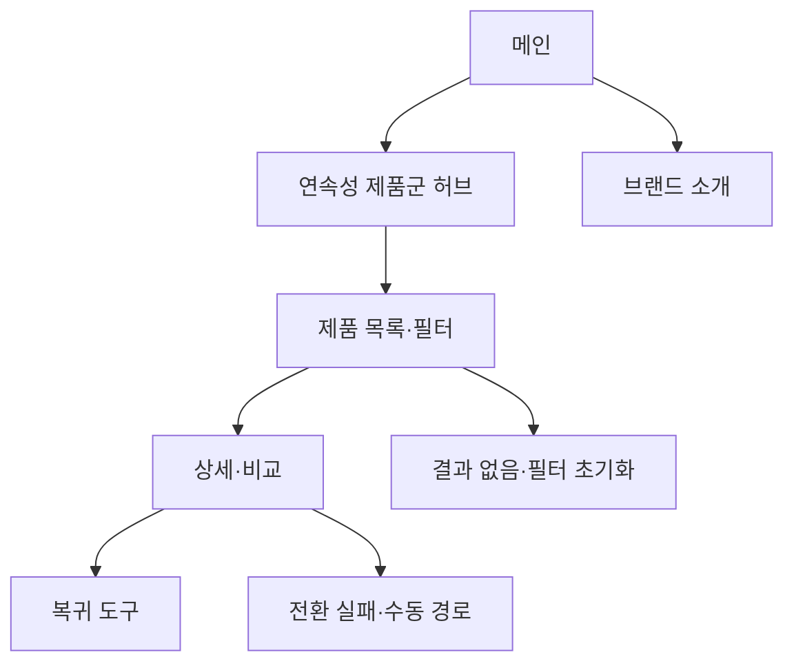

# VC-05 태오 — 사이트구조맵 C안 V2 상세본

## 1. Client 분석·구조 전략

- Client: VC-05 태오 / 다기기 연속성 검증
- 요구: 전환·보존 제품군의 전체 방향을 먼저 파악 / REQ-005
- 목표: 제품군 허브에서 자동·수동·보존 방식을 비교하고 복귀로 이동
- 제품: PROD-013·014·043·044·045·077·078
- 전략: 제품군·포트폴리오 허브형
- 성공: 허브 → 제품 목록·필터 → 상세·비교 → 복귀

## 2. 매핑표

| 요구 | 메뉴 | 콘텐츠 | 기능 | 연결 |
|---|---|---|---|---|
| 전환 제품군 구분·REQ-005 | 연속성 허브 | 자동·수동·보존 | 카테고리·필터 | 목록 |
| 선택 근거·REQ-005 | 제품 상세 | 전환 범위·상태 | 비교·보류 | 복귀 |
| 오류 대체·REQ-005 | 상태·도움말 | 오류·수동 경로 | 재시도·복귀 | 공통 |

## 3. 사이트맵·페이지

- 1차: 메인 / 연속성 제품군 허브 / 제품 목록·필터 / 브랜드 소개 / 복귀 도구
  - 메인: Hero / 연속성 레일 / 전환 장면 / 브랜드 요약 / CTA
  - 허브: 기기 전환 / 아날로그·디지털 / 수동 대체 / 기록 보존
    - 3차: 목록 / 상세 / 비교 / 상태·도움말
  - 브랜드: 방향 / 제작 과정 / 기록 자율성 / 포트폴리오

## 4. 페이지 상세·흐름

| 페이지 | 목적 | 콘텐츠 | 기능 | 행동 |
|---|---|---|---|---|
| 메인 | 전체 방향 | 연속성 제품군·Hero | 스크롤·CTA | 허브 진입 |
| 허브 | 방식 구분 | 자동·수동·보존 | 선택·필터 | 목록 |
| 목록 | 후보 비교 | 카드·상태·범위 | 정렬·비교 | 상세 |
| 상세 | 판단 완료 | 전환 단계·대체 경로 | 보류·복귀 | 기록 도구 |

- 정상: 메인 → 허브 → 목록·필터 → 상세·비교 → 복귀
- 예외: 결과 없음·필터 초기화·전환 실패·취소·복귀
- 상태: 신규·탐색·전환·보류·복귀(일부 가정)

## 5. Mermaid

## 6. 검증·추적

- Client 기본 정보·REQ-005·제품·페이지 연결: 반영
- 제품 원본: `../../03-제품콘텐츠-출력물/제품콘텐츠-도출결과-V2.md`
- 대표 15개 선정: 미실행
