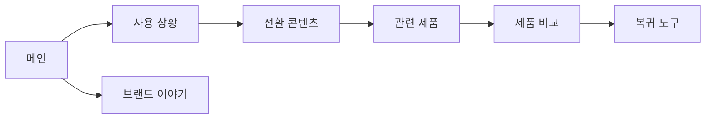

# VC-05 태오 — 사이트구조맵 B안 V3 상세본
+

## 10. 수정된 V5 입력 검증·V3 재생성

- 사이트구조맵 입력: `01-클라이언트생성-출력물/클라이언트-출력물-V5-사이트구조맵보강/VC-05-태오-다기기 연속성 검증-V5.md`
- Client·REQ 재확인: VC-05 ↔ REQ-005
- 실제 요구: 다기기 과업 연속성, 기기별 화면 적응, 동기화 상태, 충돌·오류·복구 계약.
- 수용 조건: 지원·미지원·미정 범위를 이해하고 입력을 잃지 않고 계속하거나 안전하게 보류한다.
- 실패·차단 조건: 외부 API·동기화 기술·기기 보유·가격을 사실처럼 확정한다.
- 제품 연결: PROD-013 — 기기 전환 상태 카드 / PROD-014 — Analog·Digital 브리지 폴더 / PROD-043 — 수동 전환 체크리스트 / PROD-044 — 내보내기 범위 비교 카드 / PROD-045 — 이어쓰기 위치 북마크 / PROD-077 — 기기 전환 확인표 / PROD-078 — 수동 백업 판단 카드
- 대표 15개 선정: 미실행
- V1·V2 결과: 보존. 이 V3는 수정된 V5를 반영한 재생성본입니다.
- 검증: Client 요구·REQ·제품명·페이지 구조의 연결을 재확인한 후 다음 단계 입력으로 사용합니다.

## 1. Client 분석·구조 전략

- Client: VC-05 태오 / 다기기 연속성 검증
- 요구: 기기 전환 사례와 상태를 먼저 이해하고 방식을 선택 / REQ-005
- 목표: 전환 전후의 기록 맥락과 복귀 방법을 확인
- 제품: PROD-013·014·043·044·045·077·078
- 전략: 사용 상황·전환 콘텐츠 선행형
- 성공: 전환 사례 → 관련 제품 → 수동·자동 방식 비교 → 복귀

## 2. 매핑표

| 요구 | 메뉴 | 콘텐츠 | 기능 | 연결 |
|---|---|---|---|---|
| 전환 이해·REQ-005 | 사용 상황 | 기기 변경 사례 | 사례 선택·상태 확인 | 관련 제품 |
| 오류 회피·REQ-005 | 전환 안내 | 실패·대체 경로 | 재시도·수동 전환 | 기록 도구 |
| 방식 선택·REQ-005 | 관련 제품 | 아날로그·디지털 특징 | 비교·보류 | 상세 |

## 3. 사이트맵·페이지

- 1차: 메인 / 사용 상황 / 전환 콘텐츠 / 제품 비교 / 브랜드 이야기 / 복귀 도구
  - 사용 상황: 기기 변경 / 기록 방식 전환 / 오프라인·온라인 / 다시 시작
    - 3차: 사례 상세 / 전환 상태 / 관련 제품 / 복귀 안내
  - 제품 비교: 전환형 / 수동형 / 보존형 / 기록 도구
  - 브랜드: 기록 철학 / 과정 / 제품군 관계

## 4. 페이지 상세·예외

| 페이지 | 목적 | 콘텐츠 | 기능 | 진입·이탈 |
|---|---|---|---|---|
| 메인 | 문제 공감 | 전환 사례·제품 레일 | 앵커 | 상황·제품 |
| 사용 상황 | 맥락 이해 | 기기 변경·전환 사례 | 선택·검색 | 상태·제품 |
| 전환 콘텐츠 | 상태 설명 | 단계·오류·대안 | 재시도·수동 전환 | 복귀 |
| 제품 비교 | 판단 지원 | 특징·범위 | 비교·보류 | 상세·도구 |

- 정상: 메인 → 상황 → 전환 콘텐츠 → 제품 비교 → 복귀
- 예외: 상태 불명 → 상세 근거·수동 조작; 취소 → 원래 위치
- 상태: 탐색·전환·오류·보류·복귀(가정 포함)

## 5. Mermaid

## 6. 검증·추적

- 제품 원본: `../../03-제품콘텐츠-출력물/제품콘텐츠-도출결과-V2.md`
- Product ID: PROD-013·014·043·044·045·077·078
- 대표 15개 선정: 미실행
## 구조 전략 (표준 보완)
- 기존 구조안·사이트맵과 매핑표를 표준 전략 섹션으로 매핑한다.

## 사용자 흐름·상태 (표준 보완)
- 기존 페이지 흐름·예외·상태 정보를 표준 사용자 흐름으로 통합한다.

## 중복·끊김·가정 검증 (표준 보완)
- 기존 검증·추적 내용을 중복·끊김·가정 검증으로 통합한다.

## 판정 (표준 보완)
- V3 구조·REQ·제품 연결 검증 결과를 유지한다.
## Client·REQ 추적 (표준 보완)
- 기존 Client·REQ 연결 내용을 표준 추적 섹션으로 정리한다.

## 구조 전략 (표준 보완)
- 기존 구조안·사이트맵과 매핑표를 표준 전략 섹션으로 정리한다.

## 페이지·콘텐츠·기능 계약 (표준 보완)
- 기존 페이지·상세 설계를 표준 기능 계약으로 정리한다.

## 사용자 흐름·상태 (표준 보완)
- 기존 페이지 흐름·예외·상태 정보를 표준 사용자 흐름으로 정리한다.

## 중복·끊김·가정 검증 (표준 보완)
- 기존 검증·추적 내용을 표준 검증 섹션으로 정리한다.

## Mermaid (표준 보완)
- 동일 폴더의 대응 MMD 파일을 흐름 원본으로 참조한다.

## 판정 (표준 보완)
- V3 구조·REQ·제품 연결 검증 결과를 유지한다.
