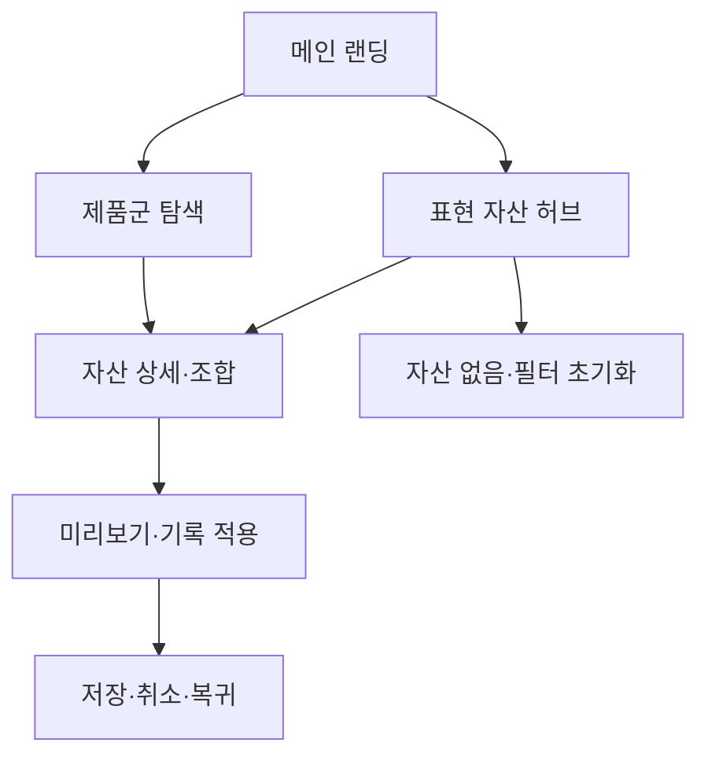

# VC-06 나린 — 사이트구조맵 A안 V2 상세본

## 1. Client 전체 분석

- Client: VC-06 나린 / 꾸미기 자산 재사용
- 목표: 기록을 꾸미되 매번 새로 고르지 않고 자산을 반복해서 활용한다.
- 상황·과업: 표현 자산을 탐색하고 조합·저장한 뒤 기록 화면에 재사용한다.
- 불편: 자산이 흩어져 있거나 재사용 경로가 없으면 꾸미기 자체를 포기한다.
- 판단 기준: 자산 찾기 쉬움, 조합 가능성, 재사용성, 원래 기록으로 복귀
- 성공: 메인 → 표현 자산 → 조합·미리보기 → 기록 적용
- 실패: 장식만 강조하고 저장·적용·취소 상태가 없음
- 요구: REQ-006
- 연결 제품: PROD-016·017·018·046·047·048·081·082·083·084
- 대표 15개: 미실행

## 2. 요구 → 메뉴·콘텐츠·기능

| 요구·REQ-006 | 메뉴 | 콘텐츠 | 기능 | 페이지 | 근거 |
|---|---|---|---|---|---|
| 자산 재사용 | 표현 자산 | 스티커·템플릿·프리셋 | 검색·저장·재사용 | 메인·자산 허브 | Client V5 |
| 조합 확인 | 꾸미기 도구 | 조합 예시·미리보기 | 배치·되돌리기·복제 | 상세·기록 | 제품 결과 V2 |
| 기록 복귀 | 기록 적용 | 적용 상태·변경 내역 | 적용·취소·복귀 | 기록 도구 | Client 요구 |

## 3. 구조안·사이트맵

- 전략: 표현 자산 과업 직결형
- 1차: 메인 랜딩 / 표현 자산 허브 / 제품군 탐색 / 브랜드 소개 / 기록 적용
  - 메인: Hero / 꾸미기 가치 / 자산 레일 / 제품·기록 CTA
  - 표현 자산: 템플릿 / 스티커 / 색·타이포 / 재사용 보관함
    - 3차: 자산 상세 / 조합 예시 / 관련 제품 / 기록 적용
  - 제품군: 꾸미기·기록 제품 / 자산 호환 / 비교
  - 브랜드: 표현 철학 / 제작 과정 / 포트폴리오 / 제품 관계

## 4. 페이지·흐름·검증

| 페이지 | 목적 | 콘텐츠 | 기능 | 행동·연결 |
|---|---|---|---|---|
| 메인 | 표현 가치 이해 | 자산 레일·사용 예시 | 앵커·CTA | 자산 허브 |
| 자산 허브 | 후보 탐색 | 자산군·태그·예시 | 검색·필터·저장 | 상세·조합 |
| 조합 상세 | 적용 전 판단 | 조합·호환 제품 | 미리보기·복제 | 기록 적용 |
| 기록 적용 | 행동 완료 | 적용 상태·변경 | 적용·취소·복귀 | 완료 |
| 브랜드 | 신뢰 형성 | 제작·표현 철학 | 앵커 | 자산·제품 |

- 정상: 메인 → 자산 허브 → 조합·미리보기 → 기록 적용
- 예외: 자산 없음 → 필터 초기화; 적용 실패 → 재시도·원래 기록 복귀
- 상태: 탐색·저장·조합·적용·취소(일부 가정)

## 5. Mermaid

## 6. 추적

- 제품 원본: `../../03-제품콘텐츠-출력물/제품콘텐츠-도출결과-V2.md`
- Product ID: PROD-016·017·018·046·047·048·081·082·083·084
- 연결 REQ: REQ-006
