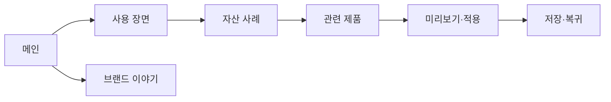

# VC-06 나린 — 사이트구조맵 B안 V3 상세본
+

## 10. 수정된 V5 입력 검증·V3 재생성

- 사이트구조맵 입력: `01-클라이언트생성-출력물/클라이언트-출력물-V5-사이트구조맵보강/VC-06-나린-꾸미기 자산 재사용-V5.md`
- Client·REQ 재확인: VC-06 ↔ REQ-006
- 실제 요구: 꾸민 메모 재사용, 직접 만든 요소의 조건부 저장, 원본·미리보기·적용 결과 분리.
- 수용 조건: 꾸미기 없이도 저장하고 필요할 때만 기존 자산을 적용·제거한다.
- 실패·차단 조건: 저작권·검색·분류 방식을 확정하거나 특정 미감을 일반화한다.
- 제품 연결: PROD-016 — 재사용 메모 스탬프 세트 / PROD-017 — 가독성 프레임 스티커 / PROD-018 — 테마 독립 표현 보관함 / PROD-046 — 선택형 여백 프레임 / PROD-047 — 직접 만든 라벨 보관 세트 / PROD-048 — 무장식 기본 기록 패키지 / PROD-081 — 무드 색상 선택표 / PROD-082 — 기록 프레임 기본팩 / PROD-083 — 자산 수정 이력 카드 / PROD-084 — 표현·기능 분리 라벨
- 대표 15개 선정: 미실행
- V1·V2 결과: 보존. 이 V3는 수정된 V5를 반영한 재생성본입니다.
- 검증: Client 요구·REQ·제품명·페이지 구조의 연결을 재확인한 후 다음 단계 입력으로 사용합니다.

## 1. Client 분석·구조 전략

- Client: VC-06 나린 / 꾸미기 자산 재사용
- 요구: 실제 사용 예시를 먼저 보고 자산을 골라 재사용 / REQ-006
- 목표: 조합 사례 → 자산 선택 → 기록 적용까지 부담을 줄인다.
- 제품: PROD-016·017·018·046·047·048·081·082·083·084
- 전략: 사용 장면·콘텐츠 선행형
- 성공: 사례 → 자산 상세 → 미리보기 → 적용

## 2. 매핑표

| 요구 | 메뉴 | 콘텐츠 | 기능 | 연결 |
|---|---|---|---|---|
| 조합 이해·REQ-006 | 사용 장면 | 꾸미기 사례·전후 | 사례 선택·관련 자산 | 자산 상세 |
| 재사용·REQ-006 | 내 자산 | 저장 자산·프리셋 | 저장·복제·검색 | 조합 도구 |
| 기록 적용·REQ-006 | 적용 도구 | 적용 상태·변경 | 적용·취소·복귀 | 기록 |

## 3. 사이트맵·페이지

- 1차: 메인 / 사용 장면 / 자산 사례 / 제품 비교 / 브랜드 이야기 / 적용 도구
  - 사용 장면: 기록 꾸미기 / 반복 사용 / 빠른 조합 / 자산 보관
    - 3차: 사례 상세 / 관련 자산 / 호환 제품 / 적용 안내
  - 제품 비교: 자산 호환·기록 방식·재사용성
  - 브랜드: 표현 철학 / 제작 / 포트폴리오

## 4. 페이지 상세·예외

| 페이지 | 목적 | 콘텐츠 | 기능 | 진입·이탈 |
|---|---|---|---|---|
| 메인 | 사용 장면 공감 | 조합 예시·자산 레일 | 앵커 | 사례·허브 |
| 사용 장면 | 맥락 이해 | 전후·반복 사용 | 선택·탐색 | 자산·제품 |
| 자산 사례 | 조합 판단 | 자산·호환 정보 | 저장·복제 | 적용 |
| 적용 도구 | 행동 완료 | 적용 상태 | 취소·복귀·재시도 | 기록 |

- 정상: 메인 → 사용 장면 → 자산 사례 → 적용
- 예외: 자산 없음·호환 불가·적용 실패·취소·복귀
- 상태: 탐색·저장·조합·적용·보류(가정 포함)

## 5. Mermaid

## 6. 검증·추적

- 제품 원본: `../../03-제품콘텐츠-출력물/제품콘텐츠-도출결과-V2.md`
- Product ID: PROD-016·017·018·046·047·048·081·082·083·084
- 대표 15개: 미실행
## 구조 전략 (표준 보완)
- 기존 구조안·사이트맵과 매핑표를 표준 전략 섹션으로 매핑한다.

## 사용자 흐름·상태 (표준 보완)
- 기존 페이지 흐름·예외·상태 정보를 표준 사용자 흐름으로 통합한다.

## 중복·끊김·가정 검증 (표준 보완)
- 기존 검증·추적 내용을 중복·끊김·가정 검증으로 통합한다.

## 판정 (표준 보완)
- V3 구조·REQ·제품 연결 검증 결과를 유지한다.
## Client·REQ 추적 (표준 보완)
- 기존 Client·REQ 연결 내용을 표준 추적 섹션으로 정리한다.

## 구조 전략 (표준 보완)
- 기존 구조안·사이트맵과 매핑표를 표준 전략 섹션으로 정리한다.

## 페이지·콘텐츠·기능 계약 (표준 보완)
- 기존 페이지·상세 설계를 표준 기능 계약으로 정리한다.

## 사용자 흐름·상태 (표준 보완)
- 기존 페이지 흐름·예외·상태 정보를 표준 사용자 흐름으로 정리한다.

## 중복·끊김·가정 검증 (표준 보완)
- 기존 검증·추적 내용을 표준 검증 섹션으로 정리한다.

## Mermaid (표준 보완)
- 동일 폴더의 대응 MMD 파일을 흐름 원본으로 참조한다.

## 판정 (표준 보완)
- V3 구조·REQ·제품 연결 검증 결과를 유지한다.
