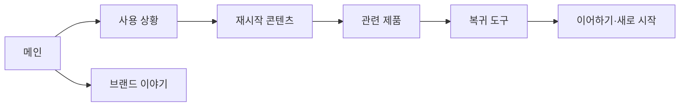

# VC-07 이준 — 사이트구조맵 B안 V2 상세본

## 1. Client 분석·구조 전략

- Client: VC-07 이준 / 중단 후 재시작
- 요구: 중단 상황과 다시 시작 사례를 먼저 이해 / REQ-007
- 목표: 중단 원인·복귀 방법·관련 제품을 확인한 뒤 재시작
- 제품: PROD-015·031·071
- 전략: 사용 상황·복귀 콘텐츠 선행형
- 성공: 중단 사례 → 진행 상태 → 관련 제품·도구 → 복귀

## 2. 매핑표

| 요구 | 메뉴 | 콘텐츠 | 기능 | 연결 |
|---|---|---|---|---|
| 중단 맥락 이해·REQ-007 | 사용 상황 | 중단·재시작 사례 | 사례 선택 | 진행 상태 |
| 복귀 경로·REQ-007 | 진행 안내 | 단계·마지막 위치 | 이어하기·재시도 | 기록 도구 |
| 재시작 선택·REQ-007 | 관련 제품 | 기록 방식·특징 | 비교·보류 | 상세 |

## 3. 사이트맵·페이지

- 1차: 메인 / 사용 상황 / 재시작 콘텐츠 / 관련 제품 / 브랜드 이야기 / 복귀 도구
  - 사용 상황: 중단 / 바쁜 일정 / 다시 시작 / 남은 단계
    - 3차: 사례 상세 / 진행 상태 / 관련 제품 / 복귀 안내
  - 관련 제품: 빠른 재시작 / 이어쓰기 / 상태 확인
  - 브랜드: 기록 철학 / 제작 / 포트폴리오

## 4. 페이지 상세·예외

| 페이지 | 목적 | 콘텐츠 | 기능 | 진입·이탈 |
|---|---|---|---|---|
| 메인 | 복귀 공감 | 중단·재시작 사례 | 앵커 | 상황·복귀 |
| 상황 | 맥락 이해 | 사례·단계 | 선택·검색 | 상태·제품 |
| 재시작 | 방법 안내 | 이어하기·초기화 | 재시도·선택 | 도구 |
| 관련 제품 | 판단 지원 | 후보·근거 | 비교·보류 | 상세·복귀 |

- 정상: 메인 → 상황 → 재시작 콘텐츠 → 관련 제품 → 복귀
- 예외: 진행 기록 없음, 상태 불명, 재시작 취소, 이전 위치 복귀
- 상태: 탐색·중단·복귀·보류(회원 상태는 가정)

## 5. Mermaid

## 6. 검증·추적

- 제품 원본: `../../03-제품콘텐츠-출력물/제품콘텐츠-도출결과-V2.md`
- Product ID: PROD-015·031·071
- 대표 15개: 미실행
