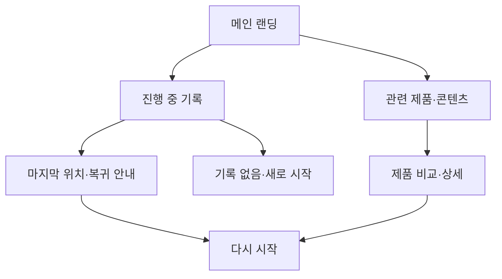

# VC-07 이준 — 사이트구조맵 A안 V3 상세본
+

## 10. 수정된 V5 입력 검증·V3 재생성

- 사이트구조맵 입력: `01-클라이언트생성-출력물/클라이언트-출력물-V5-사이트구조맵보강/VC-07-이준-중단 후 재시작-V5.md`
- Client·REQ 재확인: VC-07 ↔ REQ-007
- 실제 요구: 중단 비난 금지, 최소 기록, 공백 건너뛰기, 선택적 복귀, 구조 재선택.
- 수용 조건: 과거 공백을 복구하지 않고 지금 가능한 행동 하나를 완료한다.
- 실패·차단 조건: 복귀 효과·중단 기간·게임화 기능을 근거 없이 확정한다.
- 제품 연결: PROD-015 — 다시 시작 기록 세트 / PROD-031 — 주간 장문 회고 리필 / PROD-071 — 건너뛰기 회고 카드
- 대표 15개 선정: 미실행
- V1·V2 결과: 보존. 이 V3는 수정된 V5를 반영한 재생성본입니다.
- 검증: Client 요구·REQ·제품명·페이지 구조의 연결을 재확인한 후 다음 단계 입력으로 사용합니다.

## 1. Client 전체 분석

- Client: VC-07 이준 / 중단 후 재시작
- 목표: 중단한 기록을 부담 없이 다시 시작하고 이전 맥락을 회복한다.
- 상황·과업: 중단 지점을 확인하고 남은 작업·관련 제품·콘텐츠를 다시 선택한다.
- 불편: 이전 위치와 진행 상태가 보이지 않으면 처음부터 다시 해야 한다고 느낀다.
- 판단 기준: 진행 상태, 복귀 위치, 재시작 부담, 변경 내역
- 성공: 메인 → 진행 중 기록 → 복귀 안내 → 재시작 완료
- 실패: 중단 기록을 잃거나 복귀 경로가 숨겨짐
- 요구: REQ-007
- 연결 제품: PROD-015·031·071
- 대표 15개: 미실행

## 2. 요구 → 메뉴·콘텐츠·기능

| 요구·REQ-007 | 메뉴 | 콘텐츠 | 기능 | 페이지 | 근거 |
|---|---|---|---|---|---|
| 중단 기록 회복 | 진행 중 기록 | 마지막 위치·상태 | 복귀·재시작 | 메인·기록 도구 | Client V5 |
| 재시작 부담 완화 | 다시 시작 | 남은 단계·간단 안내 | 이어쓰기·초기화 | 기록 도구 | 제품 결과 V2 |
| 선택 보류 | 제품·콘텐츠 | 관련 후보·근거 | 보류·비교 | 상세·목록 | Client 요구 |

## 3. 구조안·사이트맵

- 전략: 복귀 과업 직결형
- 1차: 메인 랜딩 / 진행 중 기록 / 관련 제품·콘텐츠 / 브랜드 소개 / 다시 시작
  - 메인: 진행 상태 요약 / 다시 시작 CTA / 관련 제품 레일 / 브랜드 가치
  - 진행 중 기록: 마지막 위치 / 남은 단계 / 변경 내역 / 복귀 안내
    - 3차: 기록 상세 / 관련 제품 / 비교 / 재시작
  - 관련 제품: 사용 상황·기록 방식·비교
  - 브랜드: 기록 철학 / 제작 과정 / 포트폴리오

## 4. 페이지·흐름·검증

| 페이지 | 목적 | 콘텐츠 | 기능 | 행동·연결 |
|---|---|---|---|---|
| 메인 | 복귀 진입 | 진행 상태·CTA | 이어하기·탐색 | 기록·제품 |
| 진행 중 | 맥락 회복 | 마지막 위치·남은 단계 | 상태 확인·복귀 | 다시 시작 |
| 제품·콘텐츠 | 선택 지원 | 관련 후보·근거 | 비교·보류 | 상세·기록 |
| 다시 시작 | 행동 완료 | 시작 전 확인 | 이어쓰기·초기화 | 완료·복귀 |
| 브랜드 | 신뢰 | 기록 철학·과정 | 앵커 | 메인·제품 |

- 정상: 메인 → 진행 중 기록 → 복귀 안내 → 다시 시작
- 예외: 기록 없음 → 새로 시작·탐색; 상태 오류 → 마지막 저장점·재시도
- 상태: 신규·중단·복귀·진행·보류(일부 가정)

## 5. Mermaid

## 6. 추적

- 제품 원본: `../../03-제품콘텐츠-출력물/제품콘텐츠-도출결과-V2.md`
- Product ID: PROD-015·031·071
- 연결 REQ: REQ-007
## 구조 전략 (표준 보완)
- 기존 구조안·사이트맵과 매핑표를 표준 전략 섹션으로 매핑한다.

## 사용자 흐름·상태 (표준 보완)
- 기존 페이지 흐름·예외·상태 정보를 표준 사용자 흐름으로 통합한다.

## 중복·끊김·가정 검증 (표준 보완)
- 기존 검증·추적 내용을 중복·끊김·가정 검증으로 통합한다.

## 판정 (표준 보완)
- V3 구조·REQ·제품 연결 검증 결과를 유지한다.
## Client·REQ 추적 (표준 보완)
- 기존 Client·REQ 연결 내용을 표준 추적 섹션으로 정리한다.

## 구조 전략 (표준 보완)
- 기존 구조안·사이트맵과 매핑표를 표준 전략 섹션으로 정리한다.

## 페이지·콘텐츠·기능 계약 (표준 보완)
- 기존 페이지·상세 설계를 표준 기능 계약으로 정리한다.

## 사용자 흐름·상태 (표준 보완)
- 기존 페이지 흐름·예외·상태 정보를 표준 사용자 흐름으로 정리한다.

## 중복·끊김·가정 검증 (표준 보완)
- 기존 검증·추적 내용을 표준 검증 섹션으로 정리한다.

## Mermaid (표준 보완)
- 동일 폴더의 대응 MMD 파일을 흐름 원본으로 참조한다.

## 판정 (표준 보완)
- V3 구조·REQ·제품 연결 검증 결과를 유지한다.
