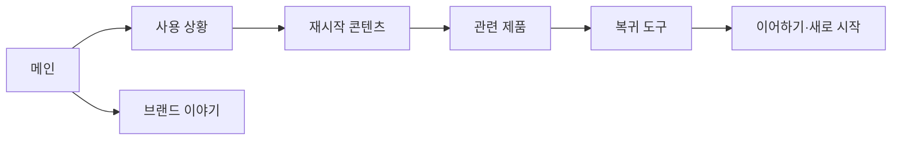

# VC-07 이준 — 사이트구조맵 B안 V3 상세본
+

## 10. 수정된 V5 입력 검증·V3 재생성

- 사이트구조맵 입력: `01-클라이언트생성-출력물/클라이언트-출력물-V5-사이트구조맵보강/VC-07-이준-중단 후 재시작-V5.md`
- Client·REQ 재확인: VC-07 ↔ REQ-007
- 실제 요구: 중단 비난 금지, 최소 기록, 공백 건너뛰기, 선택적 복귀, 구조 재선택.
- 수용 조건: 과거 공백을 복구하지 않고 지금 가능한 행동 하나를 완료한다.
- 실패·차단 조건: 복귀 효과·중단 기간·게임화 기능을 근거 없이 확정한다.
- 제품 연결: PROD-015 — 다시 시작 기록 세트 / PROD-031 — 주간 장문 회고 리필 / PROD-071 — 건너뛰기 회고 카드
- 대표 15개 선정: 미실행
- V1·V2 결과: 보존. 이 V3는 수정된 V5를 반영한 재생성본입니다.
- 검증: Client 요구·REQ·제품명·페이지 구조의 연결을 재확인한 후 다음 단계 입력으로 사용합니다.

## 1. Client 분석·구조 전략

- Client: VC-07 이준 / 중단 후 재시작
- 요구: 중단 상황과 다시 시작 사례를 먼저 이해 / REQ-007
- 목표: 중단 원인·복귀 방법·관련 제품을 확인한 뒤 재시작
- 제품: PROD-015·031·071
- 전략: 사용 상황·복귀 콘텐츠 선행형
- 성공: 중단 사례 → 진행 상태 → 관련 제품·도구 → 복귀

## 2. 매핑표

| 요구 | 메뉴 | 콘텐츠 | 기능 | 연결 |
|---|---|---|---|---|
| 중단 맥락 이해·REQ-007 | 사용 상황 | 중단·재시작 사례 | 사례 선택 | 진행 상태 |
| 복귀 경로·REQ-007 | 진행 안내 | 단계·마지막 위치 | 이어하기·재시도 | 기록 도구 |
| 재시작 선택·REQ-007 | 관련 제품 | 기록 방식·특징 | 비교·보류 | 상세 |

## 3. 사이트맵·페이지

- 1차: 메인 / 사용 상황 / 재시작 콘텐츠 / 관련 제품 / 브랜드 이야기 / 복귀 도구
  - 사용 상황: 중단 / 바쁜 일정 / 다시 시작 / 남은 단계
    - 3차: 사례 상세 / 진행 상태 / 관련 제품 / 복귀 안내
  - 관련 제품: 빠른 재시작 / 이어쓰기 / 상태 확인
  - 브랜드: 기록 철학 / 제작 / 포트폴리오

## 4. 페이지 상세·예외

| 페이지 | 목적 | 콘텐츠 | 기능 | 진입·이탈 |
|---|---|---|---|---|
| 메인 | 복귀 공감 | 중단·재시작 사례 | 앵커 | 상황·복귀 |
| 상황 | 맥락 이해 | 사례·단계 | 선택·검색 | 상태·제품 |
| 재시작 | 방법 안내 | 이어하기·초기화 | 재시도·선택 | 도구 |
| 관련 제품 | 판단 지원 | 후보·근거 | 비교·보류 | 상세·복귀 |

- 정상: 메인 → 상황 → 재시작 콘텐츠 → 관련 제품 → 복귀
- 예외: 진행 기록 없음, 상태 불명, 재시작 취소, 이전 위치 복귀
- 상태: 탐색·중단·복귀·보류(회원 상태는 가정)

## 5. Mermaid

## 6. 검증·추적

- 제품 원본: `../../03-제품콘텐츠-출력물/제품콘텐츠-도출결과-V2.md`
- Product ID: PROD-015·031·071
- 대표 15개: 미실행
## 구조 전략 (표준 보완)
- 기존 구조안·사이트맵과 매핑표를 표준 전략 섹션으로 매핑한다.

## 사용자 흐름·상태 (표준 보완)
- 기존 페이지 흐름·예외·상태 정보를 표준 사용자 흐름으로 통합한다.

## 중복·끊김·가정 검증 (표준 보완)
- 기존 검증·추적 내용을 중복·끊김·가정 검증으로 통합한다.

## 판정 (표준 보완)
- V3 구조·REQ·제품 연결 검증 결과를 유지한다.
## Client·REQ 추적 (표준 보완)
- 기존 Client·REQ 연결 내용을 표준 추적 섹션으로 정리한다.

## 구조 전략 (표준 보완)
- 기존 구조안·사이트맵과 매핑표를 표준 전략 섹션으로 정리한다.

## 페이지·콘텐츠·기능 계약 (표준 보완)
- 기존 페이지·상세 설계를 표준 기능 계약으로 정리한다.

## 사용자 흐름·상태 (표준 보완)
- 기존 페이지 흐름·예외·상태 정보를 표준 사용자 흐름으로 정리한다.

## 중복·끊김·가정 검증 (표준 보완)
- 기존 검증·추적 내용을 표준 검증 섹션으로 정리한다.

## Mermaid (표준 보완)
- 동일 폴더의 대응 MMD 파일을 흐름 원본으로 참조한다.

## 판정 (표준 보완)
- V3 구조·REQ·제품 연결 검증 결과를 유지한다.
