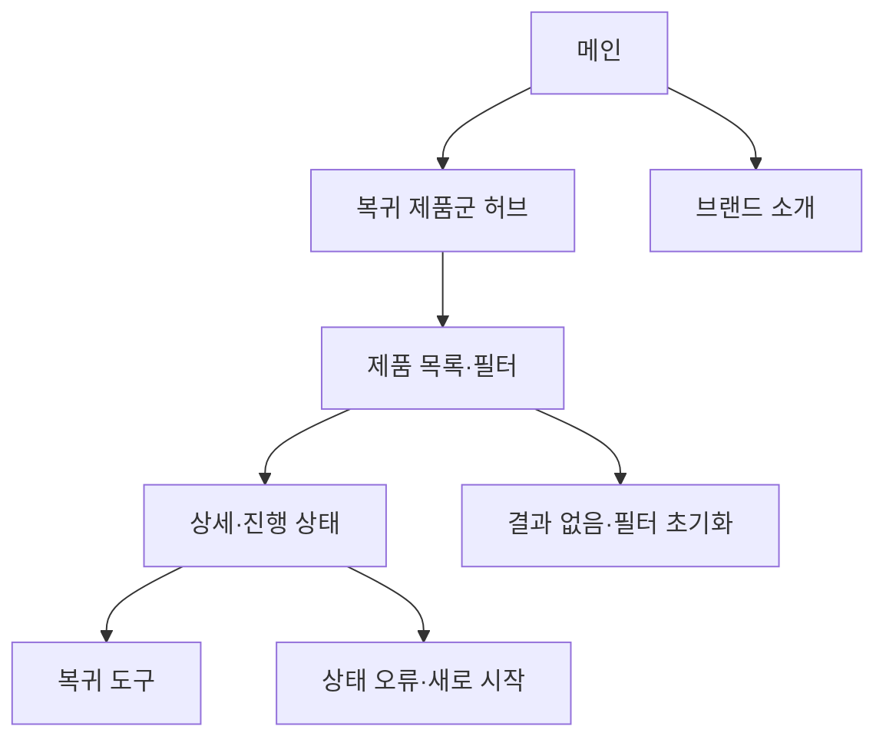

# VC-07 이준 — 사이트구조맵 C안 V3 상세본
+

## 10. 수정된 V5 입력 검증·V3 재생성

- 사이트구조맵 입력: `01-클라이언트생성-출력물/클라이언트-출력물-V5-사이트구조맵보강/VC-07-이준-중단 후 재시작-V5.md`
- Client·REQ 재확인: VC-07 ↔ REQ-007
- 실제 요구: 중단 비난 금지, 최소 기록, 공백 건너뛰기, 선택적 복귀, 구조 재선택.
- 수용 조건: 과거 공백을 복구하지 않고 지금 가능한 행동 하나를 완료한다.
- 실패·차단 조건: 복귀 효과·중단 기간·게임화 기능을 근거 없이 확정한다.
- 제품 연결: PROD-015 — 다시 시작 기록 세트 / PROD-031 — 주간 장문 회고 리필 / PROD-071 — 건너뛰기 회고 카드
- 대표 15개 선정: 미실행
- V1·V2 결과: 보존. 이 V3는 수정된 V5를 반영한 재생성본입니다.
- 검증: Client 요구·REQ·제품명·페이지 구조의 연결을 재확인한 후 다음 단계 입력으로 사용합니다.

## 1. Client 분석·구조 전략

- Client: VC-07 이준 / 중단 후 재시작
- 요구: 진행·복귀 제품군 전체 방향을 먼저 파악 / REQ-007
- 목표: 재시작 방식과 진행 상태 제품을 비교한 뒤 이어하기
- 제품: PROD-015·031·071
- 전략: 진행·복귀 제품군 허브형
- 성공: 허브 → 목록·상세 → 복귀 도구

## 2. 매핑표

| 요구 | 메뉴 | 콘텐츠 | 기능 | 연결 |
|---|---|---|---|---|
| 재시작 제품군·REQ-007 | 복귀 허브 | 이어쓰기·빠른 시작 | 카테고리·필터 | 목록 |
| 진행 상태·REQ-007 | 상태 상세 | 마지막 위치·단계 | 상태 확인·복귀 | 도구 |
| 선택 보류·REQ-007 | 제품 상세 | 사용 상황·근거 | 비교·보류 | 복귀 |

## 3. 사이트맵·페이지

- 1차: 메인 / 복귀 제품군 허브 / 제품 목록·필터 / 브랜드 소개 / 복귀 도구
  - 메인: 진행 상태 레일 / 재시작 장면 / 제품군 / 브랜드 요약 / CTA
  - 허브: 이어쓰기 / 빠른 시작 / 상태 확인 / 보류·복귀
    - 3차: 목록 / 상세 / 비교 / 진행 상태
  - 브랜드: 방향 / 제작 과정 / 기록 철학 / 포트폴리오

## 4. 페이지 상세·흐름

| 페이지 | 목적 | 콘텐츠 | 기능 | 행동 |
|---|---|---|---|---|
| 메인 | 전체 방향 | 진행·복귀 레일 | CTA | 허브 |
| 허브 | 방식 구분 | 이어쓰기·새 시작 | 선택·필터 | 목록 |
| 목록 | 후보 비교 | 카드·단계·근거 | 정렬·비교 | 상세 |
| 상세 | 복귀 판단 | 마지막 위치·방법 | 이어하기·보류 | 도구 |

- 정상: 메인 → 허브 → 목록·필터 → 상세·복귀
- 예외: 기록 없음·필터 초기화·상태 오류·취소·새로 시작
- 상태: 신규·중단·복귀·진행·보류(일부 가정)

## 5. Mermaid

## 6. 검증·추적

- Client 기본 정보·REQ-007·제품·페이지 연결: 반영
- 제품 원본: `../../03-제품콘텐츠-출력물/제품콘텐츠-도출결과-V2.md`
- 대표 15개 선정: 미실행
## 구조 전략 (표준 보완)
- 기존 구조안·사이트맵과 매핑표를 표준 전략 섹션으로 매핑한다.

## 사용자 흐름·상태 (표준 보완)
- 기존 페이지 흐름·예외·상태 정보를 표준 사용자 흐름으로 통합한다.

## 중복·끊김·가정 검증 (표준 보완)
- 기존 검증·추적 내용을 중복·끊김·가정 검증으로 통합한다.

## 판정 (표준 보완)
- V3 구조·REQ·제품 연결 검증 결과를 유지한다.
## Client·REQ 추적 (표준 보완)
- 기존 Client·REQ 연결 내용을 표준 추적 섹션으로 정리한다.

## 구조 전략 (표준 보완)
- 기존 구조안·사이트맵과 매핑표를 표준 전략 섹션으로 정리한다.

## 페이지·콘텐츠·기능 계약 (표준 보완)
- 기존 페이지·상세 설계를 표준 기능 계약으로 정리한다.

## 사용자 흐름·상태 (표준 보완)
- 기존 페이지 흐름·예외·상태 정보를 표준 사용자 흐름으로 정리한다.

## 중복·끊김·가정 검증 (표준 보완)
- 기존 검증·추적 내용을 표준 검증 섹션으로 정리한다.

## Mermaid (표준 보완)
- 동일 폴더의 대응 MMD 파일을 흐름 원본으로 참조한다.

## 판정 (표준 보완)
- V3 구조·REQ·제품 연결 검증 결과를 유지한다.
