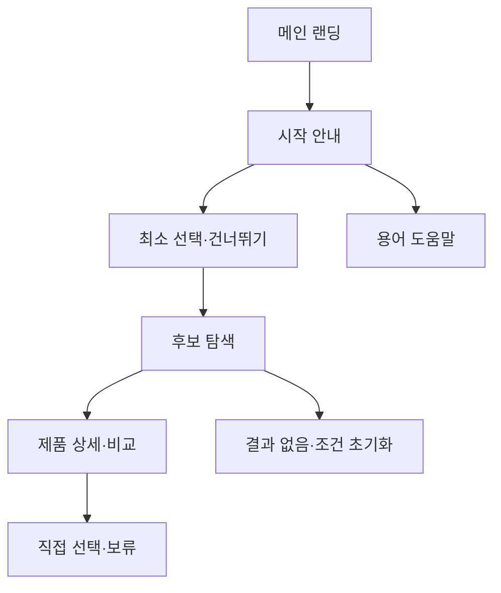

# VC-08 다온 — 사이트구조맵 A안 V3 상세본

## 1. Client 전체 분석·REQ 연결

- Client: VC-08 다온 / 첫 선택 부담
- 목표: 처음부터 많은 설정을 하지 않고 최소 정보로 적합한 후보를 확인한다.
- 상황·과업: 용어와 대표 상황을 확인하고 하나의 선택으로 시작한 뒤 필요하면 조건을 추가한다.
- 불편: 긴 필터·다단계 질문·강제 추천이 첫 행동을 막는다.
- 판단 기준: 선택권, 이해 가능한 용어, 건너뛰기, 수정 가능성
- 성공: 메인 → 간단한 시작 → 후보 확인 → 직접 선택·보류
- 실패: 성격 진단·필수 설정·복잡한 필터를 강제
- 요구: REQ-008
- 연결 제품: PROD-009·024·048·062·075·092
- 대표 15개: 미실행

## 2. 실제 요구 → 메뉴·콘텐츠·기능

| 요구·REQ-008 | 메뉴 | 콘텐츠 | 기능 | 연결 페이지 | 근거 |
|---|---|---|---|---|---|
| 용어 설명·대표 상황·건너뛰기 | 시작 안내 | 용어·대표 상황·간단 예시 | 건너뛰기·직접 선택 | 메인·카테고리 | 요구사항분석 V2 |
| 추천 초안 수정 | 후보 탐색 | 추천 이유·수정 가능한 조건 | 수정·초기화·보류 | 제품 목록·상세 | REQ-008 수용 조건 |
| 필수 설정 금지 | 기록 시작 | 최소 입력·다음 행동 | 선택·취소·복귀 | 행동 도구 | REQ-008 실패 조건 |

## 3. 구조안·계층형 사이트맵

- 전략: 최소 선택 직결형
- 1차: 메인 랜딩 / 시작 안내 / 후보 탐색 / 제품군 / 브랜드 소개
  - 메인: Hero / 쉬운 시작 설명 / 대표 상황 / 제품 레일 / CTA
  - 시작 안내: 용어 설명 / 대표 상황 / 건너뛰기 / 직접 선택
    - 3차: 후보 목록 / 추천 이유 / 조건 수정 / 제품 상세
  - 제품군: 기록 방식 / 초보 선택 / 선물·입문 / 비교
  - 브랜드: 방향 / 제작 과정 / 포트폴리오 / 제품 관계

## 4. 페이지 상세·사용자 흐름

| 페이지 | 목적 | 핵심 콘텐츠 | 기능 | 행동·연결 |
|---|---|---|---|---|
| 메인 | 부담 낮은 진입 | 짧은 설명·대표 상황 | 시작·건너뛰기 | 안내·제품 |
| 시작 안내 | 용어 이해 | 용어·예시·선택권 | 건너뛰기·직접 선택 | 후보 |
| 후보 탐색 | 적합 후보 확인 | 추천 초안·근거 | 수정·필터·보류 | 상세 |
| 제품 상세 | 선택 판단 | 사용 상황·차이 | 비교·복귀 | 선택·보류 |
| 브랜드 | 신뢰 | 방향·과정 | 앵커 | 메인·제품 |

- 정상: 메인 → 시작 안내 → 최소 선택 → 후보 → 상세·보류
- 분기: 건너뛰기 → 전체 후보; 추천 수정 → 조건 초기화·재탐색
- 예외: 결과 없음, 용어 이해 안 됨, 선택 취소, 복귀
- 상태: 신규·탐색·추천 수정·보류(일부 가정)

## 5. Mermaid

## 6. 제품·검증 추적

- 제품 원본: `../../03-제품콘텐츠-출력물/제품콘텐츠-도출결과-V2.md`
- Product ID: PROD-009·024·048·062·075·092
- 대표 15개: 미실행
## 구조 전략 (표준 보완)
기존 구조안·사이트맵과 매핑표를 표준 전략 섹션으로 매핑한다.

## 사용자 흐름·상태 (표준 보완)
기존 페이지 흐름·예외·상태 정보를 표준 사용자 흐름으로 통합한다.

## 중복·끊김·가정 검증 (표준 보완)
기존 검증·추적 내용을 중복·끊김·가정 검증으로 통합한다.

## 판정 (표준 보완)
V3 구조·REQ·제품 연결 검증 결과를 유지한다.

### 연결 제품 ID (개별 표기)
- PROD-009
- PROD-024
- PROD-048
- PROD-062
- PROD-075
- PROD-092
## Client·REQ 추적 (표준 보완)
- 기존 Client·REQ 연결 내용을 표준 추적 섹션으로 정리한다.

## 구조 전략 (표준 보완)
- 기존 구조안·사이트맵과 매핑표를 표준 전략 섹션으로 정리한다.

## 페이지·콘텐츠·기능 계약 (표준 보완)
- 기존 페이지·상세 설계를 표준 기능 계약으로 정리한다.

## 사용자 흐름·상태 (표준 보완)
- 기존 페이지 흐름·예외·상태 정보를 표준 사용자 흐름으로 정리한다.

## 중복·끊김·가정 검증 (표준 보완)
- 기존 검증·추적 내용을 표준 검증 섹션으로 정리한다.

## Mermaid (표준 보완)
- 동일 폴더의 대응 MMD 파일을 흐름 원본으로 참조한다.

## 판정 (표준 보완)
- V3 구조·REQ·제품 연결 검증 결과를 유지한다.
