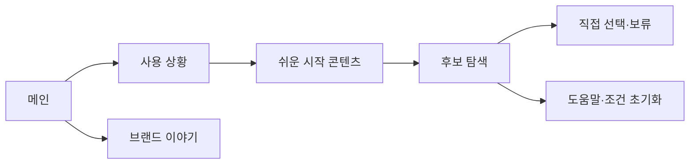

# VC-08 다온 — 사이트구조맵 B안 V3 상세본

## 1. Client 분석·구조 전략

- Client: VC-08 다온 / 첫 선택 부담
- 요구: 대표 상황과 쉬운 용어를 먼저 보고 선택 / REQ-008
- 목표: 사례 → 간단한 후보 → 직접 수정·보류
- 제품: PROD-009·024·048·062·075·092
- 전략: 상황·콘텐츠 선행형
- 성공: 첫 사례에서 다음 행동을 이해하고 필수 설정 없이 진행

## 2. 매핑표

| 요구 | 메뉴 | 콘텐츠 | 기능 | 연결 |
|---|---|---|---|---|
| 대표 상황 이해·REQ-008 | 사용 상황 | 초보 기록 사례 | 상황 선택·건너뛰기 | 후보 |
| 용어 부담 완화·REQ-008 | 도움말 | 용어·비교 기준 | 설명·닫기·복귀 | 공통 |
| 추천 수정·REQ-008 | 후보 목록 | 추천 초안·근거 | 조건 수정·초기화 | 상세 |

## 3. 사이트맵·페이지

- 1차: 메인 / 사용 상황 / 쉬운 시작 콘텐츠 / 후보 탐색 / 브랜드 이야기
  - 사용 상황: 처음 기록 / 짧은 기록 / 사진·한 줄 / 선물·입문
    - 3차: 사례 상세 / 관련 제품 / 용어 도움말
  - 후보 탐색: 추천 초안 / 직접 선택 / 비교 / 보류
  - 브랜드: 방향 / 제작 / 포트폴리오

## 4. 페이지 상세·예외

| 페이지 | 목적 | 콘텐츠 | 기능 | 진입·이탈 |
|---|---|---|---|---|
| 메인 | 첫 부담 낮춤 | 사례·짧은 CTA | 시작·건너뛰기 | 상황·후보 |
| 사용 상황 | 맥락 제공 | 초보 사례·용어 | 선택·도움말 | 후보 |
| 후보 | 판단 지원 | 추천·근거 | 수정·비교·보류 | 상세 |
| 브랜드 | 신뢰 | 방향·과정 | 앵커 | 메인·제품 |

- 정상: 메인 → 상황 → 쉬운 시작 → 후보 → 직접 선택
- 예외: 결과 없음·추천 해제·용어 도움말·취소·복귀
- 상태: 탐색·최소 입력·추천 수정·보류(가정 포함)

## 5. Mermaid

## 6. 검증·추적

- 제품 원본: `../../03-제품콘텐츠-출력물/제품콘텐츠-도출결과-V2.md`
- Product ID: PROD-009·024·048·062·075·092
- 대표 15개: 미실행
## 구조 전략 (표준 보완)
기존 구조안·사이트맵과 매핑표를 표준 전략 섹션으로 매핑한다.

## 사용자 흐름·상태 (표준 보완)
기존 페이지 흐름·예외·상태 정보를 표준 사용자 흐름으로 통합한다.

## 중복·끊김·가정 검증 (표준 보완)
기존 검증·추적 내용을 중복·끊김·가정 검증으로 통합한다.

## 판정 (표준 보완)
V3 구조·REQ·제품 연결 검증 결과를 유지한다.

### 연결 제품 ID (개별 표기)
- PROD-009
- PROD-024
- PROD-048
- PROD-062
- PROD-075
- PROD-092
## Client·REQ 추적 (표준 보완)
- 기존 Client·REQ 연결 내용을 표준 추적 섹션으로 정리한다.

## 구조 전략 (표준 보완)
- 기존 구조안·사이트맵과 매핑표를 표준 전략 섹션으로 정리한다.

## 페이지·콘텐츠·기능 계약 (표준 보완)
- 기존 페이지·상세 설계를 표준 기능 계약으로 정리한다.

## 사용자 흐름·상태 (표준 보완)
- 기존 페이지 흐름·예외·상태 정보를 표준 사용자 흐름으로 정리한다.

## 중복·끊김·가정 검증 (표준 보완)
- 기존 검증·추적 내용을 표준 검증 섹션으로 정리한다.

## Mermaid (표준 보완)
- 동일 폴더의 대응 MMD 파일을 흐름 원본으로 참조한다.

## 판정 (표준 보완)
- V3 구조·REQ·제품 연결 검증 결과를 유지한다.
