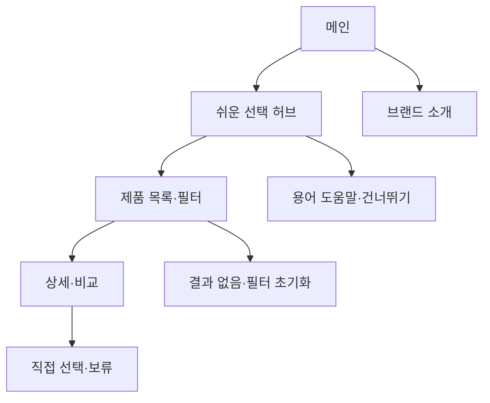

# VC-08 다온 — 사이트구조맵 C안 V3 상세본

## 1. Client 분석·구조 전략

- Client: VC-08 다온 / 첫 선택 부담
- 요구: 초보자용 제품군과 선택권 전체 방향을 먼저 파악 / REQ-008
- 목표: 제품군 허브에서 간단한·선택형·입문 후보를 비교한다.
- 제품: PROD-009·024·048·062·075·092
- 전략: 초보 선택·제품군 허브형
- 성공: 허브 → 필터·비교 → 상세 → 직접 선택·보류

## 2. 매핑표

| 요구 | 메뉴 | 콘텐츠 | 기능 | 연결 |
|---|---|---|---|---|
| 초보 제품군·REQ-008 | 쉬운 선택 허브 | 입문·최소 기록·선물 | 카테고리·필터 | 목록 |
| 선택권·REQ-008 | 제품 상세 | 추천 이유·수정 범위 | 비교·조건 수정 | 보류 |
| 필수 설정 금지·REQ-008 | 시작 도구 | 최소 입력·건너뛰기 | 직접 선택·복귀 | 공통 |

## 3. 사이트맵·페이지

- 1차: 메인 / 쉬운 선택 허브 / 제품 목록·필터 / 브랜드 소개 / 시작 도구
  - 메인: Hero / 초보 선택 레일 / 대표 상황 / 브랜드 요약 / CTA
  - 허브: 최소 기록 / 입문 제품 / 선택형 추천 / 선물·보류
    - 3차: 목록 / 상세 / 비교 / 용어 도움말
  - 브랜드: 방향 / 제작 / 포트폴리오 / 제품 관계

## 4. 페이지 상세·흐름

| 페이지 | 목적 | 콘텐츠 | 기능 | 행동 |
|---|---|---|---|---|
| 메인 | 선택권 안내 | 초보 제품군·사례 | CTA·건너뛰기 | 허브 |
| 허브 | 후보 구분 | 입문·최소 기록 | 필터·선택 | 목록 |
| 목록 | 비교 | 카드·추천 근거 | 정렬·비교 | 상세 |
| 상세 | 최종 판단 | 사용 상황·조건 | 수정·보류·복귀 | 시작 |

- 정상: 메인 → 허브 → 목록·필터 → 상세·비교 → 직접 선택
- 예외: 결과 없음·필터 초기화·용어 도움말·취소·복귀
- 상태: 신규·탐색·추천 수정·보류(일부 가정)

## 5. Mermaid

## 6. 검증·추적

- Client 기본 정보·REQ-008·제품·페이지 연결: 반영
- 제품 원본: `../../03-제품콘텐츠-출력물/제품콘텐츠-도출결과-V2.md`
- 대표 15개: 미실행
## 구조 전략 (표준 보완)
기존 구조안·사이트맵과 매핑표를 표준 전략 섹션으로 매핑한다.

## 사용자 흐름·상태 (표준 보완)
기존 페이지 흐름·예외·상태 정보를 표준 사용자 흐름으로 통합한다.

## 중복·끊김·가정 검증 (표준 보완)
기존 검증·추적 내용을 중복·끊김·가정 검증으로 통합한다.

## 판정 (표준 보완)
V3 구조·REQ·제품 연결 검증 결과를 유지한다.

### 연결 제품 ID (개별 표기)
- PROD-009
- PROD-024
- PROD-048
- PROD-062
- PROD-075
- PROD-092
## Client·REQ 추적 (표준 보완)
- 기존 Client·REQ 연결 내용을 표준 추적 섹션으로 정리한다.

## 구조 전략 (표준 보완)
- 기존 구조안·사이트맵과 매핑표를 표준 전략 섹션으로 정리한다.

## 페이지·콘텐츠·기능 계약 (표준 보완)
- 기존 페이지·상세 설계를 표준 기능 계약으로 정리한다.

## 사용자 흐름·상태 (표준 보완)
- 기존 페이지 흐름·예외·상태 정보를 표준 사용자 흐름으로 정리한다.

## 중복·끊김·가정 검증 (표준 보완)
- 기존 검증·추적 내용을 표준 검증 섹션으로 정리한다.

## Mermaid (표준 보완)
- 동일 폴더의 대응 MMD 파일을 흐름 원본으로 참조한다.

## 판정 (표준 보완)
- V3 구조·REQ·제품 연결 검증 결과를 유지한다.
