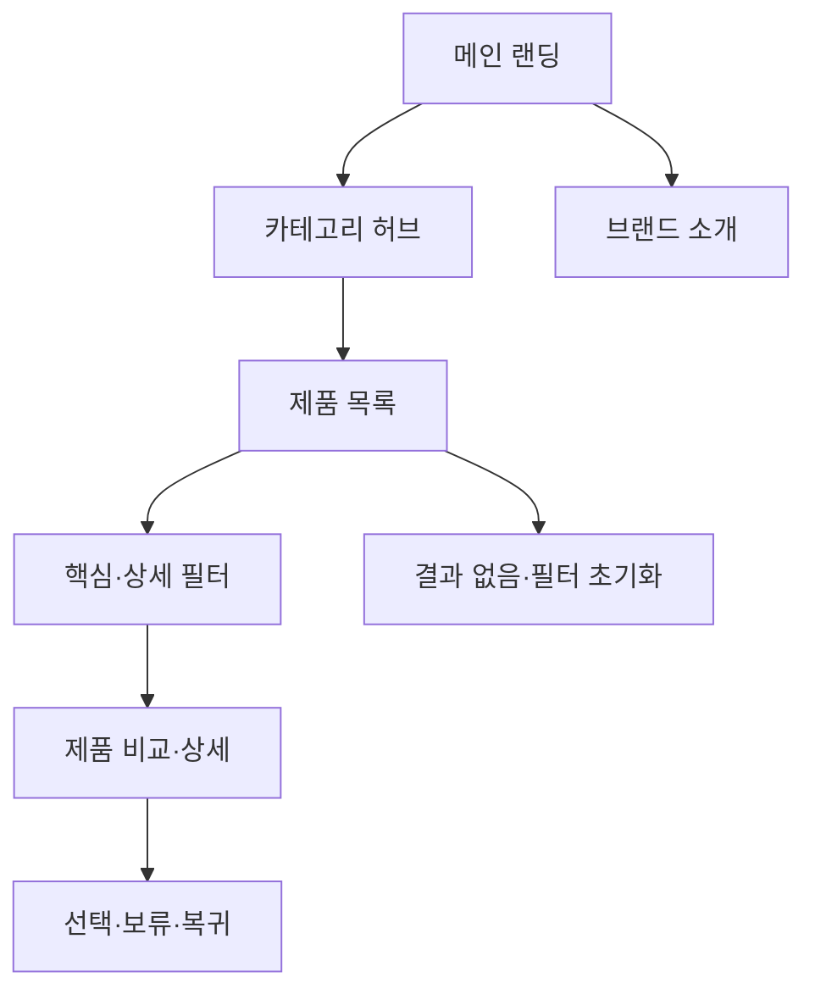

# VC-09 윤슬 — 사이트구조맵 A안 V3 상세본

## 1. Client 전체 분석·REQ 연결

- Client: VC-09 윤슬 / 카테고리·제품 비교
- 목표: 명확한 카테고리와 비교 기준으로 후보를 좁힌다.
- 상황·과업: 카테고리 경계를 이해하고 핵심·상세 필터로 제품을 비교·보류한다.
- 불편: 판매량·베스트 배지가 적합성을 대신하거나 결과가 끊긴다.
- 판단 기준: 카테고리 명확성, 비교 가능성, 필터 부담, Empty 복구
- 성공: 메인 → 카테고리 → 핵심 필터 → 비교 → 선택·보류
- 실패: 가격·판매 순위 중심 추천, 긴 필터, 복구 불가
- 요구: REQ-009
- 연결 제품: PROD-004·012·030·034·065
- 대표 15개: 미실행

## 2. 실제 요구 → 메뉴·콘텐츠·기능

| 요구·REQ-009 | 메뉴 | 콘텐츠 | 기능 | 연결 페이지 | 근거 |
|---|---|---|---|---|---|
| 명확한 카테고리 | 카테고리 허브 | 제품군 정의·경계 | 카테고리 선택·브레드크럼 | 메인·카테고리 | 요구사항분석 V2 |
| 핵심·상세 필터 분리 | 제품 목록 | 핵심 조건·상세 조건 | 필터·초기화·결과 없음 | 목록 | REQ-009 수용 조건 |
| 비교 기준 | 제품 비교 | 특징·사용 상황·근거 | 비교·보류·복귀 | 상세 | 제품 결과 V2 |

## 3. 구조안·계층형 사이트맵

- 전략: 카테고리 직결형
- 1차: 메인 랜딩 / 카테고리 허브 / 제품 목록·필터 / 제품 비교 / 브랜드 소개
  - 메인: Hero / 카테고리 미리보기 / 제품 레일 / 브랜드 요약 / CTA
  - 카테고리: 기록 방식 / 상황 / 기능 / 비교 기준
    - 3차: 제품 목록 / 핵심 필터 / 상세 필터 / 결과 없음·복구
  - 비교: 제품 상세 / 비교표 / 보류 / 원래 목록 복귀
  - 브랜드: 방향 / 제작 과정 / 포트폴리오 / 제품 관계

## 4. 페이지·흐름·검증

| 페이지 | 목적 | 핵심 콘텐츠 | 기능 | 행동·연결 |
|---|---|---|---|---|
| 메인 | 전체 방향 | 카테고리·제품 레일 | 앵커·CTA | 허브 |
| 카테고리 | 경계 이해 | 정의·대표 제품군 | 선택·브레드크럼 | 목록 |
| 목록 | 후보 좁히기 | 카드·조건·근거 | 핵심·상세 필터 | 비교 |
| 비교 | 판단 지원 | 차이·사용 상황 | 비교·보류 | 상세·복귀 |
| 브랜드 | 신뢰 | 방향·과정 | 앵커 | 제품 |

- 정상: 메인 → 카테고리 → 핵심 필터 → 목록 → 비교·보류
- 분기: 필터 없이 전체 보기; 상세 필터 추가; 카테고리 전환
- 예외: 결과 없음 → 초기화·상위 카테고리; 비교 취소 → 목록 복귀
- 상태: 탐색·필터·비교·보류(일부 가정)

## 5. Mermaid

## 6. 제품·검증 추적

- 제품 원본: `../../03-제품콘텐츠-출력물/제품콘텐츠-도출결과-V2.md`
- Product ID: PROD-004·012·030·034·065
- 대표 15개: 미실행
## 구조 전략 (표준 보완)
기존 구조안·사이트맵과 매핑표를 표준 전략 섹션으로 매핑한다.

## 사용자 흐름·상태 (표준 보완)
기존 페이지 흐름·예외·상태 정보를 표준 사용자 흐름으로 통합한다.

## 중복·끊김·가정 검증 (표준 보완)
기존 검증·추적 내용을 중복·끊김·가정 검증으로 통합한다.

## 판정 (표준 보완)
V3 구조·REQ·제품 연결 검증 결과를 유지한다.

### 연결 제품 ID (개별 표기)
- PROD-012
- PROD-030
- PROD-034
- PROD-065
## Client·REQ 추적 (표준 보완)
- 기존 Client·REQ 연결 내용을 표준 추적 섹션으로 정리한다.

## 구조 전략 (표준 보완)
- 기존 구조안·사이트맵과 매핑표를 표준 전략 섹션으로 정리한다.

## 페이지·콘텐츠·기능 계약 (표준 보완)
- 기존 페이지·상세 설계를 표준 기능 계약으로 정리한다.

## 사용자 흐름·상태 (표준 보완)
- 기존 페이지 흐름·예외·상태 정보를 표준 사용자 흐름으로 정리한다.

## 중복·끊김·가정 검증 (표준 보완)
- 기존 검증·추적 내용을 표준 검증 섹션으로 정리한다.

## Mermaid (표준 보완)
- 동일 폴더의 대응 MMD 파일을 흐름 원본으로 참조한다.

## 판정 (표준 보완)
- V3 구조·REQ·제품 연결 검증 결과를 유지한다.
