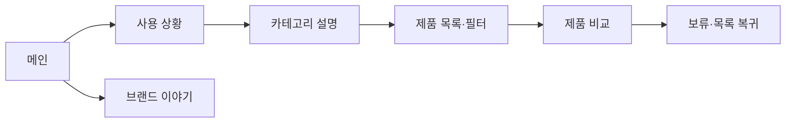

# VC-09 윤슬 — 사이트구조맵 B안 V3 상세본

## 1. Client 분석·구조 전략

- Client: VC-09 윤슬 / 카테고리·제품 비교
- 요구: 사용 상황과 비교 기준을 먼저 이해 / REQ-009
- 목표: 상황 콘텐츠 → 카테고리 경계 → 관련 제품 비교
- 제품: PROD-004·012·030·034·065
- 전략: 상황·비교 콘텐츠 선행형
- 성공: 사례에서 카테고리와 다음 필터를 이해

## 2. 매핑표

| 요구 | 메뉴 | 콘텐츠 | 기능 | 연결 |
|---|---|---|---|---|
| 카테고리 이해·REQ-009 | 사용 상황 | 일정·기록 상황 사례 | 상황 선택·관련 제품 | 카테고리 |
| 비교 기준·REQ-009 | 비교 가이드 | 특징·범위·근거 | 비교·보류 | 상세 |
| 결과 복구·REQ-009 | 탐색 결과 | Empty 원인·대안 | 초기화·상위 이동 | 목록 |

## 3. 사이트맵·페이지

- 1차: 메인 / 사용 상황 / 카테고리 설명 / 제품 비교 / 브랜드 이야기
  - 사용 상황: 일정 / 기록 / 회고 / 전환
    - 3차: 사례 상세 / 관련 카테고리 / 제품 목록
  - 카테고리 설명: 이름·경계 / 핵심 조건 / 상세 조건 / 비교 기준
  - 제품 비교: 후보·근거 / 비교표 / 보류 / 복귀
  - 브랜드: 방향 / 제작 / 포트폴리오

## 4. 페이지 상세·예외

| 페이지 | 목적 | 콘텐츠 | 기능 | 진입·이탈 |
|---|---|---|---|---|
| 메인 | 탐색 진입 | 상황·카테고리 | 앵커 | 상황·허브 |
| 상황 | 맥락 이해 | 사례·목적 | 선택·검색 | 카테고리 |
| 카테고리 | 경계 설명 | 정의·조건 | 필터·브레드크럼 | 목록 |
| 비교 | 선택 지원 | 차이·근거 | 비교·보류 | 상세·목록 |

- 정상: 메인 → 상황 → 카테고리 → 비교
- 예외: 결과 없음·상위 이동·필터 초기화·비교 취소
- 상태: 탐색·조건 선택·비교·보류(가정 포함)

## 5. Mermaid

## 6. 검증·추적

- 제품 원본: `../../03-제품콘텐츠-출력물/제품콘텐츠-도출결과-V2.md`
- Product ID: PROD-004·012·030·034·065
- 대표 15개: 미실행
## 구조 전략 (표준 보완)
기존 구조안·사이트맵과 매핑표를 표준 전략 섹션으로 매핑한다.

## 사용자 흐름·상태 (표준 보완)
기존 페이지 흐름·예외·상태 정보를 표준 사용자 흐름으로 통합한다.

## 중복·끊김·가정 검증 (표준 보완)
기존 검증·추적 내용을 중복·끊김·가정 검증으로 통합한다.

## 판정 (표준 보완)
V3 구조·REQ·제품 연결 검증 결과를 유지한다.

### 연결 제품 ID (개별 표기)
- PROD-012
- PROD-030
- PROD-034
- PROD-065
## Client·REQ 추적 (표준 보완)
- 기존 Client·REQ 연결 내용을 표준 추적 섹션으로 정리한다.

## 구조 전략 (표준 보완)
- 기존 구조안·사이트맵과 매핑표를 표준 전략 섹션으로 정리한다.

## 페이지·콘텐츠·기능 계약 (표준 보완)
- 기존 페이지·상세 설계를 표준 기능 계약으로 정리한다.

## 사용자 흐름·상태 (표준 보완)
- 기존 페이지 흐름·예외·상태 정보를 표준 사용자 흐름으로 정리한다.

## 중복·끊김·가정 검증 (표준 보완)
- 기존 검증·추적 내용을 표준 검증 섹션으로 정리한다.

## Mermaid (표준 보완)
- 동일 폴더의 대응 MMD 파일을 흐름 원본으로 참조한다.

## 판정 (표준 보완)
- V3 구조·REQ·제품 연결 검증 결과를 유지한다.
