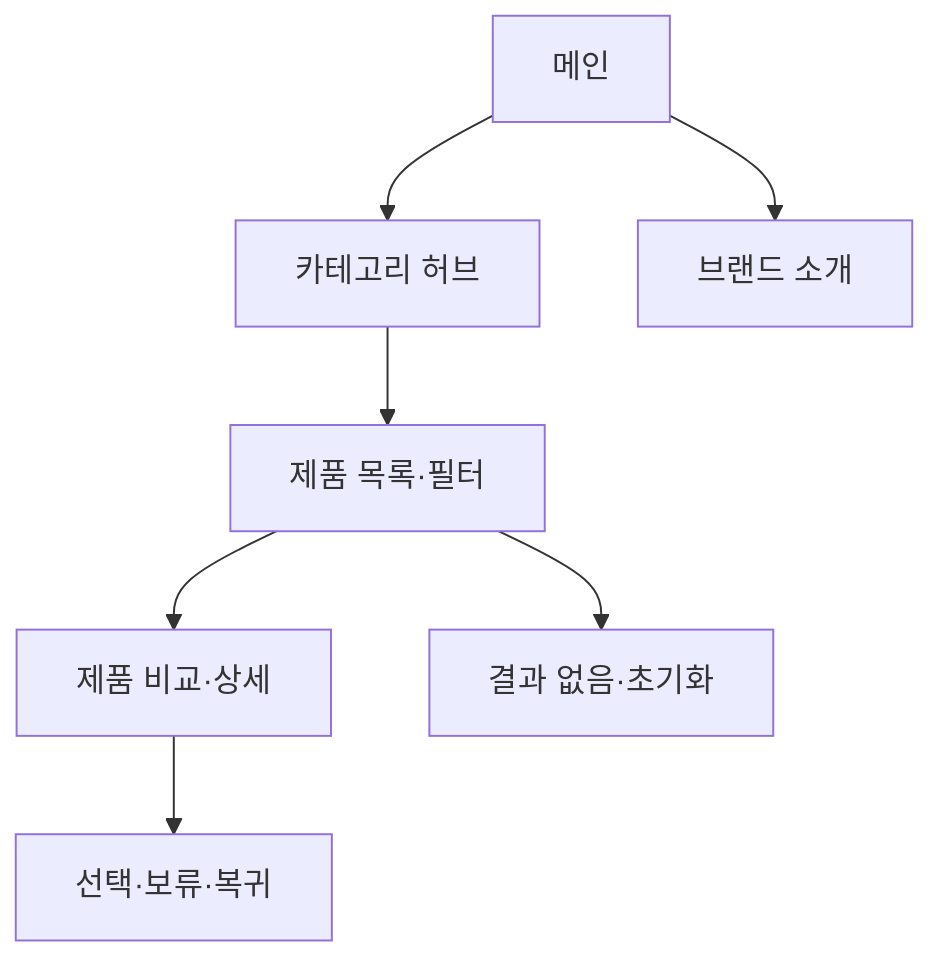

# VC-09 윤슬 — 사이트구조맵 C안 V3 상세본

## 1. Client 분석·구조 전략

- Client: VC-09 윤슬 / 카테고리·제품 비교
- 요구: 전체 카테고리 경계와 제품군을 먼저 파악 / REQ-009
- 목표: 카테고리 허브 → 목록·필터 → 비교·복귀
- 제품: PROD-004·012·030·034·065
- 전략: 카테고리·제품군 허브형
- 성공: 제품군 소속과 비교 이유를 설명

## 2. 매핑표

| 요구 | 메뉴 | 콘텐츠 | 기능 | 연결 |
|---|---|---|---|---|
| 전체 구조·REQ-009 | 카테고리 허브 | 제품군·경계 설명 | 카테고리 전환 | 목록 |
| 필터 부담 관리·REQ-009 | 목록 | 핵심·상세 조건 | 단계적 필터·초기화 | 비교 |
| 판매 순위 비의존·REQ-009 | 비교 상세 | 사용 상황·근거 | 비교·보류 | 복귀 |

## 3. 사이트맵·페이지

- 1차: 메인 / 카테고리 허브 / 제품 목록·필터 / 제품 비교 / 브랜드 소개
  - 메인: Hero / 카테고리 레일 / 비교 안내 / 브랜드 요약 / CTA
  - 허브: 기록 / 일정 / 회고 / 전환 / 비교 기준
    - 3차: 목록 / 상세 / 비교 / 결과 없음
  - 브랜드: 방향 / 제작 과정 / 포트폴리오 / 제품 관계

## 4. 페이지 상세·흐름

| 페이지 | 목적 | 콘텐츠 | 기능 | 행동 |
|---|---|---|---|---|
| 메인 | 전체 방향 | 카테고리·비교 안내 | CTA | 허브 |
| 허브 | 구조 이해 | 제품군·경계 | 선택·전환 | 목록 |
| 목록 | 후보 좁히기 | 카드·필터 | 단계적 필터·정렬 | 비교 |
| 비교 | 판단 완료 | 차이·근거 | 비교·보류·복귀 | 선택 |

- 정상: 메인 → 허브 → 목록·필터 → 비교
- 예외: 결과 없음·초기화·카테고리 전환·취소·복귀
- 상태: 신규·탐색·필터·비교·보류(일부 가정)

## 5. Mermaid

## 6. 검증·추적

- Client 기본 정보·REQ-009·제품·페이지 연결: 반영
- 제품 원본: `../../03-제품콘텐츠-출력물/제품콘텐츠-도출결과-V2.md`
- 대표 15개: 미실행
## 구조 전략 (표준 보완)
기존 구조안·사이트맵과 매핑표를 표준 전략 섹션으로 매핑한다.

## 사용자 흐름·상태 (표준 보완)
기존 페이지 흐름·예외·상태 정보를 표준 사용자 흐름으로 통합한다.

## 중복·끊김·가정 검증 (표준 보완)
기존 검증·추적 내용을 중복·끊김·가정 검증으로 통합한다.

## 판정 (표준 보완)
V3 구조·REQ·제품 연결 검증 결과를 유지한다.

### 연결 제품 ID (개별 표기)
- PROD-012
- PROD-030
- PROD-034
- PROD-065
## Client·REQ 추적 (표준 보완)
- 기존 Client·REQ 연결 내용을 표준 추적 섹션으로 정리한다.

## 구조 전략 (표준 보완)
- 기존 구조안·사이트맵과 매핑표를 표준 전략 섹션으로 정리한다.

## 페이지·콘텐츠·기능 계약 (표준 보완)
- 기존 페이지·상세 설계를 표준 기능 계약으로 정리한다.

## 사용자 흐름·상태 (표준 보완)
- 기존 페이지 흐름·예외·상태 정보를 표준 사용자 흐름으로 정리한다.

## 중복·끊김·가정 검증 (표준 보완)
- 기존 검증·추적 내용을 표준 검증 섹션으로 정리한다.

## Mermaid (표준 보완)
- 동일 폴더의 대응 MMD 파일을 흐름 원본으로 참조한다.

## 판정 (표준 보완)
- V3 구조·REQ·제품 연결 검증 결과를 유지한다.
