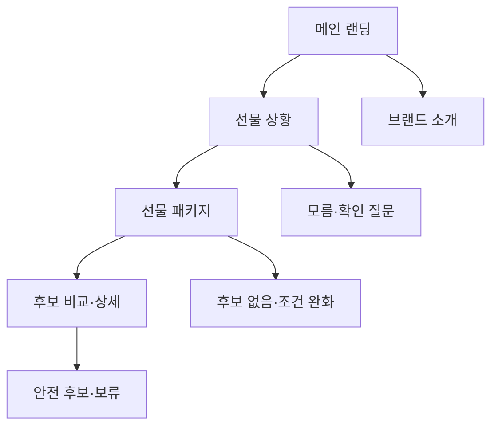

# VC-10 온유 — 사이트구조맵 A안 V3 상세본

## 1. Client 전체 분석·REQ 연결

- Client: VC-10 온유 / 선물 패키지 선택
- 목표: 받는 사람 정보를 과하게 추정하지 않고 안전한 선물 후보를 고른다.
- 상황·과업: 선물 상황·모름 선택·피할 조건을 구분하고 제품 패키지를 비교한다.
- 불편: 누구나 좋아한다는 단정, 가상 후기, 구매 완료 흐름이 판단을 왜곡한다.
- 판단 기준: 확인 정보, 미정 정책, 피할 조건, 받는 사람에게 물을 질문
- 성공: 메인 → 선물 상황 → 안전한 후보 → 비교·보류
- 실패: 성격·취향을 임의 추정하거나 구매 CTA를 강제
- 요구: REQ-010
- 연결 제품: PROD-022·023·024·052·053·054·089·090·092
- 대표 15개: 미실행

## 2. 실제 요구 → 메뉴·콘텐츠·기능

| 요구·REQ-010 | 메뉴 | 콘텐츠 | 기능 | 연결 페이지 | 근거 |
|---|---|---|---|---|---|
| 선물 상황 필터·모름 허용 | 선물 상황 | 상황·확인 질문·모름 | 필터·질문 건너뛰기 | 메인·카테고리 | 요구사항분석 V2 |
| 안전 후보·피할 조건 | 선물 패키지 | 후보·제외 조건·미정 정보 | 비교·보류·질문 저장 | 목록·상세 | REQ-010 수용 조건 |
| 구매 CTA 차단 | 선물 안내 | 포트폴리오·검토용 고지 | 구매 대신 보류·복귀 | 제품 상세 | REQ-010 실패 조건 |

## 3. 구조안·계층형 사이트맵

- 전략: 선물 판단 직결형
- 1차: 메인 랜딩 / 선물 상황 / 선물 패키지 / 제품 비교 / 브랜드 소개
  - 메인: Hero / 선물 상황 카드 / 패키지 레일 / 검토용 안내 / CTA
  - 선물 상황: 관계·용도 / 모름 / 확인 질문 / 피할 조건
    - 3차: 후보 목록 / 패키지 상세 / 비교 / 보류 이유
  - 패키지: 초보·안전 후보 / 조건 비교 / 미정 정보
  - 브랜드: 방향 / 제작 / 포트폴리오 / 제품 관계

## 4. 페이지·흐름·검증

| 페이지 | 목적 | 핵심 콘텐츠 | 기능 | 행동·연결 |
|---|---|---|---|---|
| 메인 | 선물 진입 | 상황 카드·고지 | 선택·건너뛰기 | 선물 허브 |
| 선물 상황 | 맥락 확인 | 관계·용도·모름 | 질문·필터 | 패키지 |
| 패키지 | 안전 후보 탐색 | 후보·피할 조건 | 비교·보류 | 상세 |
| 상세 | 판단 지원 | 확인·미정·질문 | 비교·복귀 | 보류 |
| 브랜드 | 신뢰 | 방향·제작·고지 | 앵커 | 제품 |

- 정상: 메인 → 선물 상황 → 패키지 → 비교·보류
- 분기: 모름 선택 → 안전 후보·확인 질문; 조건 추가 → 후보 좁히기
- 예외: 후보 없음·질문 취소·구매 CTA 차단·복귀
- 상태: 탐색·질문·비교·보류(일부 가정)

## 5. Mermaid

## 6. 제품·검증 추적

- 제품 원본: `../../03-제품콘텐츠-출력물/제품콘텐츠-도출결과-V2.md`
- Product ID: PROD-022·023·024·052·053·054·089·090·092
- 대표 15개: 미실행
## 구조 전략 (표준 보완)
기존 구조안·사이트맵과 매핑표를 표준 전략 섹션으로 매핑한다.

## 사용자 흐름·상태 (표준 보완)
기존 페이지 흐름·예외·상태 정보를 표준 사용자 흐름으로 통합한다.

## 중복·끊김·가정 검증 (표준 보완)
기존 검증·추적 내용을 중복·끊김·가정 검증으로 통합한다.

## 판정 (표준 보완)
V3 구조·REQ·제품 연결 검증 결과를 유지한다.

### 연결 제품 ID (개별 표기)
- PROD-023
- PROD-024
- PROD-052
- PROD-053
- PROD-054
- PROD-089
- PROD-090
- PROD-092
## Client·REQ 추적 (표준 보완)
- 기존 Client·REQ 연결 내용을 표준 추적 섹션으로 정리한다.

## 구조 전략 (표준 보완)
- 기존 구조안·사이트맵과 매핑표를 표준 전략 섹션으로 정리한다.

## 페이지·콘텐츠·기능 계약 (표준 보완)
- 기존 페이지·상세 설계를 표준 기능 계약으로 정리한다.

## 사용자 흐름·상태 (표준 보완)
- 기존 페이지 흐름·예외·상태 정보를 표준 사용자 흐름으로 정리한다.

## 중복·끊김·가정 검증 (표준 보완)
- 기존 검증·추적 내용을 표준 검증 섹션으로 정리한다.

## Mermaid (표준 보완)
- 동일 폴더의 대응 MMD 파일을 흐름 원본으로 참조한다.

## 판정 (표준 보완)
- V3 구조·REQ·제품 연결 검증 결과를 유지한다.
