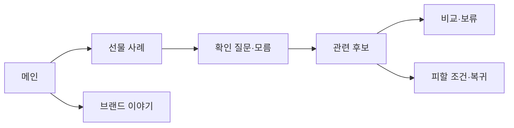

# VC-10 온유 — 사이트구조맵 B안 V3 상세본

## 1. Client 분석·구조 전략

- Client: VC-10 온유 / 선물 패키지 선택
- 요구: 선물 사례와 확인 질문을 먼저 보고 후보를 판단 / REQ-010
- 목표: 상황 콘텐츠 → 질문·모름 → 안전 후보 → 비교·보류
- 제품: PROD-022·023·024·052·053·054·089·090·092
- 전략: 선물 상황·콘텐츠 선행형
- 성공: 받는 사람을 단정하지 않고 질문과 피할 조건을 구분

## 2. 매핑표

| 요구 | 메뉴 | 콘텐츠 | 기능 | 연결 |
|---|---|---|---|---|
| 상황 이해·REQ-010 | 선물 사례 | 관계·용도 사례 | 사례 선택·모름 | 패키지 |
| 안전 판단·REQ-010 | 확인 질문 | 물어볼 질문·피할 조건 | 저장·건너뛰기 | 후보 |
| 검토용 제품·REQ-010 | 관련 후보 | 후보·근거·미정 | 비교·보류 | 상세 |

## 3. 사이트맵·페이지

- 1차: 메인 / 선물 사례 / 확인 질문 / 관련 후보 / 브랜드 이야기
  - 선물 사례: 관계 / 용도 / 초보 / 모름
    - 3차: 사례 상세 / 질문 / 관련 패키지
  - 후보: 안전 후보 / 피할 조건 / 비교 / 보류
  - 브랜드: 방향 / 제작 / 포트폴리오·검토용 고지

## 4. 페이지 상세·예외

| 페이지 | 목적 | 콘텐츠 | 기능 | 진입·이탈 |
|---|---|---|---|---|
| 메인 | 선물 공감 | 사례·고지 | 앵커 | 사례·질문 |
| 사례 | 상황 이해 | 관계·용도 | 선택·모름 | 질문 |
| 질문 | 정보 수집 | 확인 질문·피할 조건 | 건너뛰기·저장 | 후보 |
| 후보 | 안전 판단 | 후보·근거 | 비교·보류 | 상세 |

- 정상: 메인 → 사례 → 질문 → 후보 비교
- 예외: 질문 미정·후보 없음·구매 CTA 차단·취소·복귀
- 상태: 탐색·모름·질문·비교·보류(가정 포함)

## 5. Mermaid

## 6. 검증·추적

- 제품 원본: `../../03-제품콘텐츠-출력물/제품콘텐츠-도출결과-V2.md`
- Product ID: PROD-022·023·024·052·053·054·089·090·092
- 대표 15개: 미실행
## 구조 전략 (표준 보완)
기존 구조안·사이트맵과 매핑표를 표준 전략 섹션으로 매핑한다.

## 사용자 흐름·상태 (표준 보완)
기존 페이지 흐름·예외·상태 정보를 표준 사용자 흐름으로 통합한다.

## 중복·끊김·가정 검증 (표준 보완)
기존 검증·추적 내용을 중복·끊김·가정 검증으로 통합한다.

## 판정 (표준 보완)
V3 구조·REQ·제품 연결 검증 결과를 유지한다.

### 연결 제품 ID (개별 표기)
- PROD-023
- PROD-024
- PROD-052
- PROD-053
- PROD-054
- PROD-089
- PROD-090
- PROD-092
## Client·REQ 추적 (표준 보완)
- 기존 Client·REQ 연결 내용을 표준 추적 섹션으로 정리한다.

## 구조 전략 (표준 보완)
- 기존 구조안·사이트맵과 매핑표를 표준 전략 섹션으로 정리한다.

## 페이지·콘텐츠·기능 계약 (표준 보완)
- 기존 페이지·상세 설계를 표준 기능 계약으로 정리한다.

## 사용자 흐름·상태 (표준 보완)
- 기존 페이지 흐름·예외·상태 정보를 표준 사용자 흐름으로 정리한다.

## 중복·끊김·가정 검증 (표준 보완)
- 기존 검증·추적 내용을 표준 검증 섹션으로 정리한다.

## Mermaid (표준 보완)
- 동일 폴더의 대응 MMD 파일을 흐름 원본으로 참조한다.

## 판정 (표준 보완)
- V3 구조·REQ·제품 연결 검증 결과를 유지한다.
