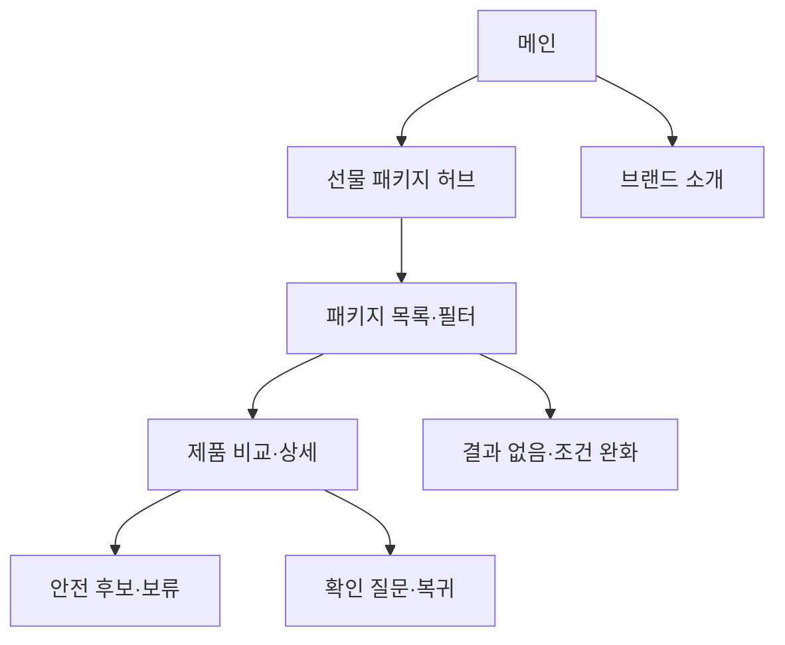

# VC-10 온유 — 사이트구조맵 C안 V3 상세본

## 1. Client 분석·구조 전략

- Client: VC-10 온유 / 선물 패키지 선택
- 요구: 선물용 제품군과 선택권을 한눈에 파악 / REQ-010
- 목표: 패키지 허브 → 조건·질문 → 비교·보류
- 제품: PROD-022·023·024·052·053·054·089·090·092
- 전략: 선물 패키지·포트폴리오 허브형
- 성공: 패키지 소속·피할 조건·확인 질문을 설명

## 2. 매핑표

| 요구 | 메뉴 | 콘텐츠 | 기능 | 연결 |
|---|---|---|---|---|
| 안전 패키지·REQ-010 | 선물 패키지 허브 | 관계·용도·모름 | 카테고리·필터 | 목록 |
| 피할 조건·REQ-010 | 패키지 상세 | 제외 조건·미정 | 비교·보류 | 복귀 |
| 구매 차단·REQ-010 | 검토 안내 | 가상 제품·포트폴리오 | 구매 대신 질문·보류 | 공통 |

## 3. 사이트맵·페이지

- 1차: 메인 / 선물 패키지 허브 / 패키지 목록·필터 / 제품 비교 / 브랜드 소개
  - 메인: Hero / 패키지 레일 / 질문 안내 / 브랜드 고지 / CTA
  - 허브: 관계 / 용도 / 초보 / 모름 / 피할 조건
    - 3차: 목록 / 상세 / 비교 / 질문·보류
  - 브랜드: 방향 / 제작 / 포트폴리오 / 검토용 고지

## 4. 페이지 상세·흐름

| 페이지 | 목적 | 콘텐츠 | 기능 | 행동 |
|---|---|---|---|---|
| 메인 | 전체 방향 | 패키지·고지 | CTA·건너뛰기 | 허브 |
| 허브 | 후보 구분 | 관계·용도·모름 | 필터·질문 | 목록 |
| 목록 | 후보 비교 | 카드·근거·제외 | 정렬·비교 | 상세 |
| 비교 | 판단 완료 | 차이·미정·질문 | 보류·복귀 | 다음 행동 |

- 정상: 메인 → 허브 → 목록·필터 → 비교·보류
- 예외: 결과 없음·조건 완화·질문 취소·구매 CTA 차단·복귀
- 상태: 신규·탐색·질문·비교·보류(일부 가정)

## 5. Mermaid

## 6. 검증·추적

- Client 기본 정보·REQ-010·제품·페이지 연결: 반영
- 제품 원본: `../../03-제품콘텐츠-출력물/제품콘텐츠-도출결과-V2.md`
- 대표 15개: 미실행
## 구조 전략 (표준 보완)
기존 구조안·사이트맵과 매핑표를 표준 전략 섹션으로 매핑한다.

## 사용자 흐름·상태 (표준 보완)
기존 페이지 흐름·예외·상태 정보를 표준 사용자 흐름으로 통합한다.

## 중복·끊김·가정 검증 (표준 보완)
기존 검증·추적 내용을 중복·끊김·가정 검증으로 통합한다.

## 판정 (표준 보완)
V3 구조·REQ·제품 연결 검증 결과를 유지한다.

### 연결 제품 ID (개별 표기)
- PROD-023
- PROD-024
- PROD-052
- PROD-053
- PROD-054
- PROD-089
- PROD-090
- PROD-092
## Client·REQ 추적 (표준 보완)
- 기존 Client·REQ 연결 내용을 표준 추적 섹션으로 정리한다.

## 구조 전략 (표준 보완)
- 기존 구조안·사이트맵과 매핑표를 표준 전략 섹션으로 정리한다.

## 페이지·콘텐츠·기능 계약 (표준 보완)
- 기존 페이지·상세 설계를 표준 기능 계약으로 정리한다.

## 사용자 흐름·상태 (표준 보완)
- 기존 페이지 흐름·예외·상태 정보를 표준 사용자 흐름으로 정리한다.

## 중복·끊김·가정 검증 (표준 보완)
- 기존 검증·추적 내용을 표준 검증 섹션으로 정리한다.

## Mermaid (표준 보완)
- 동일 폴더의 대응 MMD 파일을 흐름 원본으로 참조한다.

## 판정 (표준 보완)
- V3 구조·REQ·제품 연결 검증 결과를 유지한다.
