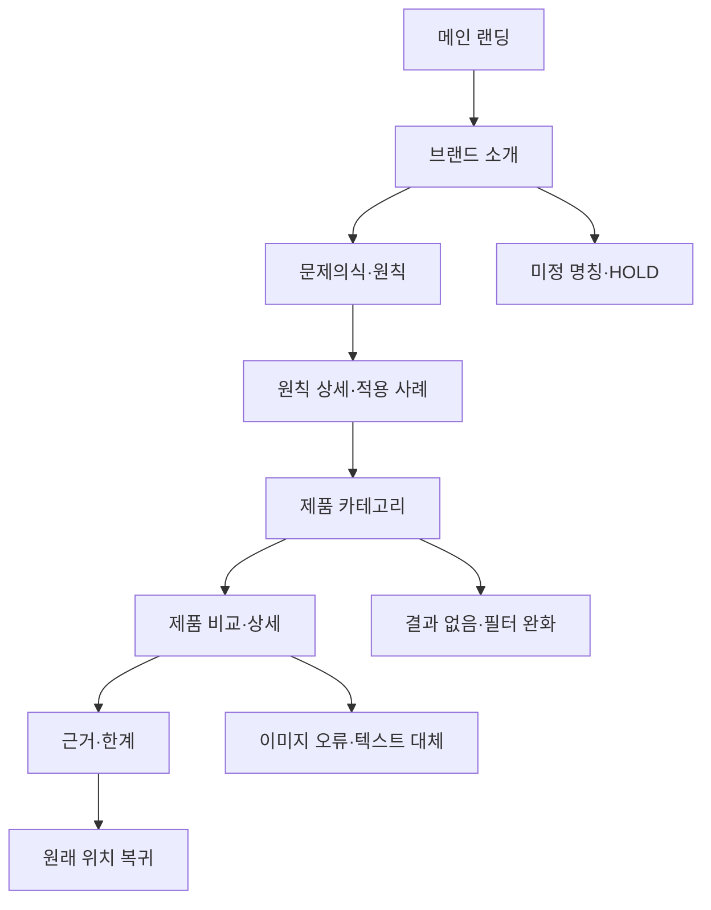

# VC-11 가람 — 사이트구조맵 A안 V3 상세본

## 1. Client·REQ 추적

- Client: VC-11 가람 / 브랜드 신뢰
- 판정: `KEEP / STRATEGIC_VALIDATION`
- 목표: 브랜드 약속이 실제 제품·화면 판단으로 이어지는지 확인한다.
- 핵심 과업: 문제의식 → 원칙 → 적용 사례 → 근거·한계 → 관련 탐색
- 성공: 원칙 하나가 화면 또는 제품 판단에 쓰인 방식을 설명한다.
- 실패·차단: 성과·인증·연혁·브랜드 의미를 근거 없이 확정하거나 구매를 유도한다.
- 요구: REQ-011, `ER-008·009`, PAGE-001·020·021
- 연결 제품: PROD-028 브랜드 원칙 사례 카드, PROD-058 브랜드 원칙·Client 연결 지도, PROD-097 브랜드 원칙 적용 노트

## 2. 구조 전략

`브랜드 원칙 직결형` — 브랜드 소개를 시작점으로 삼고 각 원칙에서 실제 제품·화면 적용 사례로 이동한다. 사실·가설·보류를 카드 상태로 분리한다.

### 1차 메뉴

메인 랜딩 / 브랜드 소개 / 제품 카테고리 / 제품 비교 / 근거·상태

### 계층

- 메인 랜딩: 브랜드 문제의식 / 원칙 미리보기 / 적용 사례 레일 / 제품 탐색 CTA
- 브랜드 소개: 문제의식 / 원칙 / 적용 사례 / 제작·기록 맥락 / 근거·한계
  - 3차: 원칙 상세 / 제품 연결 / 화면 적용 / 출처·확인일 / 보류 이유
- 제품 카테고리: 원칙별 제품군 / 사용 상황 / 가상 제품 고지
  - 3차: PROD-028·058·097 카드 / 필터 / 상세
- 제품 비교: 선택 제품 / 원칙·요구 매핑 / 확인 정보 / 미확정 정보
- 근거·상태: 확인됨 / 가설 / 보류 / 미정 명칭

## 3. 페이지·콘텐츠·기능 계약

| PAGE | 목적 | 핵심 콘텐츠 | 기능·상태 | 연결 |
|---|---|---|---|---|
| PAGE-001 메인 | 신뢰 판단 진입 | 문제의식·원칙 요약·제품 레일 | 적용 사례 보기, 가상 제품 고지 | PAGE-020·021 |
| PAGE-020 브랜드 소개 | 인과 설명 | 문제→원칙→제품·화면 적용 | 원칙 앵커, 출처 펼치기, 보류 | PAGE-021 |
| PAGE-021 카테고리 | 적용 사례 탐색 | 제품군·Client 연결·한계 | 필터, 비교, 보류, 복귀 | PAGE-020 |
| 제품 상세 | 판단 지원 | PROD ID·원칙·근거·미정 | 비교, 재시도, 이전 위치 복귀 | PAGE-021 |
| 근거·상태 | 과장 방지 | 확인일·출처·제한 | 상태별 보기, 원문 링크 | 전 페이지 |

## 4. 사용자 흐름·상태

- 정상: 메인 → 브랜드 소개 → 원칙 상세 → 적용 사례 → 제품 카테고리 → 비교·복귀
- 분기: 원칙 선택 → 연결 제품 1~3개; 미확정 정보 선택 → 근거·한계 펼침
- 예외: 출처 없음 → `확인 필요` 표시·보류; 제품 없음 → 필터 완화·카테고리 복귀; 이미지 실패 → 텍스트 카드·재시도
- 취소·복귀: 비교 취소 시 원래 원칙과 스크롤 위치를 보존한다.
- 상태: `DEFAULT / EMPTY / ERROR / OFFLINE / RESUME / HOLD`

## 5. 중복·끊김·가정 검증

- 중복 방지: 브랜드 소개는 인과 설명, 카테고리는 제품 탐색, 근거 페이지는 상태 확인으로 역할을 분리한다.
- 끊긴 링크 방지: 모든 원칙 카드에 PAGE-020 앵커와 PAGE-021 복귀 링크를 둔다.
- 제품 고지: PROD-028·058·097은 검증용 가상 후보이며 가격·재고·배송·인증·후기를 표시하지 않는다.
- 가정: 회원·저장 기능은 원자료 근거가 없으므로 `가정/HOLD`로 표시한다.
- 접근성: Heading·landmark·키보드 포커스·대체 텍스트·제품 레일의 이전/다음 조작을 제공한다.

## 6. Mermaid

## 7. 판정

`KEEP / 후보 A` — REQ-011의 인과 설명과 근거 공개를 가장 직접적으로 검증한다. 다음 단계에서 PAGE-020 원칙 앵커와 제품 카드의 상태 문구를 화면설계로 전달한다.
