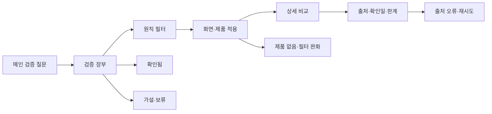

# VC-11 가람 — 사이트구조맵 B안 V3 상세본

## 1. Client·REQ 추적

- Client: VC-11 가람 / 브랜드 신뢰
- 요구: 문제→원칙→제품·서비스 반영, 확인된 근거와 한계의 구체화
- 성공: 원칙 하나와 실제 적용 위치를 설명한다.
- 실패·차단: 근거 없는 성과·인증·연혁·브랜드 의미 확정
- 추적: REQ-011, `ER-008·009`, PAGE-001·020·021
- 제품: PROD-028, PROD-058, PROD-097

## 2. 구조 전략

`증거 장부형` — 메인에서 검증 질문을 먼저 제시하고, 원칙·제품·화면을 하나의 추적 장부로 비교한다. 감성적 서사보다 확인일과 한계를 우선 노출한다.

### 1차 메뉴 및 계층

- 메인 랜딩: 검증 질문 / 원칙 요약 / 확인된 사례 / 브랜드 소개 CTA
- 검증 장부: 주장 목록 / 원칙 / 적용 화면 / 연결 제품 / 출처·확인일
  - 3차: 확인됨 / 가설 / 보류 / 미정
- 브랜드 소개: 문제의식 / 원칙 / 제작 맥락 / 장부로 확인
- 제품 카테고리: 원칙별 보기 / 제품군 / 비교함
- 제품 상세·비교: 제품 ID / 적용 원칙 / Client / 한계

## 3. 페이지·콘텐츠·기능 계약

| PAGE | 목적 | 콘텐츠 | 기능·예외 |
|---|---|---|---|
| PAGE-001 | 검증 질문 진입 | 약속·질문·사례 | 장부 보기, 브랜드 이동 |
| PAGE-020 | 서사와 장부 연결 | 문제·원칙·제작 맥락 | 상태 필터, 출처 펼치기 |
| PAGE-021 | 제품 증거 비교 | PROD-028·058·097 | 비교함, 결과 없음, 복귀 |
| 근거 장부 | 주장 검증 | 출처·확인일·한계 | 미정·보류 분리 |

## 4. 사용자 흐름·상태

- 정상: 메인 검증 질문 → 장부 → 원칙 필터 → 제품·화면 적용 → 상세 비교
- 분기: `확인됨`만 보기 / `가설·보류` 보기 / 원칙 없이 전체 제품 보기
- 오류: 출처 링크 실패 → 출처 미확인 상태 유지·재시도; 제품 이미지 실패 → 텍스트 대체
- 취소: 필터 취소 시 전체 장부로 복귀하고 선택 조건을 지운다.
- 오프라인: 마지막으로 확인된 장부 시점과 변경 가능성을 함께 표시한다.

## 5. 중복·끊김·가정 검증

- 장부와 브랜드 소개의 동일 주장은 ID로 연결하고 문구를 중복 생성하지 않는다.
- 제품은 판매 상품이 아닌 가상 검증 후보로 고지한다.
- 가격·인증·성과·연혁·상표·브랜드 의미는 `미정/HOLD`다.
- 키보드와 스크린리더가 상태·필터·비교 순서를 동일하게 읽도록 한다.

## 6. Mermaid

## 7. 판정

`KEEP / 후보 B` — 브랜드 신뢰를 출처·확인일·한계로 검증하기 쉽다. PAGE-020의 장부 밀도가 지나치게 높아지지 않도록 화면설계 단계에서 요약과 상세를 분리한다.
