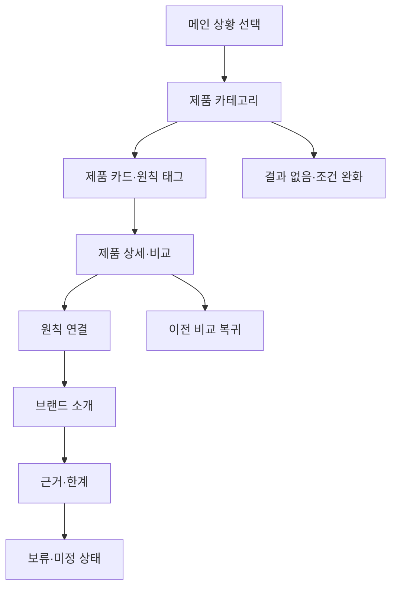

# VC-11 가람 — 사이트구조맵 C안 V3 상세본

## 1. Client·REQ 추적

- Client: VC-11 가람 / 브랜드 신뢰
- 판정: `KEEP / STRATEGIC_VALIDATION`
- 목표: 사용 상황에서 제품을 고른 뒤 브랜드 원칙과 한계를 역으로 확인한다.
- 요구·추적: REQ-011, `ER-008·009`, PAGE-001·020·021
- 성공: 제품 판단이 어떤 원칙에 근거하는지 설명한다.
- 차단: 가상 후기, 인증, 성과, 연혁, 브랜드 의미를 사실처럼 제시하지 않는다.
- 제품: PROD-028 브랜드 원칙 사례 카드, PROD-058 브랜드 원칙·Client 연결 지도, PROD-097 브랜드 원칙 적용 노트

## 2. 구조 전략

`제품에서 원칙으로 역추적형` — 카테고리·제품 탐색을 먼저 허용하되, 상세에서 브랜드 원칙과 근거를 확인하게 한다. 제품 선택 부담을 줄이고 신뢰 검증을 후속 행동으로 배치한다.

### 계층

- 메인 랜딩: 사용 상황 / 제품 레일 / 브랜드 원칙 CTA
- 제품 카테고리: 상황별 제품군 / 제품 카드 / 원칙 태그
  - 3차: 제품 상세 / 비교 / 원칙 연결
- 브랜드 소개: 문제의식 / 원칙 / 제품·화면 적용 / 근거·한계
- 근거·상태: 확인됨 / 가설 / 보류 / 가상 제품 고지

## 3. 페이지·콘텐츠·기능 계약

| PAGE | 목적 | 핵심 콘텐츠 | 행동·상태 |
|---|---|---|---|
| PAGE-001 | 상황별 탐색 | 제품 레일·브랜드 약속 | 상세, 원칙 보기 |
| PAGE-021 | 제품 판단 | PROD 카드·비교·원칙 태그 | 비교, 보류, 필터 완화 |
| 제품 상세 | 원칙 역추적 | 제품 목적·원칙·한계 | 브랜드 소개 앵커, 복귀 |
| PAGE-020 | 신뢰 확인 | 문제→원칙→적용 사례 | 출처 펼침, 미정 표시 |

## 4. 사용자 흐름·상태

- 정상: 메인 상황 선택 → 카테고리 → 제품 상세 → 원칙 연결 → 근거·한계 → 복귀
- 분기: 제품 비교 → 공통 원칙/차이 확인; 원칙 보기 → 브랜드 소개 앵커
- Empty: 조건에 맞는 제품이 없으면 전체 보기·조건 완화·브랜드 소개로 이동한다.
- Error: 이미지·출처 오류를 해당 카드에 격리하고 텍스트·재시도·건너뛰기를 제공한다.
- Resume: 이전 비교 조건은 자동 적용하지 않고 `이전 선택을 불러올까요?`로 확인한다.
- HOLD: 회원 저장·구매·배송·가격은 실행 CTA를 만들지 않는다.

## 5. 중복·끊김·가정 검증

- 카테고리는 탐색, 브랜드 소개는 인과, 근거·상태는 사실성 확인으로 역할을 분리한다.
- 원칙 태그는 추상 슬로건이 아니라 제품·화면 적용 문장과 연결한다.
- 가상 제품 상태와 확인일을 카드에 고정한다.
- Mobile 제품 레일은 영역 내부만 수평 이동하며 버튼·키보드·현재 위치를 함께 제공한다.

## 6. Mermaid

## 7. 판정

`KEEP / 후보 C` — 제품 탐색을 막지 않으면서 상세에서 브랜드 신뢰를 검증한다. 최종 선택 시 PAGE-021과 PAGE-020의 연결 강도, 근거 노출 부담을 비교한다.
