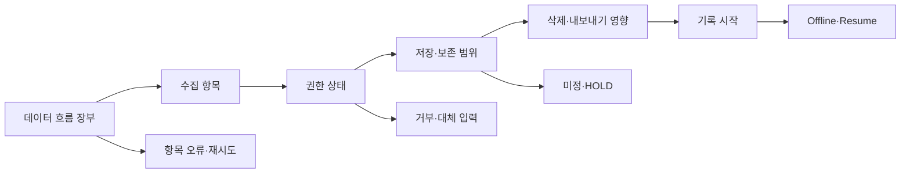

# VC-12 해솔 — 사이트구조맵 B안 V3 상세본

## 1. Client·REQ 추적

- Client: VC-12 해솔 / 개인정보·보존 통제
- 요구·추적: REQ-012, `ER-010·011`, PAGE-010·012·019·020
- 수용: 데이터 흐름과 불가능한 기능을 먼저 이해하고 선택한다.
- 차단: 완벽한 보호·자동 동기화·감정 분석의 근거 없는 암시
- 제품: PROD-038 음성 대체 기록 카드

## 2. 입력 충돌 감사

V5에는 개인정보·보존 요구와 이미지 실패·텍스트 대체 요구가 함께 기록되어 있다. 개인정보 축은 REQ-012의 주 요구로 유지하고, 이미지 축은 Error/Offline에서 보조 계약으로 유지한다.

## 3. 구조 전략

`데이터 흐름 장부형` — 입력 전에 수집 항목→권한→저장 위치→보존·삭제 영향→미지원 범위를 한 장부에서 확인한다. 사실·가정·HOLD를 분리한다.

### 1차 메뉴·계층

- 메인 랜딩 / 데이터 흐름 장부 / 입력 권한 / 보존·삭제 / 대체 기록 / 브랜드 소개
- 장부 3차: 수집 항목 / 저장 위치 / 권한 상태 / 삭제 영향 / 내보내기·백업 / 확인일
- 대체 기록 3차: 텍스트 입력 / 수동 기록 / 음성 권한 보류 / 이미지 오류 대체

## 4. 페이지·콘텐츠·기능 계약

| PAGE | 목적 | 콘텐츠 | 기능·상태 |
|---|---|---|---|
| PAGE-001 | 장부 진입 | 최소 수집 요약 | 항목별 상세 이동 |
| PAGE-010 | 권한 결정 | 선택 동의·대체 입력 | 허용·거부·보류 |
| PAGE-012 | 보존 판단 | 삭제·내보내기·백업 차이 | 영향 확인·HOLD |
| PAGE-019 | 재개 | 마지막 확인 시점·미완료 | Resume·초기화 |
| PAGE-020 | 원칙 근거 | 지원·미지원·미정 | 근거 펼치기 |

## 5. 사용자 흐름·상태

- 정상: 장부 → 수집 항목 → 권한 선택 → 저장 범위 확인 → 시작
- 분기: 저장 위치 미정 → `확인 필요`와 입력 보류; 권한 거부 → 수동·텍스트 대체
- 오류: 장부 일부 로드 실패 → 실패 항목만 격리·재시도; 이미지 실패 → 텍스트 속성 유지
- 취소·복귀: 장부를 닫아도 입력 전 상태와 선택을 유지한다.
- 오프라인: 마지막 확인일과 변경 가능성을 표시하며 자동 동기화를 약속하지 않는다.

## 6. 중복·끊김·가정 검증

- 저장 위치와 백업·내보내기·삭제를 같은 말로 축약하지 않는다.
- 감정 분석·자동 동기화·완벽한 보호·실제 보존 기간은 `HOLD`다.
- 장부 각 항목에 PAGE-010·012 앵커와 PAGE-019 복귀 링크를 둔다.
- 화면·제품이 이미지 없이도 제품명·분류·차이를 읽을 수 있도록 고정한다.
- 키보드, 스크린리더, 200% 확대, reduced motion을 검증 대상으로 남긴다.

## 7. Mermaid

## 8. 판정

`KEEP / 후보 B` — 개인정보 판단을 장부로 추적하기 쉽다. 정보량이 많아질 수 있으므로 화면설계에서 요약·상세를 분리한다.
