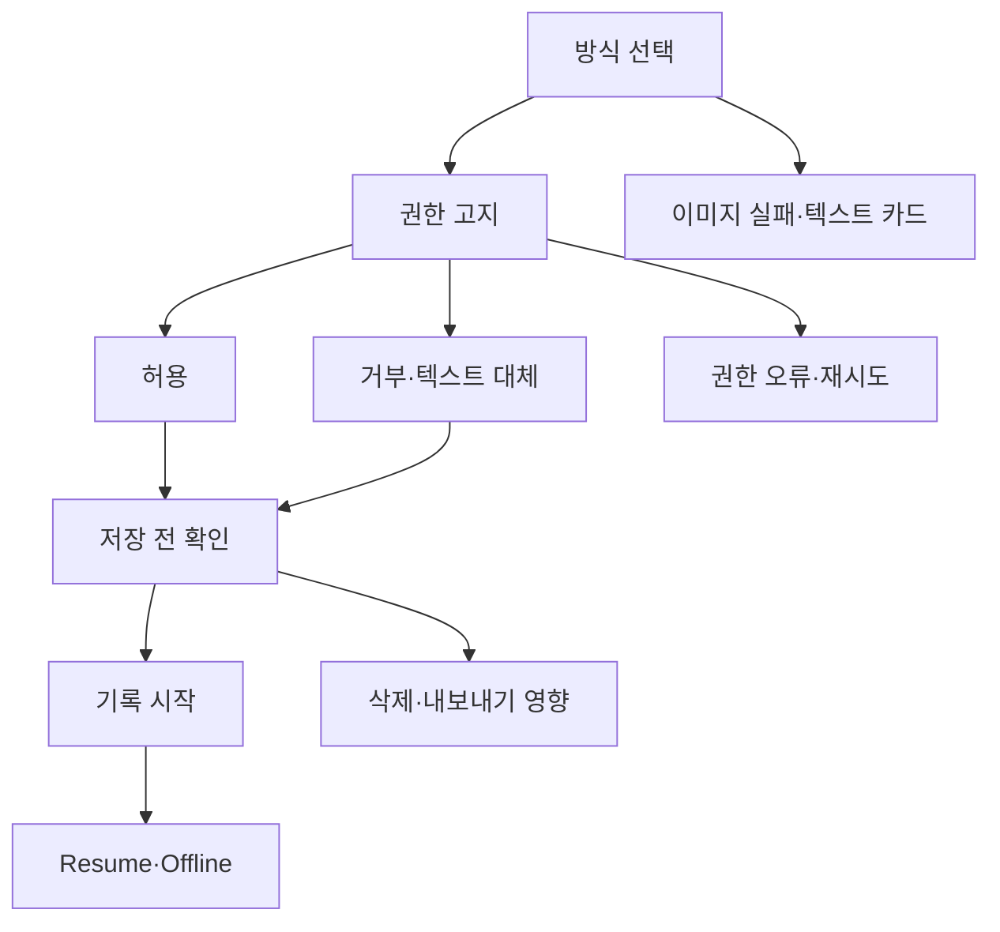

# VC-12 해솔 — 사이트구조맵 C안 V3 상세본

## 1. Client·REQ 추적

- Client: VC-12 해솔 / 개인정보·보존 통제
- 요구: 권한 전 고지, 선택 동의, 미지원 기능, 보존·삭제 영향 설명
- 추적: REQ-012, `ER-010·011`, PAGE-010·012·019·020
- 성공: 불가능한 기능과 대체 경로를 이해한 뒤 시작 여부를 선택한다.
- 실패: 완벽한 보호·자동 동기화·감정 분석 암시
- 제품: PROD-038 음성 대체 기록 카드(권한·삭제·텍스트 대체)

## 2. 입력 충돌 감사

V5 상단의 이미지 독립 제품 카드 요구는 CR-044 보조 축으로 남기고, REQ-012의 개인정보·보존 통제를 주 구조로 삼는다. 두 Client 요구를 병합하지 않고 각각 추적한다.

## 3. 구조 전략

`대체 경로 우선형` — 동의하지 않아도 기록을 완전히 막지 않고 텍스트·수동·나가기·보류를 제공한다. 사용자가 민감 정보의 범위와 결과를 선택하도록 한다.

### 1차 메뉴·계층

- 메인 랜딩: 기록 전 선택 / 대체 방식 / 개인정보 도움말
- 기록 방식: 음성 / 텍스트 / 수동 / 이미지 없는 탐색
- 개인정보 도움말: 권한 / 저장 / 삭제 / 내보내기 / 미지원
- 브랜드 소개: 정보 정직성 원칙
- 카테고리: 텍스트 우선 제품 카드 / PROD-038

## 4. 페이지·콘텐츠·기능 계약

| PAGE | 목적 | 콘텐츠 | 기능·상태 |
|---|---|---|---|
| PAGE-001 | 방식 선택 | 민감 정보 입력 전 요약 | 방식 선택·도움말 |
| PAGE-010 | 기록 입력 | 권한·대체 경로 | 음성 허용·거부·텍스트 전환 |
| PAGE-012 | 보존 통제 | 삭제·내보내기·백업 | 영향 보기·보류 |
| PAGE-019 | 중단 복귀 | 선택·확인 상태 | Resume·초기화 |
| PAGE-020 | 원칙 설명 | 지원·미지원 근거 | 상태·출처 보기 |

## 5. 사용자 흐름·상태

- 정상: 방식 선택 → 권한 고지 → 허용 또는 텍스트 대체 → 저장 전 확인 → 완료
- 분기: 권한 거부 → 텍스트·수동 입력; 삭제 영향 불명확 → 저장하지 않고 나가기
- 예외: 음성 권한 오류 → 재시도·대체; 이미지 실패 → 제품명·분류·차이 텍스트 유지
- Empty: 대체 방식이 없으면 기록 시작 대신 안내·보류를 제공한다.
- Resume: 이전 선택과 저장 여부를 보여주고 자동 복원하지 않는다.

## 6. 중복·끊김·가정 검증

- 동의와 기록 시작을 한 번의 강제 CTA로 합치지 않는다.
- 삭제·내보내기·백업은 서로 다른 페이지 항목이다.
- 실제 저장소·계정·보존 기간·완전 삭제는 근거가 없어 `HOLD`다.
- 제품 카드에는 이미지가 없어도 이름·분류·차이·상태·비교 링크를 남긴다.
- 색상만으로 권한·오류 상태를 전달하지 않고 텍스트와 아이콘을 병행한다.

## 7. Mermaid

## 8. 판정

`KEEP / 후보 C` — 동의 거부를 실패로 취급하지 않고 대체 입력과 보류를 제공한다. 최종 선택 시 A안의 통제 명확성과 C안의 부담 완화 효과를 비교한다.
