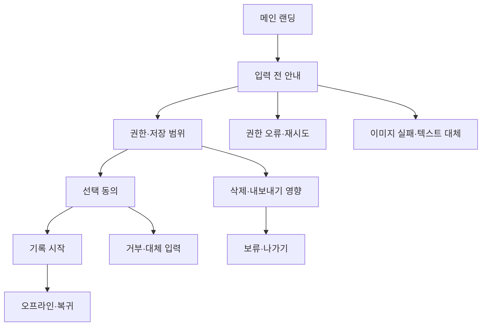

# VC-12 해솔 — 사이트구조맵 A안 V3 상세본

## 1. Client·REQ 추적

- Client: VC-12 해솔 / 개인정보·보존 통제
- 판정: `KEEP / STRATEGIC_VALIDATION`
- 요구: 권한 전 고지, 선택 동의, 미지원 기능, 보존·삭제·내보내기 영향을 설명한다.
- 수용: 입력 전에 데이터 흐름과 불가능한 기능을 이해하고 대체 경로를 선택한다.
- 실패·차단: 완벽한 보호·자동 동기화·감정 분석을 암시한다.
- 추적: REQ-012, `ER-010·011`, PAGE-010·012·019·020
- 연결 제품: PROD-038 음성 대체 기록 카드(권한 고지·텍스트 대체·삭제 상태)

## 2. 입력 충돌 감사

V5의 초반 요청 항목에는 `CR-044` 및 이미지 오류·제품 비교 요구가 혼재되어 있다. 본 구조맵은 REQ-012와 V5 10장(권한·저장·삭제)을 주 요구로 사용하고, 이미지 실패·텍스트 대체는 보조 Error/Offline 계약으로 보존한다. 두 요구를 하나로 병합하지 않는다.

## 3. 구조 전략

`입력 전 통제형` — 기록을 시작하기 전에 데이터 흐름, 권한, 보존·삭제 범위와 미지원 기능을 확인하게 한다. 동의하지 않아도 대체 경로와 나가기 경로를 제공한다.

### 1차 메뉴·계층

- 메인 랜딩: 기록 시작 전 확인 / 방식 선택 / 개인정보 안내
- 기록 시작 안내: 수집 항목 / 저장 위치 / 권한 / 보존 기간·삭제 영향
  - 3차: 동의 선택 / 거부·대체 입력 / 미지원 기능 / 확인 요약
- 보존·삭제 도움말: 삭제 범위 / 내보내기·백업 구분 / 확인일·미정
- 브랜드 소개: 정보의 정직성 / 지원·미지원 원칙
- 제품 카테고리: PROD-038 / 텍스트 대체 / 상태 고지

## 4. 페이지·콘텐츠·기능 계약

| PAGE | 목적 | 콘텐츠 | 기능·상태 |
|---|---|---|---|
| PAGE-001 | 안전한 진입 | 기록 시작 전 확인·요약 | 안내 보기, 시작 보류 |
| PAGE-010 | 입력 전 선택 | 권한·저장·대체 경로 | 선택 동의, 거부, 텍스트/수동 대체 |
| PAGE-012 | 보존 통제 | 삭제·내보내기·백업 영향 | 범위 확인, 삭제 안내, 미지원 표시 |
| PAGE-019 | 복귀·상태 | 미완료 선택·최종 확인 | Resume, 초기화, Offline |
| PAGE-020 | 원칙 근거 | 정보 정직성·지원 범위 | 출처·확인일 펼치기 |

## 5. 사용자 흐름·상태

- 정상: 메인 → 입력 전 안내 → 권한·저장 범위 → 선택 동의 → 기록 시작
- 분기: 동의 거부 → 음성 대신 텍스트/수동 입력; 내보내기 미지원 → 보존·삭제 안내 후 보류
- 예외: 권한 오류 → 재시도·대체·나가기; 이미지 실패 → 제품명·분류·차이 텍스트 카드
- 취소: 언제든 시작을 취소하고 입력하지 않은 상태로 복귀한다.
- Resume: 이전 선택을 자동 적용하지 않고 범위 확인 후 이어간다.
- 상태: `DEFAULT / EMPTY / ERROR / OFFLINE / RESUME / HOLD`

## 6. 중복·끊김·가정 검증

- 권한, 저장, 백업, 내보내기, 삭제를 별도 항목으로 분리한다.
- `안전하게 저장`, 자동 동기화, 감정 분석, 완전 삭제 보장은 근거 없이는 표시하지 않는다.
- 회원·실제 서버·보존 기간은 원자료 근거가 없으므로 `가정/HOLD`다.
- 모든 상태에서 사용자의 기존 선택·비교·현재 위치를 보존한다.
- 접근성: 상태 텍스트, 명확한 Label, 키보드 포커스, 드래그 대안, reduced motion을 제공한다.

## 7. Mermaid

## 8. 판정

`KEEP / 후보 A` — REQ-012의 입력 전 통제와 대체 경로를 가장 직접적으로 검증한다.
