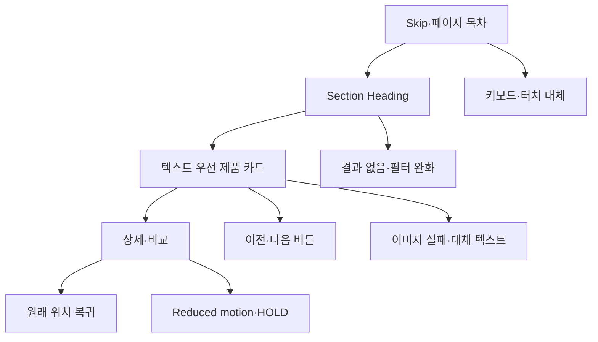

# VC-13 여울 — 사이트구조맵 A안 V3 상세본

## 1. Client·REQ 추적

- Client: VC-13 여울 / 접근성
- 요구: 대체 조작, 명확한 Label, 상태 텍스트, 드래그 대안, reduced motion
- 수용: 대표 3페이지와 핵심 Flow를 대체 수단으로 완료한다.
- 실패·차단: 접근성을 별도 축약 화면으로 분리하거나 색·이미지만으로 상태를 전달한다.
- 추적: REQ-013, `ER-012·013`, 전 Page·와이어프레임·스타일 가이드
- 연결 제품: PROD-017·019·021·046·049·051·082·085·087·091

### 제품 ID·제품군 배치

- PROD-017 — 가독성 프레임 스티커: 꾸미기와 정보 영역 분리
- PROD-019 — 텍스트 우선 제품 카드 세트: 이미지 없는 차이 비교
- PROD-021 — 레일 탐색 보조 라벨 세트: 현재 위치·이전·다음
- PROD-046 — 선택형 여백 프레임: 텍스트 영역·대비 유지
- PROD-049 — Heading 탐색 제품 목록: 긴 Section 건너뛰기
- PROD-051 — 키보드·터치 대체 조작 카드: 드래그 대안
- PROD-082 — 기록 프레임 기본팩: 꾸밈 후 읽기 순서 유지
- PROD-085 — 제품 Section 요약 카드: 범위·Skip
- PROD-087 — 포커스 순서 제품 카드: 포커스·상태·대체 조작
- PROD-091 — 대체 조작 선물 안내: 접근성 미정 시 보류

모든 제품은 가상 검증 후보이며 가격·재고·배송·후기·인증은 확정하지 않는다.

## 2. 구조 전략

`접근성 내장형` — 별도 접근성 페이지를 만들지 않고 메인·카테고리·브랜드 소개와 핵심 Flow에 대체 조작과 상태 텍스트를 기본값으로 내장한다.

### 계층·메뉴

- 메인 랜딩: Skip·Heading 목차 / 핵심 CTA / 제품 레일
- 카테고리: Section 요약 / 텍스트 우선 카드 / 필터·비교
  - 3차: 카드 상세 / 이전·다음 / 전체 보기 / 상태
- 브랜드 소개: 원칙·접근성 적용 사례
- 도움말: 키보드·터치·대체 텍스트·동작 감소

## 3. 페이지·콘텐츠·기능 계약

| PAGE | 목적 | 콘텐츠 | 기능·상태 |
|---|---|---|---|
| PAGE-001 | 긴 랜딩 탐색 | Heading·Skip·제품 레일 | 키보드·버튼·현재 위치 |
| PAGE-021 | 제품 비교 | 텍스트 우선 카드·Section 요약 | 필터·비교·대체 조작 |
| PAGE-020 | 원칙 확인 | 접근성 적용 사례 | 앵커·상태 텍스트 |
| 공통 상태 | 실패 대응 | Empty·Error·Offline·Resume·HOLD | 재시도·건너뛰기·복귀 |

## 4. 사용자 흐름·상태

- 정상: Skip → Section Heading → 제품 카드 → 상세·비교 → 원래 위치 복귀
- 분기: 이미지 없이 텍스트 카드; 드래그 대신 이전·다음 버튼; 필터 결과 없음 → 조건 완화
- 오류: 이미지·Section 실패를 격리하고 재시도·건너뛰기·현재 위치를 제공한다.
- 취소·복귀: 비교 취소 시 포커스와 스크롤 위치를 보존한다.
- 반응형: Mobile 레일만 수평 이동, 본문은 세로 스크롤; 320px·200% 확대에서 Reflow
- 상태: `DEFAULT / EMPTY / ERROR / OFFLINE / RESUME / HOLD`

## 5. 중복·끊김·가정 검증

- 접근성 요구를 별도 축약 화면으로 분리하지 않는다.
- 색·이미지·제스처만으로 의미나 상태를 전달하지 않는다.
- 버튼 이름에 제품명·동작을 포함하고 DOM·포커스 순서를 시각 순서와 맞춘다.
- 44px 터치 목표, 키보드 Tab/Shift+Tab/Enter/Space/Escape, reduced motion을 계약으로 남긴다.
- 회원·저장 기능은 원자료 근거가 없어 `가정/HOLD`다.

## 6. Mermaid

## 7. 판정

`KEEP / 후보 A` — 전 페이지에 접근성을 내장해 REQ-013 수용 조건을 직접 검증한다.
