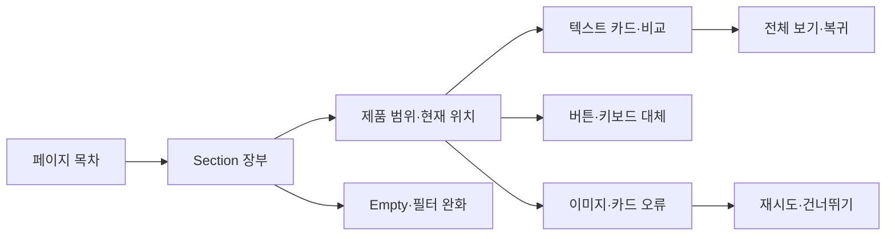

# VC-13 여울 — 사이트구조맵 B안 V3 상세본

## 1. Client·REQ 추적

- Client: VC-13 여울 / 접근성
- 추적: REQ-013, `ER-012·013`, 전 Page·와이어프레임·스타일 가이드
- 수용: 대표 3페이지와 핵심 Flow를 대체 수단으로 완료한다.
- 차단: 색·이미지·드래그만으로 상태와 행동을 전달한다.
- 제품: PROD-017·019·021·046·049·051·082·085·087·091

### 제품 ID·제품군 배치

- PROD-017 — 가독성 프레임 스티커: 대비·여백·텍스트 영역
- PROD-019 — 텍스트 우선 제품 카드 세트: 이미지 독립 정보
- PROD-021 — 레일 탐색 보조 라벨 세트: 범위·현재 번호·Skip
- PROD-046 — 선택형 여백 프레임: 꾸밈 제거·대체 텍스트
- PROD-049 — Heading 탐색 제품 목록: Landmark·Section 이동
- PROD-051 — 키보드·터치 대체 조작 카드: 버튼·포커스 순서
- PROD-082 — 기록 프레임 기본팩: 읽기 순서 보존
- PROD-085 — 제품 Section 요약 카드: 요약·전체 보기
- PROD-087 — 포커스 순서 제품 카드: 키보드·스크린리더
- PROD-091 — 대체 조작 선물 안내: 미정 정보·보류

모든 제품은 가상 검증 후보이며 판매·가격·재고·배송을 확정하지 않는다.

## 2. 구조 전략

`탐색 장부형` — 각 Section에 Heading, 범위, 현재 위치, 대체 조작, 상태 텍스트를 장부처럼 제공해 긴 페이지를 건너뛰며 탐색한다.

### 계층·메뉴

- 메인: 페이지 목차 / Section 장부 / 핵심 CTA
- 카테고리: 제품 Section 장부 / 필터 / 비교함
  - 3차: 범위·현재 위치 / 텍스트 카드 / 대체 행동
- 브랜드: 접근성 원칙·적용 사례
- 도움말: 키보드·터치·스크린리더·동작 감소

## 3. 페이지·콘텐츠·기능 계약

| PAGE | 목적 | 콘텐츠 | 기능·상태 |
|---|---|---|---|
| PAGE-001 | 전체 범위 파악 | 목차·Section 요약 | Skip·Heading·현재 위치 |
| PAGE-021 | 레일 탐색 | 카드 범위·제품 차이 | 이전·다음·전체 보기 |
| PAGE-020 | 원칙 설명 | 포용성 적용 사례 | 상태·근거 펼치기 |
| 공통 | 실패 대체 | 텍스트·재시도·건너뛰기 | Error·Offline·Resume |

## 4. 사용자 흐름·상태

- 정상: 페이지 목차 → Section 요약 → 원하는 제품군 → 카드 비교 → 복귀
- 분기: 스크린리더 Heading 이동; 드래그 불가 시 버튼·키보드; 저연결성 시 텍스트 우선
- 오류: 이미지·카드 오류를 전체 페이지와 분리하고 재시도·대체·건너뛰기를 제공한다.
- Empty: 제품 없음과 필터 미적용을 구분하고 조건 완화·전체 보기로 이동한다.
- 반응형: 레일 내부 스냅은 수동만 허용하고 320px·200%에서 핵심 정보가 잘리지 않는다.
- 상태: `DEFAULT / EMPTY / ERROR / OFFLINE / RESUME / HOLD`

## 5. 중복·끊김·가정 검증

- 장부는 탐색 보조, 브랜드 페이지는 원칙 설명, 카테고리는 제품 비교로 역할을 분리한다.
- Section 제목·카드 번호·이전/다음·전체 보기를 동일한 순서로 제공한다.
- 드래그·스와이프만 제공하지 않고 버튼·키보드·텍스트 링크를 병행한다.
- 상태는 색상 외 텍스트와 아이콘으로 전달하고 포커스 표시를 유지한다.
- 자동 재생·강제 모션은 금지하며 `prefers-reduced-motion`을 반영한다.

## 6. Mermaid

## 7. 판정

`KEEP / 후보 B` — 긴 페이지와 제품 레일의 접근성 검증에 강하다. 장부가 감사 문서처럼 보이지 않도록 화면설계에서 요약 우선으로 조정한다.
