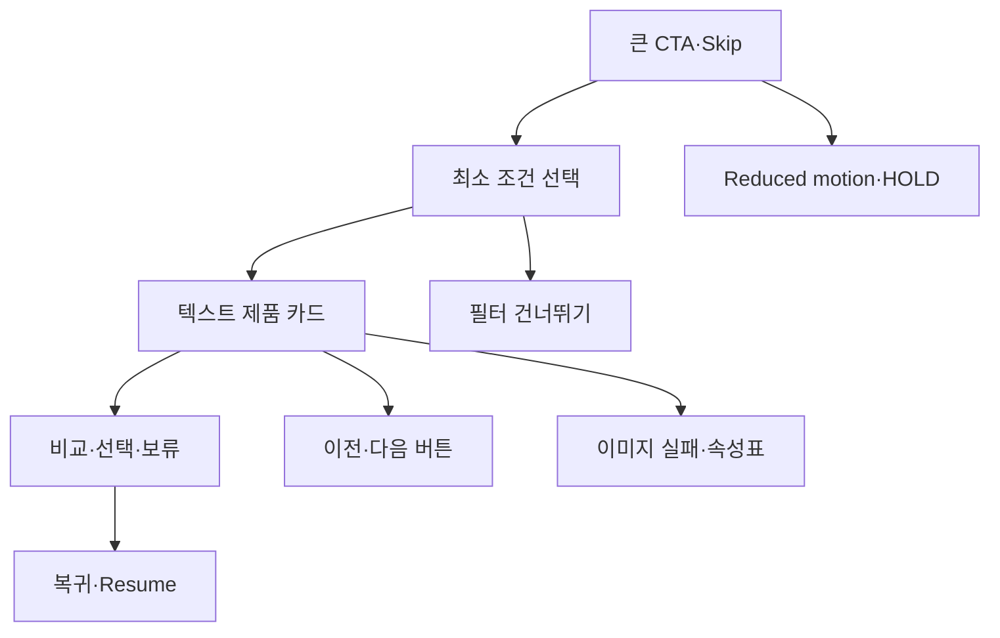

# VC-13 여울 — 사이트구조맵 C안 V3 상세본

## 1. Client·REQ 추적

- Client: VC-13 여울 / 접근성
- 요구: 명확한 Label, 상태 텍스트, 드래그 대안, reduced motion, 320px·200% Reflow, 44px Target
- 추적: REQ-013, `ER-012·013`, 전 Page·와이어프레임·스타일 가이드
- 성공: 접근성 기능을 의식적으로 찾지 않아도 대표 3페이지와 Flow를 완료한다.
- 실패: 접근성을 별도 축약 화면으로 보내거나 색·이미지·제스처에 의존한다.
- 제품: PROD-017·019·021·046·049·051·082·085·087·091

### 제품 ID·제품군 배치

- PROD-017 — 가독성 프레임 스티커: 정보와 꾸밈 충돌 완화
- PROD-019 — 텍스트 우선 제품 카드 세트: 이름·분류·차이·상태
- PROD-021 — 레일 탐색 보조 라벨 세트: 버튼·현재 위치
- PROD-046 — 선택형 여백 프레임: 대비·대체 텍스트
- PROD-049 — Heading 탐색 제품 목록: 짧은 경로 이동
- PROD-051 — 키보드·터치 대체 조작 카드: 드래그 대안
- PROD-082 — 기록 프레임 기본팩: 핵심 정보 우선
- PROD-085 — 제품 Section 요약 카드: 반복 정보 축약
- PROD-087 — 포커스 순서 제품 카드: 포커스·상태 텍스트
- PROD-091 — 대체 조작 선물 안내: 접근성 확인·보류

모든 제품은 가상 검증 후보이며 구매 CTA·가격·배송·인증을 확정하지 않는다.

## 2. 구조 전략

`작은 조작 우선형` — 모든 핵심 행동을 큰 버튼·명확한 Label·짧은 상태 문장으로 제공하고, 레일·필터·비교의 복잡한 조작을 단계적으로 줄인다.

### 계층·메뉴

- 메인: 오늘의 진입 / 큰 CTA / 텍스트 제품 요약
- 카테고리: 단계형 필터 / 카드 / 비교함
- 브랜드: 접근성 원칙·실제 적용
- 공통: 상태 도움말·키보드 안내·동작 감소

## 3. 페이지·콘텐츠·기능 계약

| PAGE | 목적 | 콘텐츠 | 기능·상태 |
|---|---|---|---|
| PAGE-001 | 빠른 시작 | 큰 CTA·요약·대체 텍스트 | 키보드·터치·Skip |
| PAGE-021 | 단계형 비교 | 최소 필터·텍스트 카드 | 다음 단계·초기화·비교 |
| PAGE-020 | 원칙 확인 | 접근성 적용 | 근거·상태·복귀 |
| 공통 | 동작 통제 | 오류·빈 상태·오프라인 | 재시도·HOLD·Resume |

## 4. 사용자 흐름·상태

- 정상: 큰 CTA → 최소 조건 → 제품 카드 → 비교 → 선택·보류
- 분기: 필터 건너뛰기; 드래그 대신 이전·다음; 이미지 실패 시 텍스트 속성표
- 오류: 현재 조작을 잃지 않고 오류 원인·재시도·대체 행동을 같은 영역에 표시한다.
- 취소: Escape·취소 버튼으로 이전 위치와 포커스를 복귀한다.
- 반응형: 320px와 200% 확대에서 가로 잘림 없이 순차 배치한다.
- 상태: `DEFAULT / EMPTY / ERROR / OFFLINE / RESUME / HOLD`

## 5. 중복·끊김·가정 검증

- 대체 조작은 별도 축약 화면이 아니라 동일 컴포넌트의 기본 행동으로 둔다.
- 44px 이상 터치 목표, 키보드 순서, visible focus, Label과 상태 텍스트를 일관되게 적용한다.
- 자동 재생·시간 제한·필수 드래그·색상 단독 상태 전달을 금지한다.
- 회원·저장·개인화는 근거가 없어 `가정/HOLD`로 표기한다.
- 제품 후보는 검증용 가상 제품이며 가격·배송·후기·인증을 확정하지 않는다.

## 6. Mermaid

## 7. 판정

`KEEP / 후보 C` — 사용자의 조작 부담을 가장 낮춘다. 최종 선택 시 A안의 전역 일관성, B안의 긴 페이지 탐색성과 함께 비교한다.
