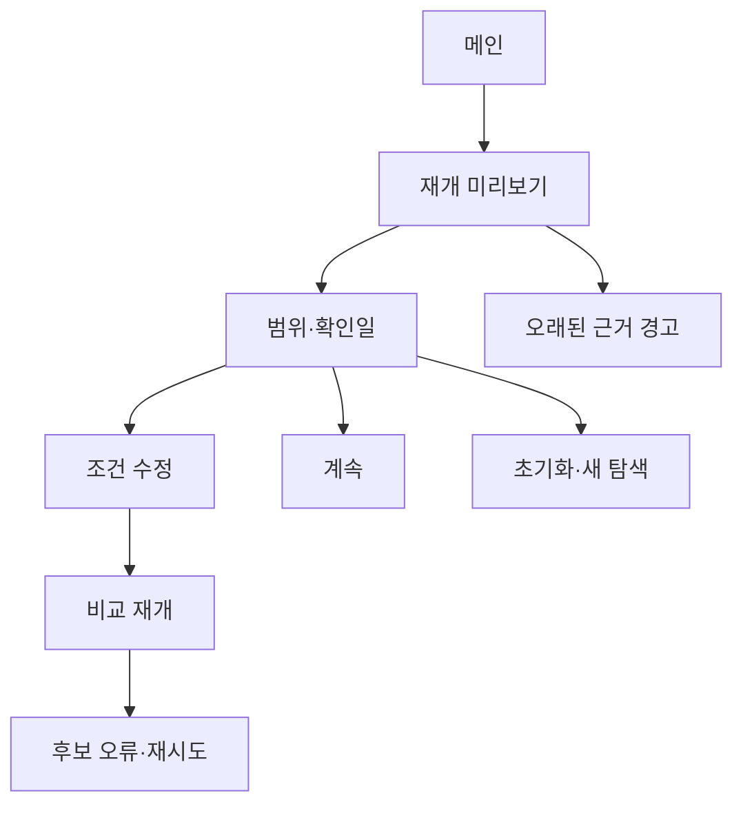

# VC-14 마루 — 사이트구조맵 A안 V3 상세본

## 1. Client·REQ 추적

- Client: VC-14 마루 / 탐색 재개
- 요구: 자동 적용 금지, 수정 가능한 미리보기, 초기화·계속 선택, 오래된 근거 구분
- 수용: 복원 범위를 확인하고 짧은 단계 안에 비교를 재개한다.
- 실패·차단: 이전 선택을 최신 사실로 갱신하거나 취소 경로를 숨긴다.
- 추적: REQ-014, `ER-014·015`, PAGE-001·019·021
- 제품: PROD-013·045·077·080

### 제품 ID·제품군 배치

- PROD-013 — 기기 전환 상태 카드: 최신 상태·선택 범위·계속/초기화
- PROD-045 — 이어쓰기 위치 북마크: 중단 위치와 다음 행동
- PROD-077 — 기기 전환 확인표: 기기 전환 범위·복귀
- PROD-080 — 복귀 맥락 북마크: 원래 조건·최신성·초기화

모든 제품은 가상 검증 후보이며 가격·재고·배송·동기화를 확정하지 않는다.

## 2. 구조 전략

`확인 후 재개형` — 메인과 카테고리에서 Resume 후보를 보여주되 자동 적용하지 않고 범위·확인일·만료 가능성을 먼저 확인한다.

### 계층·메뉴

- 메인: 다시 이어가기 / 새로 탐색 / 저장 범위 안내
- 재개 허브: 최근 위치 / 비교 후보 / 적용 조건 / 확인일
  - 3차: 미리보기 / 계속 / 초기화 / 보류 이유
- 카테고리: 현재 초안·저장 예시·적용 필터 분리
- 비교: 후보·근거 시점·변경 위험

## 3. 페이지·콘텐츠·기능 계약

| PAGE | 목적 | 콘텐츠 | 기능·상태 |
|---|---|---|---|
| PAGE-001 | 재개 진입 | 최근 위치·범위 요약 | 미리보기·새로 시작 |
| PAGE-019 | 복귀 통제 | 저장 범위·확인일·만료 | 계속·초기화·보류 |
| PAGE-021 | 비교 재개 | 후보·필터·근거 시점 | 비교·조건 수정 |
| 공통 | 오류 대응 | Empty·Error·Offline·HOLD | 재시도·복귀 |

## 4. 사용자 흐름·상태

- 정상: 메인 → 재개 미리보기 → 범위 확인 → 조건 수정 또는 계속 → 비교
- 분기: 오래된 근거 → 최신성 경고 후 확인; 범위 불명 → 초기화·새 탐색
- 오류: 후보 일부 실패 → 남은 후보 보존·재시도·건너뛰기
- 취소: 취소 시 자동 적용 없이 원래 페이지로 돌아간다.
- 상태: `DEFAULT / EMPTY / ERROR / OFFLINE / RESUME / HOLD`

## 5. 중복·끊김·가정 검증

- SAVED-SAMPLE·CURRENT-DRAFT·APPLIED-FILTER를 분리한다.
- Resume은 미리보기 후 확인하며 자동 필터 적용을 금지한다.
- 로그인·동기화·보존 기간은 근거가 없어 `가정/HOLD`다.
- 제품명·근거 확인일·변경 위험을 후보 카드에 고정한다.
- 키보드·스크린리더·320px·200% 확대를 검증한다.

## 6. Mermaid

## 7. 판정

`KEEP / 후보 A` — 자동 적용 금지와 범위 확인을 가장 직접적으로 보장한다.
