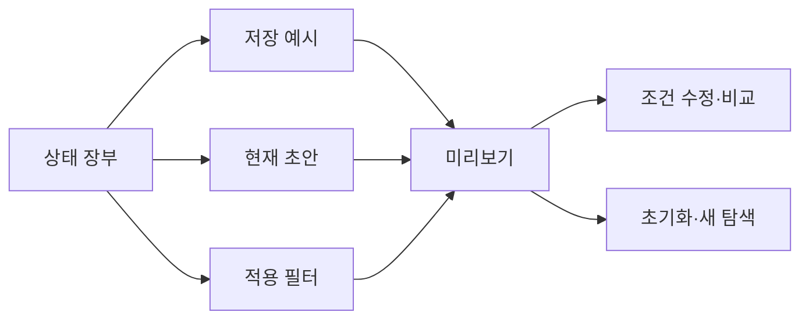

# VC-14 마루 — 사이트구조맵 B안 V3 상세본

## 1. Client·REQ 추적

- Client: VC-14 마루 / 탐색 재개
- 추적: REQ-014, `ER-014·015`, PAGE-001·019·021
- 수용: 복원 범위 확인 후 2단계 안에 비교를 재개한다.
- 차단: 이전 상태를 최신 사실로 둔갑시키거나 취소를 숨긴다.
- 제품: PROD-013·045·077·080

### 제품 ID·제품군 배치

- PROD-013 — 기기 전환 상태 카드: 상태·범위·미완료 단계
- PROD-045 — 이어쓰기 위치 북마크: 위치·다음 행동·복귀
- PROD-077 — 기기 전환 확인표: 최신성·선택 범위·HOLD
- PROD-080 — 복귀 맥락 북마크: 조건·확인일·초기화

모든 제품은 가상 검증 후보이며 자동 동기화·판매 정보를 확정하지 않는다.

## 2. 구조 전략

`상태 장부형` — 저장 예시, 현재 초안, 적용 필터, 확인일과 변경 위험을 장부로 비교한다.

### 계층·메뉴

- 메인 / 상태 장부 / 카테고리 / 비교함 / 도움말
- 장부 3차: 저장 예시 / 현재 초안 / 적용 필터 / 최신성 / 초기화

## 3. 페이지·콘텐츠·기능 계약

| PAGE | 목적 | 콘텐츠 | 기능·상태 |
|---|---|---|---|
| PAGE-001 | 장부 진입 | 재개 후보·최신성 | 범위 확인 |
| PAGE-019 | 상태 확인 | 보존 범위·미정 | 계속·초기화·보류 |
| PAGE-021 | 비교 | 후보·조건·근거 | 조건 수정·복귀 |
| 공통 | 실패 대체 | 상태 텍스트·대체 경로 | 재시도·건너뛰기 |

## 4. 사용자 흐름·상태

- 정상: 상태 장부 → 저장 예시 선택 → 미리보기 → 조건 수정 → 비교
- 분기: 현재 초안과 저장 예시 충돌 → 각각 비교 후 선택; 오래된 근거 → 경고
- 오류: 오프라인 → 마지막 확인일 표시·자동 갱신 금지
- Empty: 복원 후보 없음 → 새 탐색으로 이동
- 상태: `DEFAULT / EMPTY / ERROR / OFFLINE / RESUME / HOLD`

## 5. 중복·끊김·가정 검증

- 저장 예시·초안·필터를 한 상태로 합치지 않는다.
- 확인하지 않은 범위를 자동으로 적용하지 않는다.
- 기기 동기화·로그인·영구 보존은 `HOLD`다.
- 모든 카드에 초기화·취소·복귀 경로를 둔다.

## 6. Mermaid

## 7. 판정

`KEEP / 후보 B` — 상태 충돌과 최신성 판단에 강하다.
