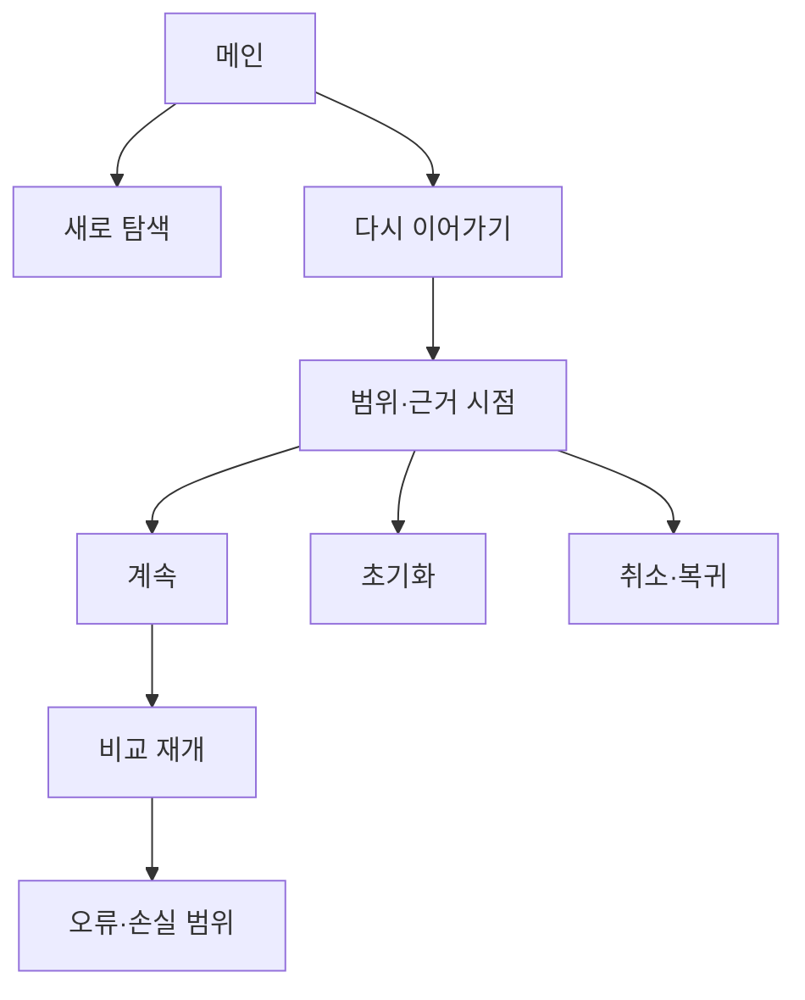

# VC-14 마루 — 사이트구조맵 C안 V3 상세본

## 1. Client·REQ 추적

- Client: VC-14 마루 / 탐색 재개
- 요구·추적: REQ-014, `ER-014·015`, PAGE-001·019·021
- 성공: 복원 범위와 근거 시점을 이해하고 비교를 재개한다.
- 실패: 취소 경로 은닉·자동 복원·최신성 오인
- 제품: PROD-013·045·077·080

### 제품 ID·제품군 배치

- PROD-013 — 기기 전환 상태 카드: 기기별 현재 상태
- PROD-045 — 이어쓰기 위치 북마크: 이전 위치·재개 지점
- PROD-077 — 기기 전환 확인표: 전환 범위·확인일
- PROD-080 — 복귀 맥락 북마크: 비교 조건·초기화

모든 제품은 가상 검증 후보이며 로그인·동기화·가격·배송을 확정하지 않는다.

## 2. 구조 전략

`새 탐색 안전 우선형` — 재개 후보와 새 탐색을 동등하게 제시하고, 사용자가 확인한 뒤에만 이전 맥락을 불러온다.

### 계층·메뉴

- 메인: 새로 탐색 / 다시 이어가기 / 보존 안내
- 카테고리: 새 조건 / 이전 후보 / 비교
- 복귀: 범위 확인 / 계속 / 초기화 / 취소

## 3. 페이지·콘텐츠·기능 계약

| PAGE | 목적 | 콘텐츠 | 기능·상태 |
|---|---|---|---|
| PAGE-001 | 선택 | 새 탐색·재개 후보 | 두 경로 선택 |
| PAGE-019 | 확인 | 복원 범위·시점 | 계속·초기화·취소 |
| PAGE-021 | 재개 | 후보·비교 기준 | 필터 수정·복귀 |
| 공통 | 예외 | 결과 없음·오류·오프라인 | 재시도·보류 |

## 4. 사용자 흐름·상태

- 정상: 새 탐색 또는 재개 선택 → 범위 확인 → 계속 또는 초기화 → 비교
- 분기: 재개 범위 불명 → 새 탐색; 오래된 근거 → 확인일 경고
- 오류: 일부 후보 손실 → 남은 후보와 손실 범위 설명
- 취소: 취소하면 이전 페이지로 복귀하고 어떤 필터도 적용하지 않는다.
- 상태: `DEFAULT / EMPTY / ERROR / OFFLINE / RESUME / HOLD`

## 5. 중복·끊김·가정 검증

- 새 탐색과 Resume CTA를 같은 버튼으로 합치지 않는다.
- 사용자 확인 없이 필터·후보·정렬을 복원하지 않는다.
- 저장·동기화·로그인은 원자료에 없어 `가정/HOLD`다.
- 모바일에서도 범위·시점·취소를 가로 스크롤 없이 읽게 한다.

## 6. Mermaid

## 7. 판정

`KEEP / 후보 C` — Resume을 강제하지 않고 새 탐색을 안전한 동등 경로로 제공한다.
