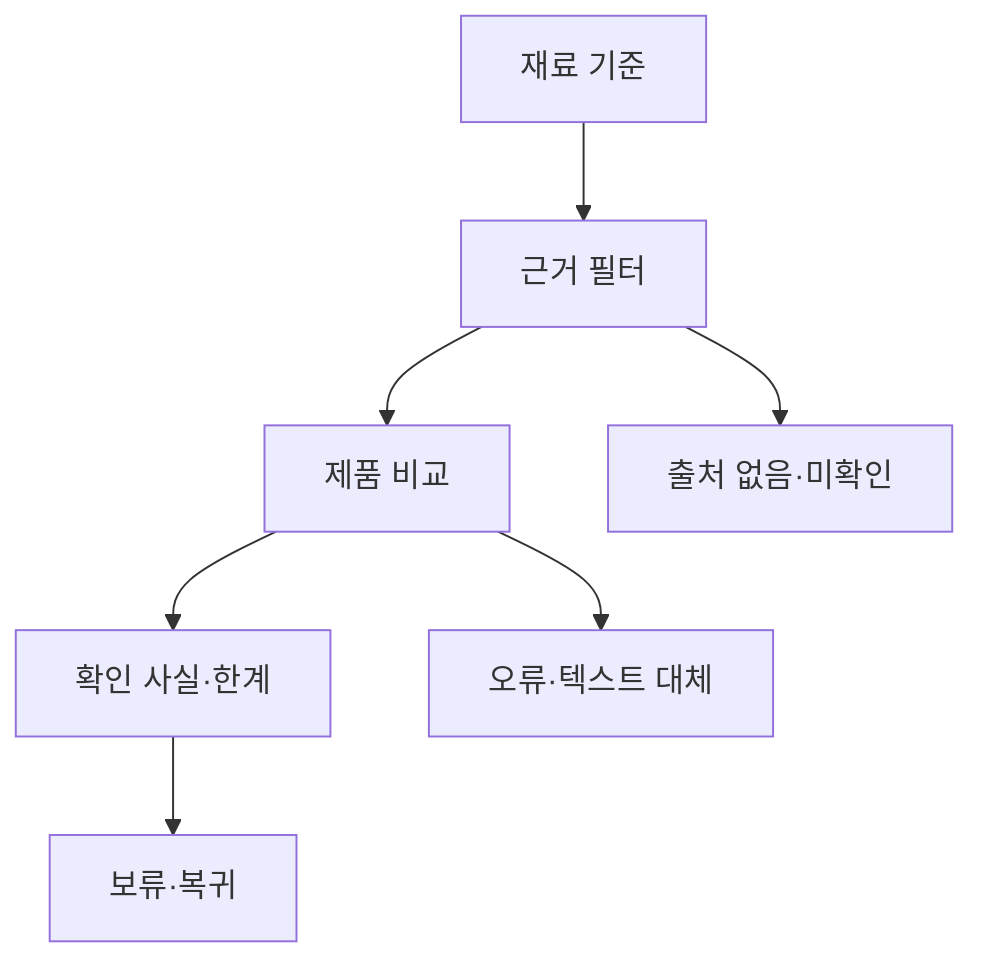

# VC-15 새봄 — 사이트구조맵 A안 V3 상세본

## 1. Client·REQ 추적
- Client: VC-15 새봄 / 재료·지속가능성 정보
- 요구: 검증 상태, 주장과 사실 분리, 인증·수치·환경 효과의 근거
- 수용: 사실과 목표를 구분하고 확인되지 않은 후보를 보류한다.
- 실패·차단: 인증·내구 연수·환경 효과를 임의 생성한다.
- 추적: REQ-015, `ER-016·017`, PAGE-007·008·014·020·021
- 제품: PROD-025·026·055·057·093·094

## 2. 구조 전략
`근거 우선형` — 제품·재료를 탐색할 때 주장, 확인 사실, 목표, 미정 상태를 카드에서 분리한다.

### 계층·메뉴
- 메인: 재료 기준 / 검증 상태 / 제품 레일
- 카테고리: 재료·내구·교체 / 근거 필터 / 비교
- 제품 상세: 주장·사실·확인일·한계
- 브랜드 소개: 지속가능성 목표와 확인 범위

## 3. 페이지·콘텐츠·기능 계약
| PAGE | 목적 | 콘텐츠 | 기능·상태 |
|---|---|---|---|
| PAGE-001 | 기준 진입 | 재료·근거 요약 | 상태 보기 |
| PAGE-007 | 재료 탐색 | 재료·확인일·출처 | 필터·비교 |
| PAGE-008 | 내구·교체 | 수치·미정·리필 | 보류·상세 |
| PAGE-014 | 제품 비교 | 근거·한계 | 비교·복귀 |
| PAGE-020 | 브랜드 목표 | 목표와 사실 분리 | 출처 펼치기 |
| PAGE-021 | 전체 후보 | 제품군·검증 상태 | 조건 완화 |

## 4. 사용자 흐름·상태
- 정상: 기준 선택 → 재료·근거 필터 → 제품 비교 → 확인 사실·한계 → 보류 또는 복귀
- 분기: 출처 없음 → 미확인 표시; 목표만 있음 → 사실로 승격 금지
- 오류: 출처·이미지 실패를 카드에 격리하고 텍스트 대체·재시도
- 상태: `DEFAULT / EMPTY / ERROR / OFFLINE / RESUME / HOLD`

## 5. 중복·끊김·가정 검증
- 인증·환경 효과·내구 연수는 출처와 확인일 없이 표시하지 않는다.
- 목표·주장·사실·미정을 별도 라벨로 유지한다.
- 가격·재고·배송·판매 여부는 확정하지 않는다.
- 키보드·대체 텍스트·320px·200% 확대를 검증한다.

## 6. Mermaid

## 7. 판정
`KEEP / 후보 A` — 근거 상태와 보류를 가장 직접적으로 보여준다.
### 연결 제품 ID (개별 표기)
- PROD-025
- PROD-026
- PROD-055
- PROD-057
- PROD-093
- PROD-094
