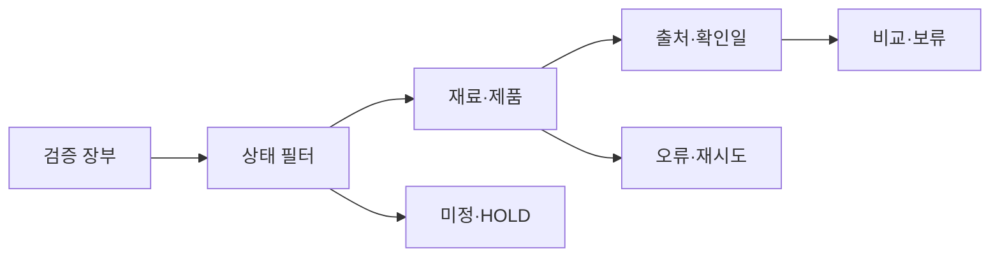

# VC-15 새봄 — 사이트구조맵 B안 V3 상세본

## 1. Client·REQ 추적
- Client: VC-15 새봄 / 재료·지속가능성 정보
- 요구·추적: REQ-015, `ER-016·017`, PAGE-007·008·014·020·021
- 수용: 확인되지 않은 후보를 안전하게 보류한다.
- 차단: 근거 없는 인증·수치·환경 효과
- 제품: PROD-025·026·055·057·093·094

## 2. 구조 전략
`검증 장부형` — 주장마다 상태·출처·확인일·한계·다음 확인 행동을 장부로 관리한다.

### 계층·메뉴
- 메인 / 검증 장부 / 재료 카테고리 / 제품 비교 / 브랜드 목표
- 장부 3차: 확인됨 / 주장 / 목표 / 미정 / 보류

## 3. 페이지·콘텐츠·기능 계약
| PAGE | 목적 | 콘텐츠 | 기능·상태 |
|---|---|---|---|
| PAGE-001 | 장부 진입 | 핵심 주장 요약 | 상태 선택 |
| PAGE-007 | 재료 근거 | 재료·출처·확인일 | 필터 |
| PAGE-008 | 유지 관리 | 교체·수리·내구 | 미정·보류 |
| PAGE-014 | 비교 판단 | 공통 기준·차이 | 비교함 |
| PAGE-020 | 브랜드 목표 | 목표·사실 경계 | 근거 펼치기 |
| PAGE-021 | 후보 전체 | 제품군·상태 | 전체 보기 |

## 4. 사용자 흐름·상태
- 정상: 장부 → 상태 필터 → 제품·재료 비교 → 한계 확인
- 분기: 상태 `미정` → 보류; 출처 시점 경과 → 최신성 경고
- 오류: 장부 일부 실패 → 실패 항목만 재시도·건너뛰기
- Empty·Offline·Resume·HOLD 상태를 텍스트로 표시한다.

## 5. 중복·끊김·가정 검증
- 동일 주장을 페이지마다 복제하지 않고 ID·출처로 연결한다.
- 목표를 사실·인증·효과로 표현하지 않는다.
- 보관 공간·리필·수리와 근거 시점 충돌은 별도 필드로 유지한다.
- 접근성 Label·Heading·키보드·상태 텍스트를 제공한다.

## 6. Mermaid

## 7. 판정
`KEEP / 후보 B` — 주장과 사실의 추적성이 높다.
### 연결 제품 ID (개별 표기)
- PROD-025
- PROD-026
- PROD-055
- PROD-057
- PROD-093
- PROD-094
