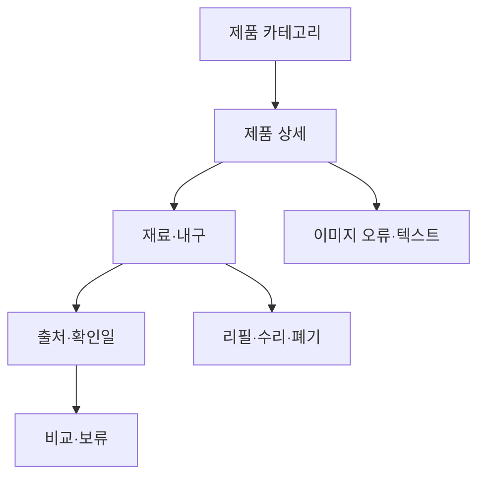

# VC-15 새봄 — 사이트구조맵 C안 V3 상세본

## 1. Client·REQ 추적
- Client: VC-15 새봄 / 재료·지속가능성 정보
- 요구·추적: REQ-015, `ER-016·017`, PAGE-007·008·014·020·021
- 성공: 확인되지 않은 후보를 보류하고 사실·목표를 구분한다.
- 실패: 인증·내구 연수·환경 효과의 임의 생성
- 제품: PROD-025·026·055·057·093·094

## 2. 구조 전략
`제품 비교 후 검증형` — 제품을 먼저 비교하되 상세에서 재료 근거·수리·교체·환경 주장 상태를 확인한다.

### 계층·메뉴
- 메인 / 제품 카테고리 / 제품 상세·비교 / 근거·상태 / 브랜드 소개
- 제품 상세 3차: 재료 / 내구 / 교체·수리 / 폐기 / 출처·한계

## 3. 페이지·콘텐츠·기능 계약
| PAGE | 목적 | 콘텐츠 | 기능·상태 |
|---|---|---|---|
| PAGE-001 | 제품 진입 | 후보 레일·고지 | 상세 이동 |
| PAGE-007 | 재료 비교 | 재료·출처 | 조건 비교 |
| PAGE-008 | 유지 판단 | 교체·수리·폐기 | 보류·복귀 |
| PAGE-014 | 비교함 | 확인 사실·미정 | 비교·초기화 |
| PAGE-020 | 목표 확인 | 브랜드 목표·한계 | 출처 보기 |
| PAGE-021 | 전체 탐색 | 제품군·상태 | 필터 완화 |

## 4. 사용자 흐름·상태
- 정상: 제품 선택 → 재료·내구 확인 → 근거 시점 확인 → 비교·보류
- 분기: 근거 부족 → 미정 카드와 보류; 리필·수리 미지원 → 대체 사용 맥락
- 오류: 제품 이미지 실패 시 텍스트 속성표 유지
- 상태: `DEFAULT / EMPTY / ERROR / OFFLINE / RESUME / HOLD`

## 5. 중복·끊김·가정 검증
- 제품 이름만으로 친환경·내구·인증을 암시하지 않는다.
- 확인일·출처·변경 위험을 제품 카드에 유지한다.
- 판매·가격·환경 효과는 미정이면 CTA를 차단한다.
- 모바일 레일은 수동·버튼·키보드로 이동하고 본문 수평 스크롤을 금지한다.

## 6. Mermaid

## 7. 판정
`KEEP / 후보 C` — 탐색 부담을 낮추면서 상세에서 사실성 검증을 수행한다.
### 연결 제품 ID (개별 표기)
- PROD-025
- PROD-026
- PROD-055
- PROD-057
- PROD-093
- PROD-094
