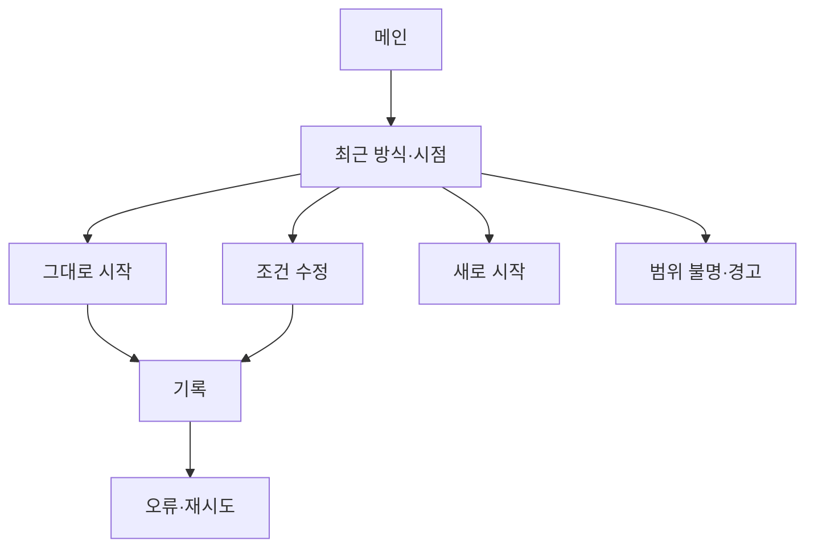

# VC-16 한결 — 사이트구조맵 A안 V3 상세본

## 1. Client·REQ 추적
- Client: VC-16 한결 / 반복 설정 피로
- 판정: `KEEP / INFERENCE`; 요구: 직전 방식의 범위·시점 표시, 수정 미리보기, 자동 적용 금지
- 수용: 저장 범위를 이해하고 두 개 이하 결정으로 시작한다.
- 실패: 계정 동기화 암시·과거 기록 노출
- 추적: REQ-016, `CR-016`, SR-018·020, ER-014·015, PAGE-001·010·019
- 제품: 직접 연결 제품 없음(제품 확정·임의 Product ID 생성 금지)

## 2. 구조 전략
`최소 결정형` — 최근 방식의 범위와 시점만 보여주고 그대로 시작·수정·새로 시작을 2단계 안에 선택하게 한다.

## 3. 페이지·콘텐츠·기능 계약
| PAGE | 목적 | 콘텐츠 | 기능·상태 |
|---|---|---|---|
| PAGE-001 | 빠른 시작 | 최근 방식·확인일 | 미리보기·새로 시작 |
| PAGE-010 | 기록 진입 | 최소 설정·대체 | 수정·건너뛰기 |
| PAGE-019 | 상태 복귀 | 범위·시점·미완료 | 계속·초기화·HOLD |

## 4. 사용자 흐름·상태
- 정상: 메인 → 최근 방식 확인 → 그대로 시작 또는 수정 → 기록
- 분기: 범위 불명 → 새로 시작; 오래된 시점 → 경고·확인
- 오류·Offline: 저장 내용 없이 안내·재시도·새로 시작
- 상태: `DEFAULT / EMPTY / ERROR / OFFLINE / RESUME / HOLD`

## 5. 중복·끊김·가정 검증
- 과거 기록 내용은 노출하지 않고 범위·시점만 표시한다.
- 자동 동기화·계정 저장은 근거가 없어 `HOLD`다.
- 설정 단계는 2개 이하로 제한하고 수정·취소를 제공한다.
- 키보드·Label·320px·200% 확대를 검증한다.

## 6. Mermaid

## 7. 판정
`KEEP / 후보 A` — 반복 설정을 줄이되 자동 적용을 차단한다.
