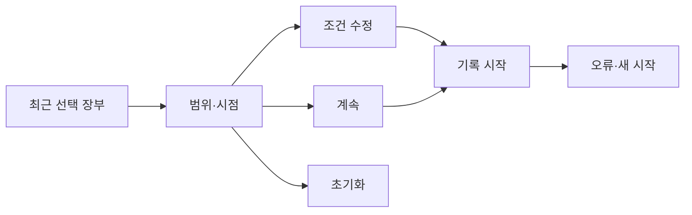

# VC-16 한결 — 사이트구조맵 B안 V3 상세본

## 1. Client·REQ 추적
- Client: VC-16 한결 / 반복 설정 피로
- 요구·추적: REQ-016, `CR-016`, PAGE-001·010·019
- 수용: 두 개 이하의 결정으로 기록 시작
- 차단: 동기화 암시·과거 내용 노출
- 제품: 직접 연결 제품 없음

## 2. 구조 전략
`최근 선택 장부형` — 최근 방식, 확인 시점, 적용 범위를 장부로 보여주고 사용자가 수정하거나 초기화한다.

## 3. 페이지·콘텐츠·기능 계약
| PAGE | 목적 | 콘텐츠 | 기능·상태 |
|---|---|---|---|
| PAGE-001 | 장부 진입 | 최근 방식·범위 | 선택·새로 시작 |
| PAGE-010 | 설정 | 최소 선택 | 수정·초기화 |
| PAGE-019 | 복귀 | 미완료·시점 | Resume·HOLD |

## 4. 사용자 흐름·상태
- 정상: 장부 → 범위 확인 → 수정 또는 계속 → 기록
- 분기: 오래된 시점 → 최신 사실로 갱신하지 않고 경고
- Empty·Error·Offline: 최근 방식 없음·실패를 명시하고 새 시작 제공
- 상태: `DEFAULT / EMPTY / ERROR / OFFLINE / RESUME / HOLD`

## 5. 중복·끊김·가정 검증
- SAVED·DRAFT·APPLIED를 분리한다.
- 과거 기록·개인정보·계정 상태는 표시하지 않는다.
- 자동 복원·동기화·분석은 `HOLD`다.
- 상태 텍스트와 키보드 포커스를 보장한다.

## 6. Mermaid

## 7. 판정
`KEEP / 후보 B` — 상태와 최신성을 명확히 추적한다.
