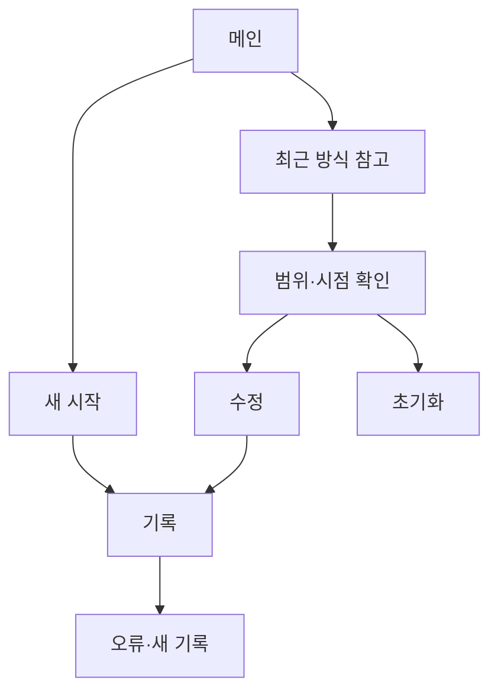

# VC-16 한결 — 사이트구조맵 C안 V3 상세본

## 1. Client·REQ 추적
- Client: VC-16 한결 / 반복 설정 피로
- 요구·추적: REQ-016, `CR-016`, PAGE-001·010·019
- 성공: 범위를 알고 짧게 시작
- 실패: 자동 적용·동기화 암시·과거 기록 노출
- 제품: 직접 연결 제품 없음

## 2. 구조 전략
`새 기록 우선형` — 최근 방식을 참고 자료로만 제시하고 새 기록 시작을 동일한 우선순위로 제공한다.

## 3. 페이지·콘텐츠·기능 계약
| PAGE | 목적 | 콘텐츠 | 기능·상태 |
|---|---|---|---|
| PAGE-001 | 진입 | 새 시작·최근 방식 | 두 경로 선택 |
| PAGE-010 | 최소 설정 | 범위·시점·수정 | 시작·취소 |
| PAGE-019 | 복귀 | 미완료·초기화 | Resume·HOLD |

## 4. 사용자 흐름·상태
- 정상: 새 시작 또는 최근 방식 → 미리보기 → 시작
- 분기: 최근 방식 불명 → 새 시작; 설정 피로 → 기본값 확인 후 수정
- 오류: 이전 상태 손실을 알리고 새 기록으로 이동
- 상태: `DEFAULT / EMPTY / ERROR / OFFLINE / RESUME / HOLD`

## 5. 중복·끊김·가정 검증
- 새 시작과 Resume을 같은 CTA로 합치지 않는다.
- 사용자 확인 전 어떤 설정도 자동 적용하지 않는다.
- 회원·동기화·과거 기록은 근거가 없어 `HOLD`다.
- 모바일에서도 범위·시점·취소를 세로 흐름으로 읽는다.

## 6. Mermaid

## 7. 판정
`KEEP / 후보 C` — 과거 맥락을 강제하지 않아 부담이 낮다.
